# 一，学习须知

##  1, 上课安排

上课时间：

* 时间：周一到周五，上午9点~12点，下午2点到6点讲课。晚上7点半到9点自习。周六全天自习，周日休息。节假日正常放假
* 上课方式是通过腾讯会议直播，有事请假的同学也可以上线。腾讯会议号：609-540-4002
* 学员需每天完成对应的任务，包括：知识点学习、练习题 和 每天的作业。
  注：练习题和作业都有视频讲解，学员需自己独立完成之后再根据老师讲解来核对自己的答案正确与否。
* 每天作业需要提交到群中，老师会挨个检查。

无线网络：

* 账号：malu1529-2.4g         malu1529-5G
* 密码：malu@163.com

## 2, 建议学习方式

* 学习笔记，在观看视频学习的过程中，可以结合老师讲解的知识点做好自己的课程笔记，便于回顾和复习。在每个模块结束时，可根据自己课堂笔记进行复习（不要再重新观看视频），提高学习效率。
* 课堂练习 / 作业题，自己独立完成之后，再看老师的讲解视频，通过对比了解的自己的不足。
* 模块总结，在每个模块结束时，回顾当前模块中所有知识点并将其整理成一个思维导图，回顾知识点的同时也可以了解所有知识点关联关系，可帮助加深记忆。
* 错题本，将自己所有的错题都记录下来，在模块结束时，着重去复习以前做过的错题。
* 单词本，编程会涉及到一些英语单词，英语薄弱的同学建议整理一份单词本，每天早上和晚上看一遍。

## 3, 笔记

作为程序员平时编写笔记和开发文档时一般都使用Markdown格式，为了让你能成为更加专业的程序员，所以建议大家的课程笔记都要使用Markdown格式来编写。

Markdown格式的文档可以用很多工具来编写，此处建议推荐大家使用 Typora 工具。

### 3.1 下载Typora

官网地址：https://www.typora.io/

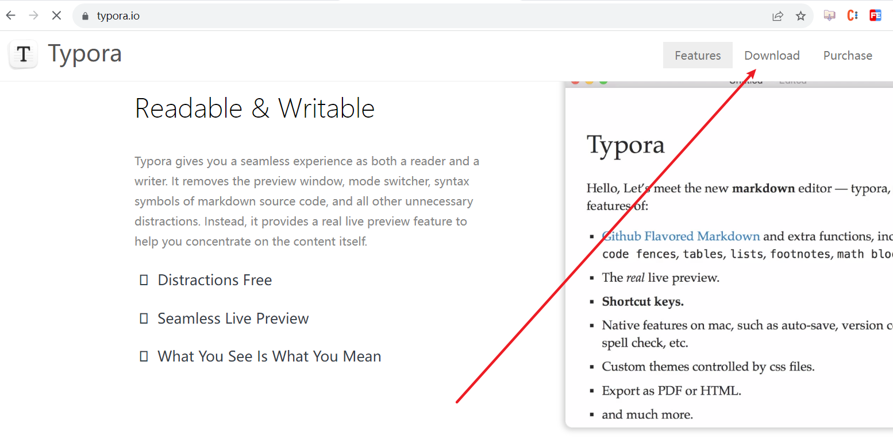

### 3.2 Typra大纲视图

在电脑上创建一个md文件，如下：

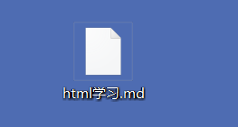

双击打开，如下：

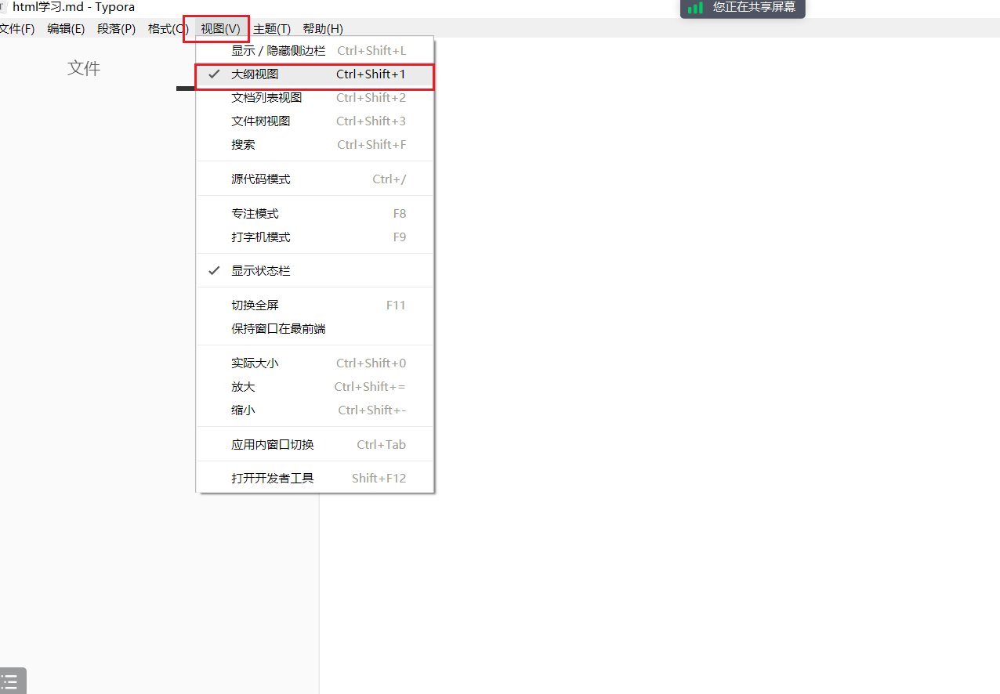

### 3.3 标题

在文档中可以快速实现标题的编写，基本结构为：

* `# 内容`，一级标题
* `## 内容`，二级标题
* `### 内容`，三级标题
* ...

注意：#符号和文本中间必须有空格。

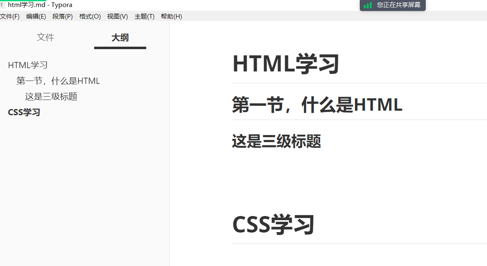

### 3.4 引用

在文档中想要让文本内容以 引用 方式展示，可通过 `> 内容` 格式实现。如：

```
> 计算机一门xx学科
```

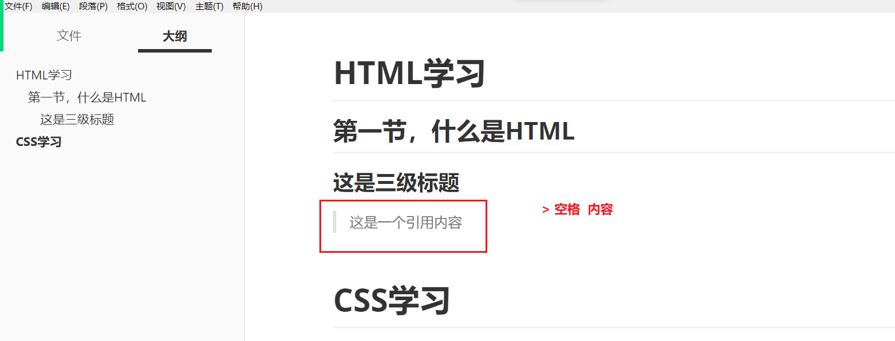

### 3.5 列表

想要以列表的形式展示数据，可以通过 `- 内容` 格式实现，如：

```
- CPU
- 硬盘
  - 普通硬盘
  - 固态硬盘
- 主板
```

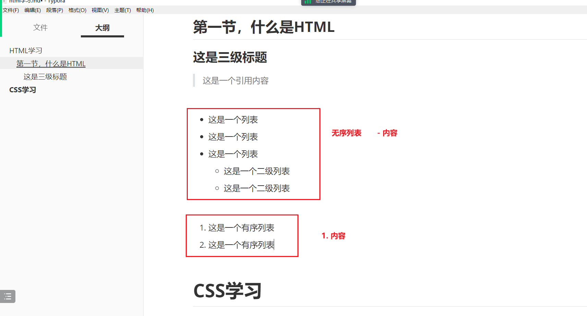

### 3.6 代码

想要在文档中集成代码时，可以通过 ` 符号包裹实现，如：

注意：第一行写上Python表示代码会按照Python的语法进行高亮显示（也可以是Java等其他语言）。

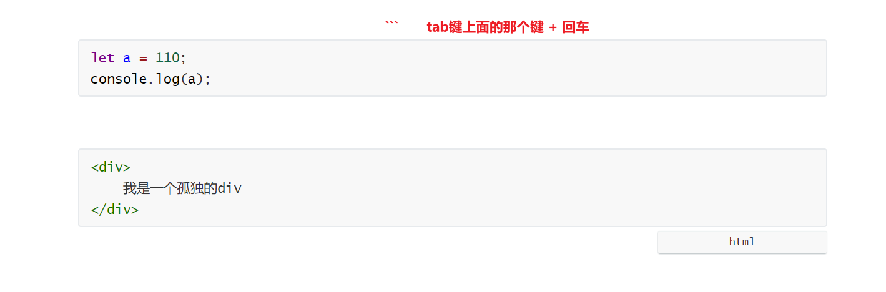

### 3.7 图片

想要在文档中显示图片时，可以通过 `` 来展示，但这种编写方式比较麻烦，因为需要自己录入图片的路径，所以一般不会这么写入图片，而是选择直接 复制图片 或 截图 直接粘贴到文档中，Typora可以自动帮助我们生成图片格式。

为了将文档中的管理文档中的图片，防止因为删除导致图片在文档中丢失，所以一般会在Typora中设置成将文档中的图片都复制到制定目录。

在Typora中找到设置页面，并按照图片先进行如下设置：

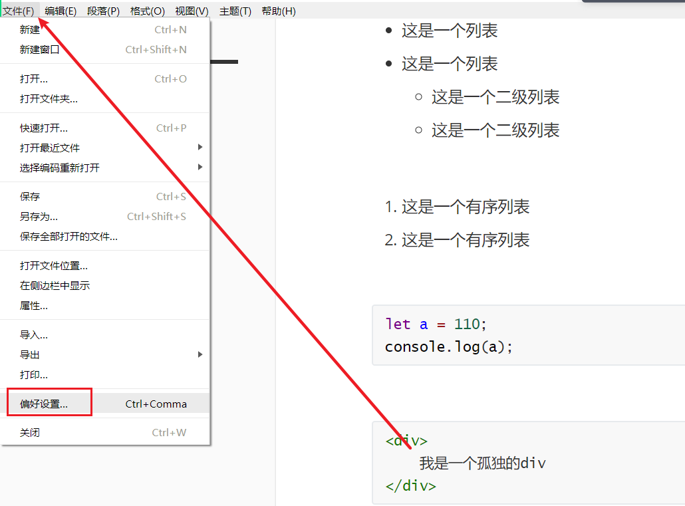


那些接下来就可以直接将图片粘贴到文档中且Typora自动将图片保存至文档根目录的 assets 文件夹中。

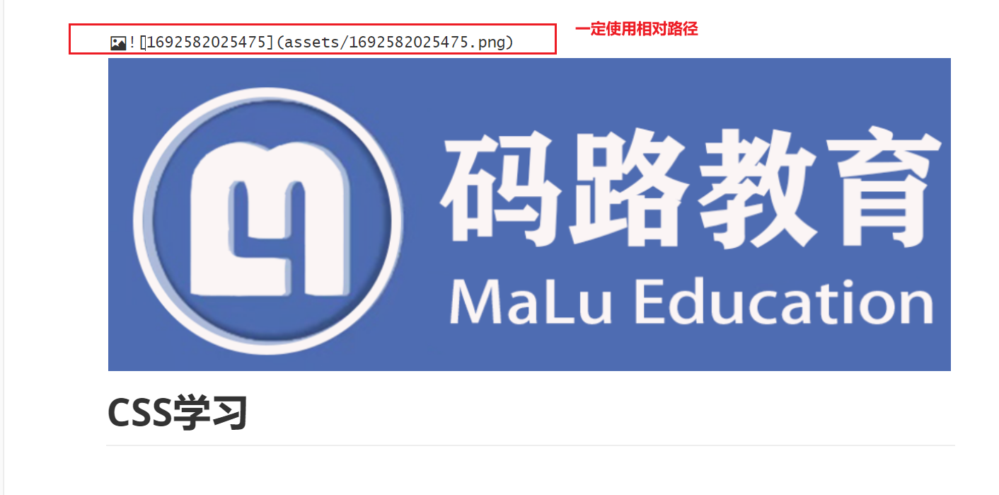

上述就是我们Typora最常见的功能，其他更多功能在后续课程中会逐步交给大家。


#  二，软件安装

## 1，截图软件

软件直接从群中下载：

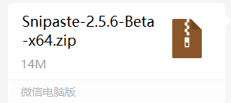


需要解压，如果电脑上没有解压软件，还需要安装解压软件，如下：

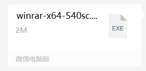


解压完后，如下：

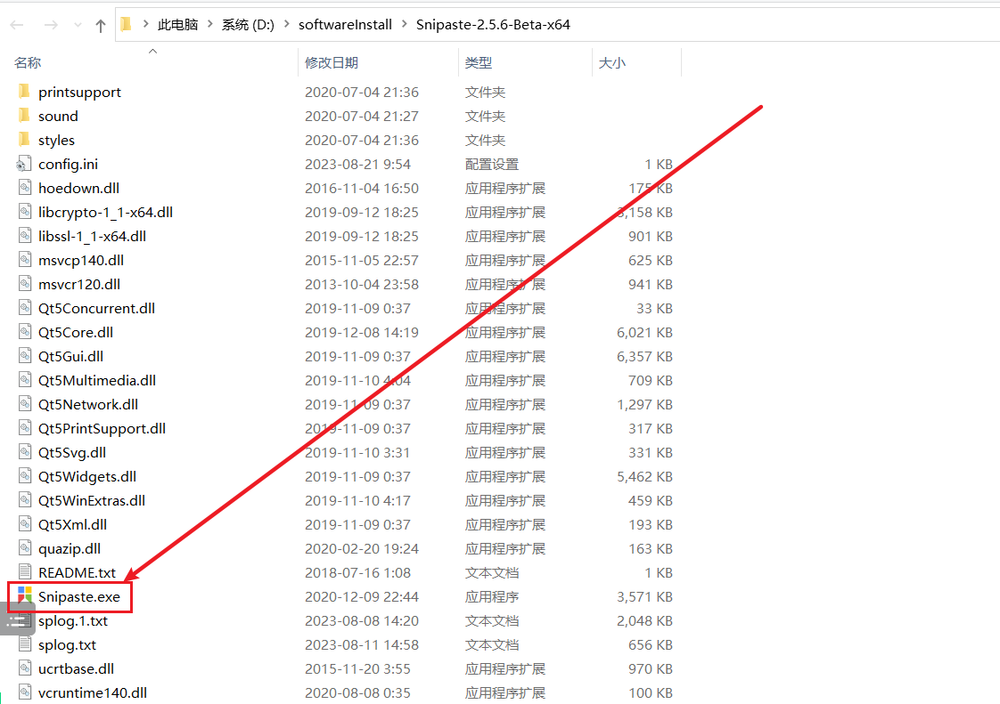


发送到桌面上，如下：

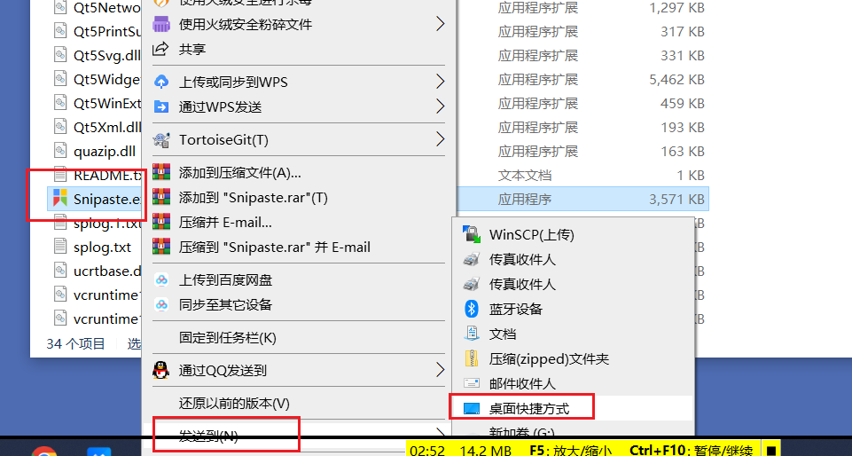


桌面上面就有一个快捷图标，如下：

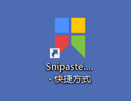


按F1就可以实现截图，如下：


## 2，编辑器

对于前端开发来说，常见的编辑器如下：

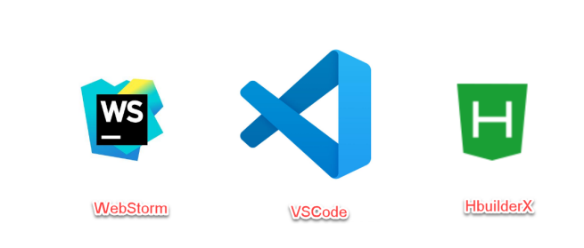

推荐使用VSCode，原因：

- 打开速度非常快
- 使用方便


百度搜索Vscode，地址：https://code.visualstudio.com/


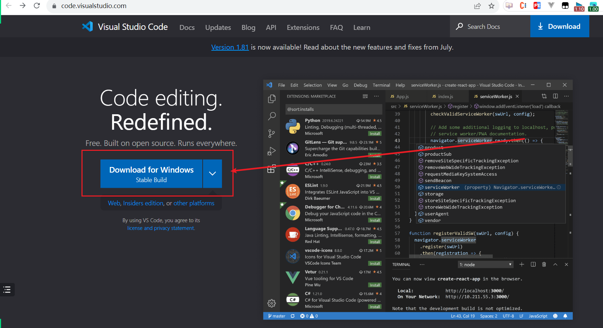


下载完后，安装也是傻瓜式安装，安装完后，还需要安装一些插件，下午打代码的时候，再说。安装完后，桌面上多了一个图标：

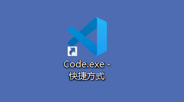


一些常用的快捷键：

- 代码格式化： Shift+Alt+F
- 向上或向下移动一行： Alt+Up 或 Alt+Down
- 快速复制一行代码： Shift+Alt+Up 或 Shift+Alt+Down
- 快速保存： Ctrl + S
- 快速查找： Ctrl + F
- 快速替换： Ctrl + H
- 快速删除某一行：Ctrl + X 


## 3，浏览器

常用的浏览器非常多，作为开发者，经常使用的有三个，如下：

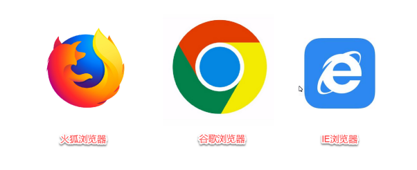


最推荐使用谷歌浏览器，原因：

- 简洁大方，打开响应速度快
- 开发者调试工具很强大


需要大家在电脑上安装谷歌浏览器，也是傻瓜式安装。安装完后，桌面上会多一个图标，如下：

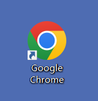


## 4，钉子

软件发群中，如下：

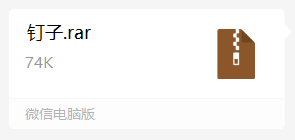


效果如下：

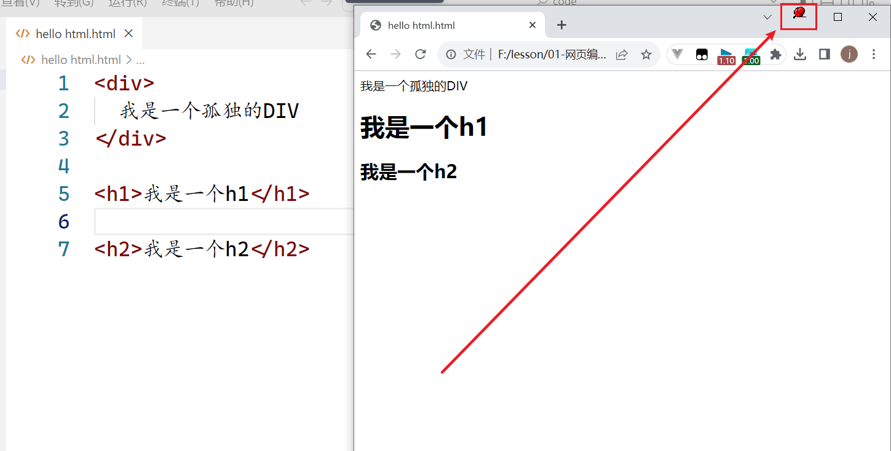


## 5，关于上网

群中有链接！


# 三，第1个网页


## 1，什么是网页

一个网站是有N个网页组成的，网页叫Web Page。使用浏览器看到的都是一张张的页面。页面中包含：包括文字、链接、图片、音乐、视频等。如下：

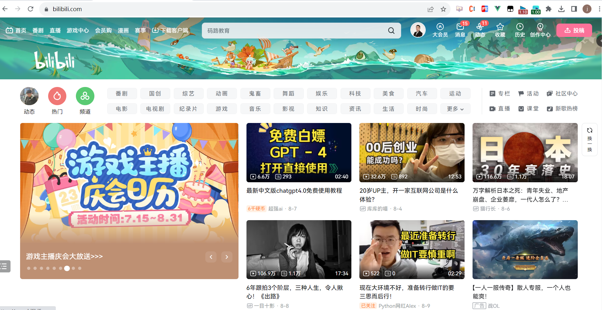


移动端网页：


看一下世界第一个网页：http://info.cern.ch/hypertext/WWW/TheProject.html

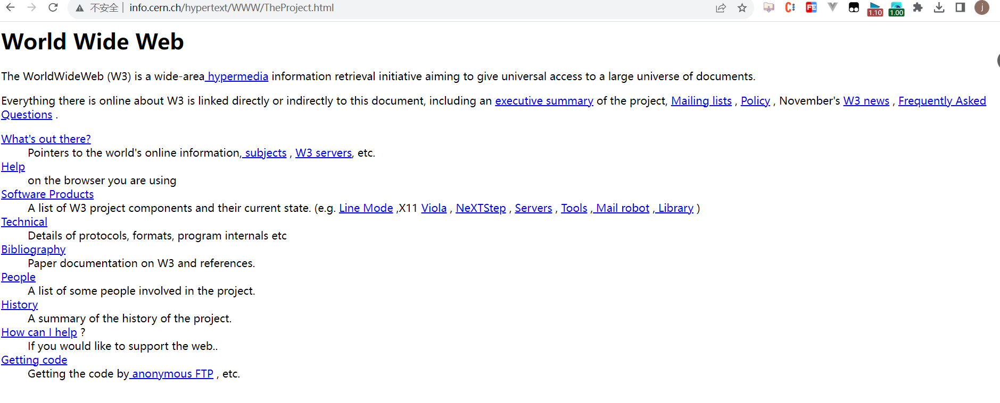


构建一个网页，需要三门技术：

- HTML  是给网页提供结构（内容）
- CSS  是给网页提供样式（颜色，大小，布局）
- JS  是给网页提供交互

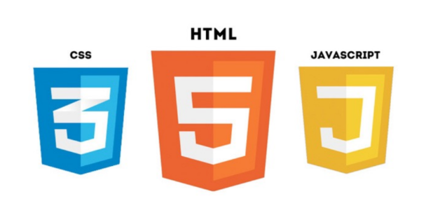


## 2，什么是HTML


**超文本标记语言**（英语：**H**yper**T**ext **M**arkup **L**anguage，简称：**HTML**）。是一种用于创建网页的标准标记语言。


**什么是标记语言（markup language ）**

- 由无数个标记（标签、tag)组成
- 比如使用h2标记的文本会被识别为“标题”进行加粗、文字放大显示
- 不同的标签，浏览器会作不同的处理


**什么是超文本（ HyperText ）**

- 表示不仅仅可以插入普通的文本（Text），还可以插入图片、音频、视频等内容
- 还可以表示超链接（HyperLink），从一个网页跳转到另一个网页


尝试写第一个网页，创建一个文件夹，如下：

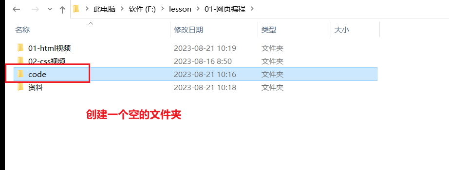


把code文件夹拖拽到vscode软件上，就意味着使用vscode软件打开发code文件夹，如下：

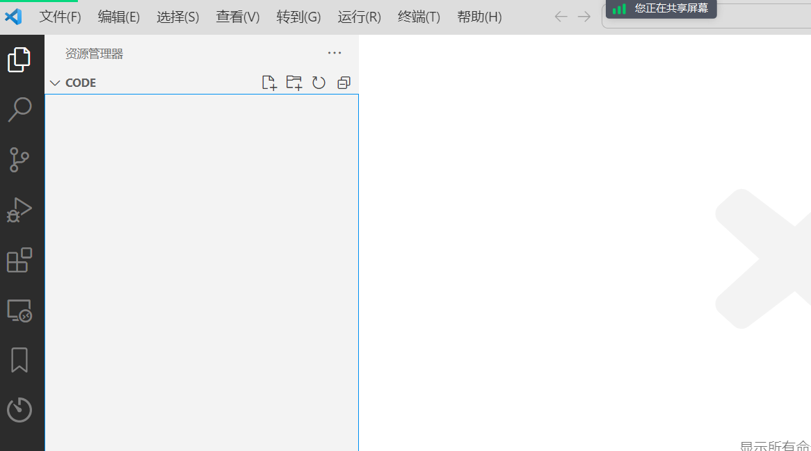


创建一个网页，后缀通常都是.html，如下：

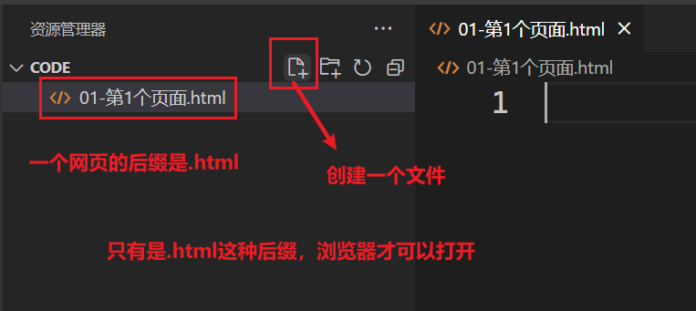


开始书写第一个网页，如下：

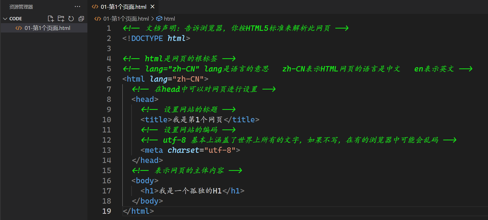


参考代码：

```html
<!-- 文档声明：告诉浏览器，你按HTML5标准来解析此网页 -->
<!DOCTYPE html>

<!-- html是网页的根标签 -->
<!-- lang="zh-CN" lang是语言的意思   zh-CN表示HTML网页的语言是中文   en表示英文 -->
<html lang="zh-CN">
  <!-- 在head中可以对网页进行设置 -->
  <head>
    <!-- 设置网站的标题 -->
    <title>我是第1个网页</title>
    <!-- 设置网站的编码 -->
    <!-- utf-8 基本上涵盖了世界上所有的文字，如果不写，在有的浏览器中可能会乱码 -->
    <meta charset="utf-8">
  </head>
  <!-- 表示网页的主体内容 -->
  <body>
    <h1>我是一个孤独的H1</h1>
  </body>
</html>
```


然后，需要让浏览器去解析代码，需要把页面的路径，copy到浏览器中，如下：

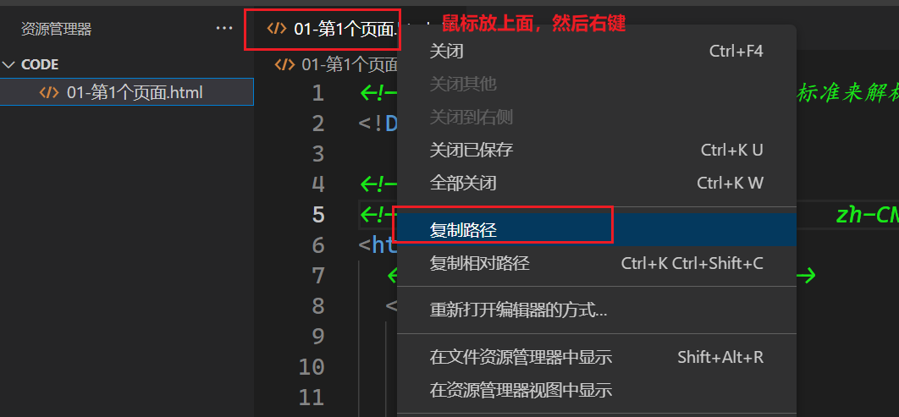


浏览器中测试之，如下：

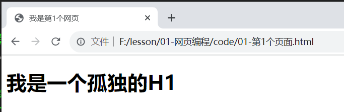


## 3，安装一些VSCODE插件 

点击vscode中的插件面板，如下：

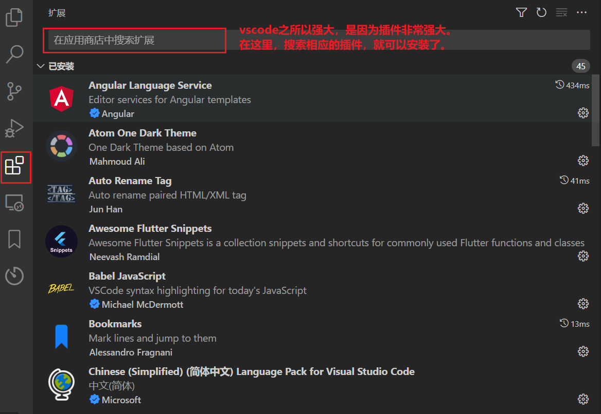


目前先安装如下的插件：

- 中文插件：Chinese
- 颜色主题：atom one dark
- 文件夹图标：VSCode Great Icons
- 在浏览器中打开网页：open in browser、Live Sever
- 自动重命名标签：auto rename tag
- 后面会给大家介绍更多的插件


## 4，VSCODE快捷键

- ctrl + /  可以生成注释 或 取消注释
- shift + alt + 向下箭头   复制上一行代码
- ctrl + x 删除当前一行


## 资料安排

* 视频：B站搜索码路漫漫谈
* 课件：https://yujingbo1023.github.io/javablog/public/
* 代码：https://gitee.com/tubie/projects
  + 刚开始会把代码发群中，后面讲完git后，需要大家去拉取代码
* 其它资料：直接扔到学习群中
