# 运算符&选择语句

**今日目标：**

* 能够知道每种运算符的作用及使用特点
* 能够理解+操作的三种情况
* 能够知道顺序结构语句的执行流程
* 能够使用Debug查看程序的执行流程
* 能够根据需求选择合适的if语句实现
* 能够知道switch语句执行流程和注意事项

## 1：运算符（Operator）

前面我们学过了通过字面量和变量来表示一个数据，这里呢，我们来学习对数据进行运算。而对数据运算就要用到我们这里要讲解的运算符，而在讲解具体的运算符之前，我们对运算符和表达式做一个简单的描述：

**运算符：**对字面量或者变量进行操作的<font color='red'>**符号**</font>

**表达式：**用<font color='red'>**运算符**</font>把字面量或者变量连接起来<font color='red'>**符合java语法的式子**</font>就可以称为表达式。不同运算符连接的表达式体现的是不同类型的表达式。

举例说明：**

int a = 10; 

int b = 20; 

int c = a + b; 

<font color='red'>**+**</font>      ：是<font color='red'>**运算符**</font>，是算术运算符

<font color='red'>**a + b**</font>：是<font color='red'>**表达式**</font>，由于+是算术运算符，所以这个表达式叫算术表达式

知道了什么是运算符和表达式以后，我们总共要学习5种类型的运算符，后三种标记为灰色了，我们是在哪里用就在哪里学习。这里我们先学习前两种，首先我们来学习算术运算符，另外，在Java中，一共有38个运算符。如下：

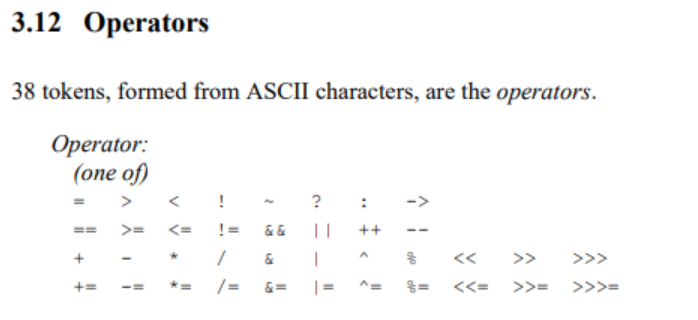

运算符的分类：

* 按照功能分：算术运算符、赋值运算符、比较运算符、逻辑运算、条件运算符、Lambda运算符

|        分类         |                        运算符                        |
| :-----------------: | :--------------------------------------------------: |
|  算术运算符（7个）  |                +、-、*、/、%、++、--                 |
| 赋值运算符（12个）  | =、+=、-=、*=、/=、%=、>>=、<<=、>>>=、&=、\|=、^=等 |
|  关系运算符（6个）  |                 >、>=、<、<=、==、!=                 |
|  逻辑运算符（6个）  |                &、\|、^、!、&&、\|\|                 |
|  条件运算符（2个）  |               (条件表达式)? 结果1: 结果2               |
|   位运算符（7个）   |               &、\|、^、~、<<、>>、>>>               |
| Lambda运算符（1个） |                     ->（后面学）                     |

* 按照操作数个数分：一元运算符（单目运算符）、二元运算符（双目运算符）、三元运算符 （三目运算符）

|           分类            |                  运算符                  |
| :-----------------------: | :--------------------------------------: |
| 一元运算符（单目运算符）  |    正号（+）、负号（-）、++、--、!、~    |
| 二元运算符（双目运算符）  | 除了一元和三元运算符剩下的都是二元运算符 |
| 三元运算符 （三目运算符） |         (条件表达式)? 结果1: 结果2         |

### 1.1 算术运算符

Java中的算术运算符有如下几种：

|  算术运算符   |            符号解释             |
| :-----------: | :-----------------------------: |
| `+` | 加法运算，字符串连接运算，正号  |
| `-` |         减法运算，负号          |
| `*` |            乘法运算             |
| `/` | 除法运算，整数/整数结果还是整数 |
| `%` | 求余运算，余数的符号只看被除数  |
| `++` 、 `--` |          自增自减运算           |

了解了Java中的算术运算符之后，下面我们到IDEA中去使用一下：

```java
/*
    算术运算符
 */
public class OperatorDemo {
    public static void main(String[] args) {
        //定义两个int类型的变量
        int a = 6;
        int b = 4;

        System.out.println(a + b);//10
        System.out.println(a - b);//2
        System.out.println(a * b);//24
        System.out.println(a / b);//1.5? 1
        System.out.println(a % b);//2

        //整数相除只能得到整数，要想得到小数，必须有浮点数的参与
        System.out.println(6.0 / 4);
        
        //余数的符号只看被除数
        System.out.println(5%2);//1
		System.out.println(5%-2);//1
		System.out.println(-5%2);//-1
		System.out.println(-5%-2);//-1
		//商*除数 + 余数 = 被除数
		//5%-2  ==>商是-2，余数时1    (-2)*(-2)+1 = 5
		//-5%2  ==>商是-2，余数是-1   (-2)*2+(-1) = -4-1=-5
    }
}

```

最后，我们来总结一下，刚才在演示代码的时候有两个注意事项：

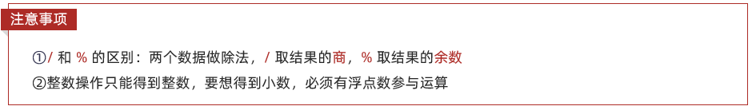

	

讲解完毕后，大家赶快动手练习一下吧。

### 1.2 案例数值拆分

需求：定义一个三位数，将其拆分为个位、十位、百位后，输出在控制台

什么意思呢？下面我们举例来说明一下：

举例：int number = 123；

在控制台输出结果：

​	个位是：3

​	十位是：2

​	百位是：1

知道了要做什么后，下面我们来分析一下如何获取个位，十位，百位：

分析：

① 个位的计算：数值 % 10

​	123 除以 10（商12，余数为3）

② 十位的计算：数值 / 10 % 10

​	123 除以 10 （商12，余数为3，整数相除只能得到整数）

​	12 除以 10 （商1，余数为2）

③ 百位的计算：数值 / 10 / 10 % 10

​	123 / 10 / 10 % 10（123 / 10 得到12，12  / 10 得到1，1 % 10 得到 1）

分析完毕之后，下面我们到IDEA中去实现一下：

```java
/*
    需求：定义一个三位数，将其拆分为个位、十位、百位后，输出在控制台
 */
public class OperatorTest {
    public static void main(String[] args) {
        //定义一个三位数
        int number = 123;

        //获取个，十，百位数据
        int ge = number % 10;
        int shi = number / 10 % 10;
        int bai = number / 100 % 10;

        //输出结果
        System.out.println("个位是：" + ge);
        System.out.println("十位是：" + shi);
        System.out.println("百位是：" + bai);
    }
}
```

讲解完毕后，大家赶快动手练习一下吧。

### 1.3 +操作的三种情况

#### 1.3.1 数字相加(类型转换)

在Java程序中，数据参与运算，要求类型一致。这里就涉及到了数据的类型转换。而类型转换又分为两种：

1. 隐式转换（自动类型转换）
2. 强制转换（显示类型转换）

**隐式转换：**把一个表示数据范围小的数值或者变量赋值给另一个表示数据范围大的变量（将 `取值范围小的类型` 自动提升为 `取值范围大的类型` 。）

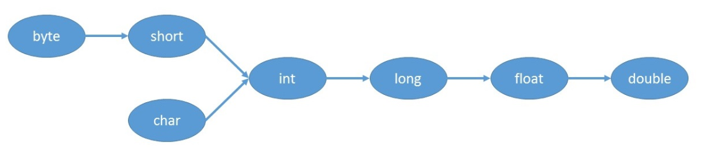

IDEA中代码演示如下：

```java
// （1）当把存储范围小的值（常量值、变量的值、表达式计算的结果值）赋值给了存储范围大的变量时。
int i = 'A';//char自动升级为int，其实就是把字符的编码值赋值给i变量了
double d = 10;//int自动升级为double

byte b = 127; //右边的整数常量值必须在-128~127范围内
//byte bigB = 130;//错误，右边的整数常量值超过byte范围
long num = 1234567; //右边的整数常量值如果在int范围呢，编译和运行都可以通过，这里涉及到数据类型转换
long bigNum = 12345678912L;//右边的整数常量值如果超过int范围，必须加L，否则编译不通过

//（2）当存储范围小的数据类型与存储范围大的数据类型一起混合运算时，会按照其中最大的类型运算。
int i = 1;
byte b = 1;
double d = 1.0;

double sum = i + b + d;//混合运算，升级为double

// （3）当byte,short,char数据类型进行算术运算时，按照int类型处理。
byte b1 = 1;
byte b2 = 2;
byte b3 = b1 + b2;//编译报错，b1 + b2自动升级为int

char c1 = '0';
char c2 = 'A';
System.out.println(c1 + c2);//113 
```

**强制转换：**把一个表示数据范围大的数值或者变量赋值给另一个表示数据范围小的变量（将 `取值范围大的类型` 强制转换成 `取值范围小的类型` 。 比较而言，自动转换是Java自动执行的，而强制转换需要我们自己手动执行。）

格式：数据类型 变量名 = (目标数据类型)(数值或者变量)

IDEA中代码演示如下：

```java
//（1）当把存储范围大的值（常量值、变量的值、表达式计算的结果值）赋值给了存储范围小的变量时，需要强制类型转换，提示：有风险，可能会损失精度或溢出
int i = (int)3.14;//提示：有风险，损失精度

double d = 1.2;
int num = (int)d;//提示：有风险，损失精度

int i = 200;
byte b = (byte)i;//提示：有风险，溢出

// （2）当某个值想要提升数据类型时，也可以使用强制类型转换
int i = 1;
int j = 2;
double shang = (double)i/j; // 提示：这个情况的强制类型转换是没有风险的。
```

讲解完毕后，大家赶快动手练习一下吧。

#### 1.3.2 字符相加

来，继续啊，这里我们再来说一下字符参与+操作。

IDEA中代码演示如下：

```java
/*
    字符相加
 */
public class OperatorDemo02 {
    public static void main(String[] args) {
        //定义两个变量
        int i = 10;
        char ch = 'A';//'A'的值是65
        ch = 'a';//'a'的值是97
        ch = '0';//'0'的值是48
        System.out.println(i + ch);
        
        // 任意数据类型的数据与String类型进行“+”运算时，结果一定是String类型
        System.out.println("" + 1 + 2);//12
        
        // 但是String类型不能通过强制类型()转换，转为其他的类型
        String str = "123";
        int num = (int)str;//错误的
        int num = Integer.parseInt(str);//后面才能讲到，借助包装类的方法才能转
    }
}
```

字符参与+操作，其实就是拿字符在计算机底层对应的数值来进行计算的，这里我们了解一下英文大小写字符和数字字符对应的数据值：

* ‘A’  65  A-Z是连续的
* ‘a’  97  a-z是连续的
* ‘0’  48  0-9是连续的

这里也给大家准备了一张ASCII码表，里面有常用的字符及其对应的数值关系：

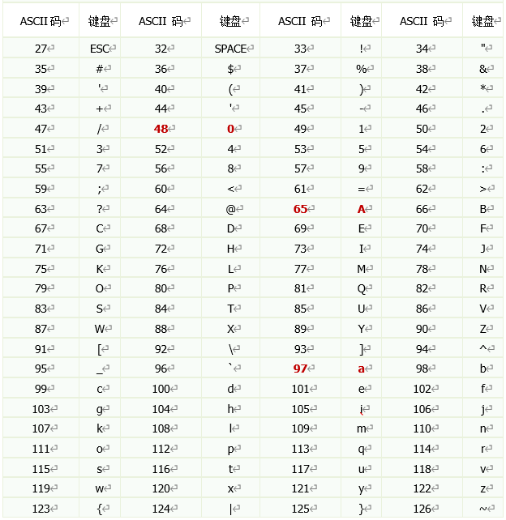

#### 1.3.3 字符串相加

接下来，我们继续讲解字符串相加，先到IDEA中去讲解，然后再回来总结。

IDEA中代码演示如下：

```java
/*
    字符串相加
 */
public class OperatorDemo03 {
    public static void main(String[] args) {
        System.out.println("it" + "malu");
        System.out.println("malu" + 666);
        System.out.println(666 + "malu");

        System.out.println("malu" + 6 + 66);
        System.out.println(1 + 99 + "年malu");
    }
}

```

总结：

* 当“+”操作中出现字符串时，这个“+”是字符串连接符，而不是算术运算
  + “malu”+ 666
* 当连续进行“+”操作时，从左到右逐个执行
  + 1 + 9999 + “malu”

讲解完毕后，大家赶快动手练习一下吧。

### 1.4 自加自减运算符

**理解：**`++`**运算，变量自己的值加1**。反之， `--` 运算，变量自己的值减少1，用法与 `++` 一致。

1、单独使用

* 变量在单独运算的时候，变量`前++`和变量`后++`，变量的是一样的；
* 变量`前++`   ：例如 `++a` 。
* 变量`后++`   ：例如 `a++` 。

```java
public class OperatorDemo3 {
	public static void main(String[] args) {
		// 定义一个int类型的变量a
		int a = 3;
		//++a;
		a++;
        // 无论是变量前++还是变量后++，结果都是4
		System.out.println(a);
	}
}
```

2、复合使用

* 和`其他变量放在一起使用`或者和`输出语句放在一起使用`，`前++`和`后++`就产生了不同。

* 变量`前++` ：变量先自身加1，然后再取值。
* 变量`后++` ：变量先取值，然后再自身加1。

```java
public class OperatorDemo03 {
	public static void main(String[] args) {
		// 其他变量放在一起使用
		int x = 3;
		//int y = ++x; // y的值是4，x的值是4，
		int y = x++; // y的值是3，x的值是4
		
		System.out.println(x);
		System.out.println(y);
		System.out.println("==========");
        
		// 和输出语句一起
		int z = 5;
		//System.out.println(++z);// 输出结果是6，z的值也是6
		System.out.println(z++);// 输出结果是5，z的值是6
		System.out.println(z);
        
        int a = 1;
        a = a++;//(1)先取a的值“1”放操作数栈(2)a再自增,a=2(3)再把操作数栈中的"1"赋值给a,a=1

        int i = 1;
        int j = i++ + ++i * i++;
        /*
        从左往右加载
        (1)先算i++
        ①取i的值“1”放操作数栈
        ②i再自增 i=2
        （2）再算++i
        ①i先自增 i=3
        ②再取i的值“3”放操作数栈
        （3）再算i++
        ①取i的值“3”放操作数栈
        ②i再自增 i=4
        （4）先算乘法
        用操作数栈中3 * 3 = 9，并把9压会操作数栈
        （5）再算求和
        用操作数栈中的 1 + 9 = 10
        （6）最后算赋值
        j = 10
        */
	} 
}
```

* 小结：
  + **++在前，先自加，后使用；**
  + **++在后，先使用，后自加。**

### 1.5 关系运算符/比较运算符

| 关系运算符 |                           符号解释                           |
| :--------: | :----------------------------------------------------------: |
| `<` |  比较符号左边的数据是否小于右边的数据，如果小于结果是true。  |
| `>` |  比较符号左边的数据是否大于右边的数据，如果大于结果是true。  |
| `<=` | 比较符号左边的数据是否小于或者等于右边的数据，如果大于结果是false。 |
| `>=` | 比较符号左边的数据是否大于或者等于右边的数据，如果小于结果是false。 |
| `==` |          比较符号两边数据是否相等，相等结果是true。          |
| `！=` |     不等于符号 ，如果符号两边的数据不相等，结果是true。      |

* 比较运算符，是两个数据之间进行比较的运算，运算结果一定是boolean值`true`或者`false` 。
* 其中>, <, >=, <=不支持boolean，String类型，==和!=支持boolean和String。

```java
public class OperatorDemo05 {
	public static void main(String[] args) {
		int a = 3;
		int b = 4;

		System.out.println(a < b); // true
		System.out.println(a > b); // false
		System.out.println(a <= b); // true
		System.out.println(a >= b); // false
		System.out.println(a == b); // false
		System.out.println(a != b); // true
	}
}
```

### 1.6 逻辑运算符

* 逻辑运算符，是用来连接两个布尔类型结果的运算符（`!`除外），运算结果一定是boolean值`true`或者`false`

| 逻辑运算符 |   符号解释   |               符号特点               |
| :--------: | :----------: | :----------------------------------: |
| `&` |    与，且    |          有 `false` 则 `false` |
| `|` |      或      |           有 `true` 则 `true` |
| `^` |     异或     |     相同为 `false` ，不同为 `true` |
| `!` |      非      | 非 `false` 则 `true` ，非 `true` 则 `false` |
| `&&` | 双与，短路与 |      左边为false，则右边就不看       |
| `||` | 双或，短路或 |       左边为true，则右边就不看       |

&&和&区别，||和|区别：

* **`&&`和`&`**区别：
  + `&&`和`&`结果一样，`&&`有短路效果，左边为false，右边不执行；`&`左边无论是什么，右边都会执行。
* **`||`和`|`**区别：
  + `||`和`|`结果一样，`||`有短路效果，左边为true，右边不执行；`|`左边无论是什么，右边都会执行。

```java
public class OperatorDemo06 {
	public static void main(String[] args) {
		int a = 3;
		int b = 4;
		int c = 5;

		// & 与，且；有false则false
		System.out.println((a > b) & (a > c)); 
		System.out.println((a > b) & (a < c)); 
		System.out.println((a < b) & (a > c)); 
		System.out.println((a < b) & (a < c)); 
		System.out.println("===============");
		// | 或；有true则true
		System.out.println((a > b) | (a > c)); 
		System.out.println((a > b) | (a < c)); 
		System.out.println((a < b) | (a > c));
		System.out.println((a < b) | (a < c));
		System.out.println("===============");
		// ^ 异或；相同为false，不同为true
		System.out.println((a > b) ^ (a > c));
		System.out.println((a > b) ^ (a < c)); 
		System.out.println((a < b) ^ (a > c)); 
		System.out.println((a < b) ^ (a < c)); 
		System.out.println("===============");
		// ! 非；非false则true，非true则false
		System.out.println(!false);
		System.out.println(!true);
        
        //&和&&的区别
        System.out.println((a > b) & (a++ > c)); 
        System.out.println("a = " + a);
        System.out.println((a > b) && (a++ > c)); 
        System.out.println("a = " + a);
        System.out.println((a == b) && (a++ > c)); 
        System.out.println("a = " + a);
        
        //|和||的区别
        System.out.println((a > b) | (a++ > c)); 
        System.out.println("a = " + a);
        System.out.println((a > b) || (a++ > c)); 
        System.out.println("a = " + a);
        System.out.println((a == b) || (a++ > c)); 
        System.out.println("a = " + a);
	}
}
```

```java
/*
3、逻辑运算符
逻辑与：&
	true & true 结果是true
	true & false 结果是false
	false & true 结果是false
	false & false 结果是false
	
	只有两个边都是true，结果才为true。

逻辑或：|
	true | true 结果是true
	true | false 结果是true
	false | true 结果是true
	false | false 结果是false
	
	只要有一边是true，结果就为true。
	
逻辑非：!
	!true  变为false
	!false 变为true
	
逻辑异或：^
	true | true 结果是false
	true | false 结果是true
	false | true 结果是true
	false | false 结果是false
	
	只有两边不一样，一个是true，一个是false，结果才为true。
	
短路与：&&
	true && true 结果是true
	true && false 结果是false
	false && ? 结果是false
	false && ? 结果是false
	
	只有两个边都是true，结果才为true。
	但是它如果左边已经是false，右边不看。这样的好处就是可以提高效率。

	
短路或：||
	true || ？ 结果是true
	true || ？ 结果是true
	false || true 结果是true
	false || false 结果是false
	
	只要有一边是true，结果就为true。
	但是它如果左边已经是true，右边就不看了。这样的好处就是可以提高效率。

特殊：
（1）逻辑运算符的操作数必须是boolean值
（2）逻辑运算符的结果也是boolean值

*/
public class LogicOperator{
	public static void main(String[] args){
		/*
		表示条件，成绩必须在[0,100]之间
		成绩是int类型变量score
		*/
		int score = 56;
		
		//System.out.println(0<=score<=100);
		/*
		LogicOperator.java:23: 错误: 二元运算符 '<=' 的操作数类型错误
                System.out.println(0<=score<=100);
                                           ^
		  第一个类型:  boolean    0<=score的结果 true
		  第二个类型: int
		  
		  true <= 100？不对的
		1 个错误*/
		
		System.out.println(0<=score  & score<=100);
		
	}
}
```

### 1.7 条件运算符

* 条件运算符格式：

```java
条件表达式？结果1：结果2
```

* 条件运算符计算方式：
  + 条件判断的结果是true，条件运算符整体结果为结果1，赋值给变量。
  + 判断条件的结果是false，条件运算符整体结果为结果2，赋值给变量。

```java
public class ConditionOperator{
	public static void main(String[] args){
		//判断两个变量a,b谁大，把大的变量赋值给max
		int a = 2;
		int b = 2;
		int max = a >= b ? a : b;
		//如果a>=b成立，就取a的值赋给max，否则取b的值赋给max
		System.out.println(max);
		
		boolean marry = false;
		System.out.println(marry ? "已婚" : "未婚"  );
	}
}
```

### 1.8 赋值运算符

下面呢，我们来学习赋值运算符。

| 运算符 |                           符号解释                           |
| :----: | :----------------------------------------------------------: |
|   =    |      将右边的常量值/变量值/表达式的值，赋值给左边的变量      |
|   +=   | 将左边变量的值和右边的常量值/变量值/表达式的值进行相加，最后将结果赋值给左边的变量 |
|   -=   | 将左边变量的值和右边的常量值/变量值/表达式的值进行相减，最后将结果赋值给左边的变量 |
|   *=   | 将左边变量的值和右边的常量值/变量值/表达式的值进行相乘，最后将结果赋值给左边的变量 |
|   /=   | 将左边变量的值和右边的常量值/变量值/表达式的值进行相除，最后将结果赋值给左边的变量 |
|   %=   | 将左边变量的值和右边的常量值/变量值/表达式的值进行相模，最后将结果赋值给左边的变量 |
|  <<=   | 将左边变量的值左移右边常量/变量值/表达式的值的相应位，最后将结果赋值给左边的变量 |
|  >>=   | 将左边变量的值右移右边常量/变量值/表达式的值的相应位，最后将结果赋值给左边的变量 |
|  >>>=  | 将左边变量的值无符号右移右边常量/变量值/表达式的值的相应位，最后将结果赋值给左边的变量 |
|   &=   | 将左边变量的值和右边的常量值/变量值/表达式的值进行按位与，最后将结果赋值给左边的变量 |
|  \|=   | 将左边变量的值和右边的常量值/变量值/表达式的值进行按位或，最后将结果赋值给左边的变量 |
|   ^=   | 将左边变量的值和右边的常量值/变量值/表达式的值进行按位异或，最后将结果赋值给左边的变量 |

```java
public class OperatorDemo04 {
	public static void main(String[] args) {
		int a = 3;
		int b = 4;
        int c = a + b;        
        
		b += a;// 相当于 b = b + a ; 
		System.out.println(a); // 3
		System.out.println(b); // 7	
        System.out.println(c); //7
		
		short s = 3;
		// s = s + 4; 代码编译报错，因为将int类型的结果赋值给short类型的变量s时，可能损失精度
		s += 4; // 代码没有报错
        //因为在得到int类型的结果后，JVM自动完成一步强制类型转换，将int类型强转成short
		System.out.println(s);
        
        int j = 1;
		j += ++j * j++;//相当于  j = j + (++j * j++);
		System.out.println(j);//5
        
        int m = 1;
        m <<= 2;
        System.out.println(m);
	}
}
```

* 扩展赋值运算符在**将最后的结果赋值给左边的变量前，多做了一步强制类型转换**。
* 注意：所有的赋值运算符的=左边一定是一个变量

### 1.9 运算符优先级

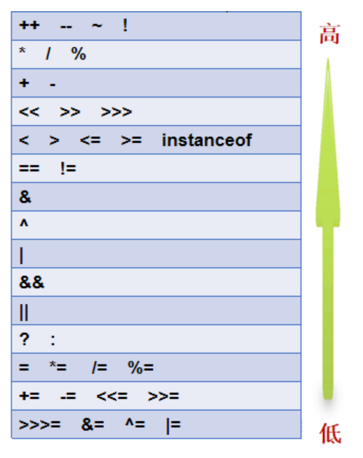

提示说明：

（1）表达式不要太复杂

（2）先算的使用()

口诀：

* 单目运算排第一；

* 乘除余二加减三；

* 移位四，关系五；

* 等和不等排第六；

* 位与、异或和位或；

* 短路与和短路或；

* 依次从七到十一；

* 条件排在第十二；

* 赋值一定是最后；

讲解完毕后，大家赶快动手练习一下吧。

### 1.10 标点符号

在Java中一共有12个标点符号。（后面再一一学习）

* 小括号()用于强制类型转换、表示优先运算表达式、方法参数列表
* 大括号{}用于数组元素列表、类体、方法体、复合语句代码块边界符
* 中括号[]用于数组
* 分号; 用于结束语句
* 逗号, 用于多个赋值表达式的分隔符和方法参数列表分隔符
* 英文句号. 用于成员访问和包目录结构分隔符
* 英文省略号... 用于可变参数
* @用于注解
* 双冒号:: 用于方法引用

## 2：选择语句

### 2.1 什么是表达式和语句

常量、变量代表数据。由变量或常量 + 运算符构成的计算表达式。但其实表达式一共分为三种：

（1）变量或常量 + 运算符构成的计算表达式

（2）new 表达式，结果是一个数组或类的对象。（后面讲）

（3）方法调用表达式，结果是方法返回值或void（无返回值）。（后面讲）

程序的功能是由语句来完成的，语句分为单语句和复合语句。单语句又分为：

（1）空语句，什么功能都没有。它就是单独的一个分号；（==需要避免==）

（2）表达式语句，就是表达式后面加分号; 

不是所有表达式加分号都能称为一个独立的语句的，只有以下三种表达式加上分号才能构成一个独立的语句。

（1）new表达式

（2）方法调用表达式

（3）计算表达式中的赋值表达式、自增自减表达式

演示如下：

```java
//空语句
;

//表达式语句
i++; //自增表达式 + ;
System.out.println("hello");  //方法调用表达式 + ;
```

复合语句分为：

（1）分支语句：if...else，switch...case

（2）循环语句：for, while, do...while

（3）跳转语句：break, continue, return, throw

（4）try语句：try...catch...finally（后面学习）

（5）同步语句：synchronized（后面学习）

不同的语句执行顺序和效果是不同的，下面我们一一学习它们。不同的语句对应不对的结构，如下：

**顺序结构：**从上往下，依次执行

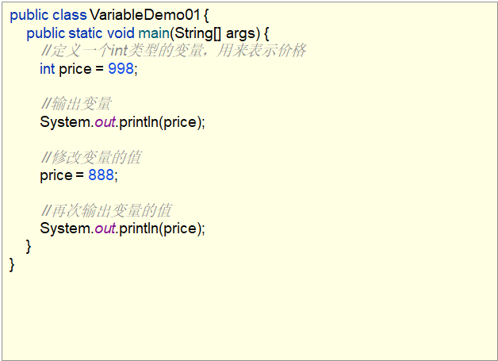

**选择结构：**

QQ界面的登录，填写账号和密码正确，展示好友列表界面。填写账号或者密码有误，提示：你输入的账号或密码不正确。

这就是通过选择结构来实现的，实际开发中，类似这种逻辑判断的情况非常常见。

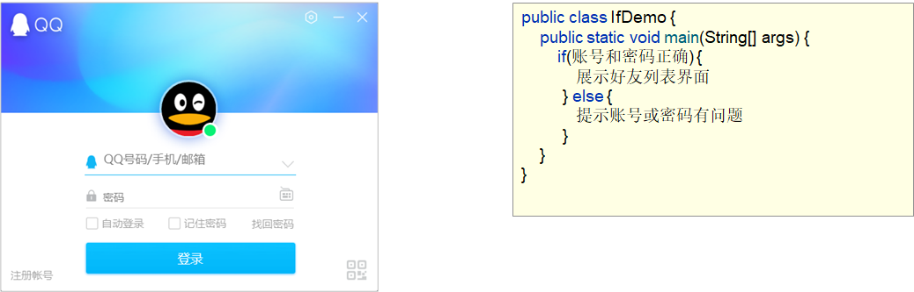

**循环结构：**

比如说，京东商城中，查询手机数据，京东就会返回给你一堆符合你查询要求的数据。

假如，每一部手机数据的展示需要5行代码，如果最终返回了1000部手机，你就需要编写5000行代码来实现数据展示。

这样就太麻烦了，那么，有没有一种流程语句，能够简化这种操作呢？答案肯定是有的，就是我们的循环结构，它就可以通过一个比较简单的结构来控制我们的手机展示1000次。

比如说，带着这样写就可以了，这就是循环结构。

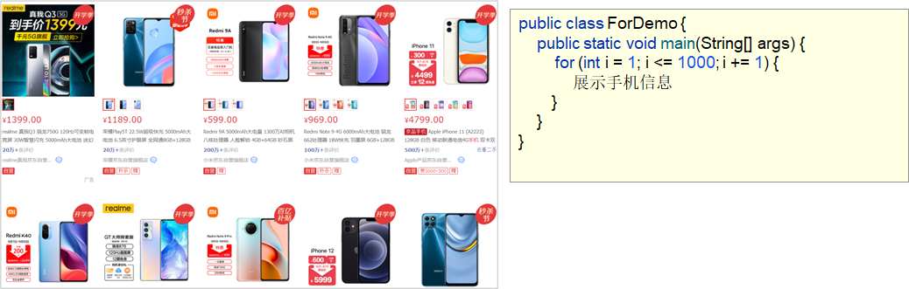

首先，我们来学习顺序结构

### 2.1 顺序结构

**顺序结构：**顺序结构就是程序从上到下逐行地执行。表达式语句都是顺序执行的。并且上一行对某个变量的修改对下一行会产生影响。

**执行流程图：**

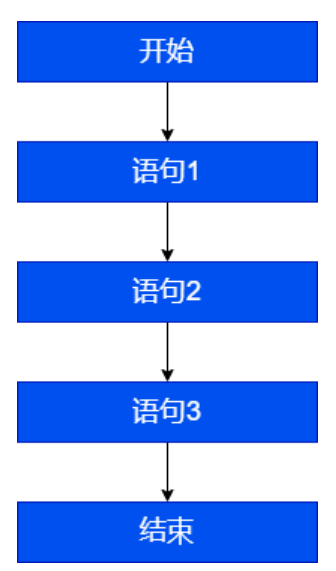

了解完顺序结构后，下面我们到IDEA中去演示一下：

```java
/*
    顺序结构语句
 */
public class OrderDemo {
    public static void main(String[] args) {
		int x = 1;
		int y = 2;
		System.out.println("x = " + x);		
        System.out.println("y = " + y);	
        //对x、y的值进行修改
        x++;
        y = 2 * x + y;
        x = x * 10;	
        System.out.println("x = " + x);
        System.out.println("y = " + y);
    }
}
```

这个比较简单，也没什么好练习的。就不练了，我们继续往下学习。

### 2.2 Debug的基本使用

为了帮助大家更好的理解程序的执行流程，我们来学习Debug，那什么是Debug呢？

**Debug：**是供程序员使用的程序调试工具，它可以用于查看程序的执行流程，也可以用于追踪程序执行过程来调试程序

它的两大作用，查看程序执行流程，调试程序。由于目前我们每个程序的代码内容还比较少，

所以，今天重点掌握查看程序执行流程，当代码复杂的时候，我们需要通过debug来调试程序。那么，debug操作的流程是什么样子的呢？

在讲解操作流程前，我们来说一下：

Debug，又被称为<font color='red'>**断点调试**</font>，断点其实是一个标记，告诉我们从哪里开始查看

知道了Debug被称为断点调试后，我们来讲一下Debug的操作流程：

① 如何加断点

选择要设置断点的代码行，在行号的区域后面单击鼠标左键即可。如图

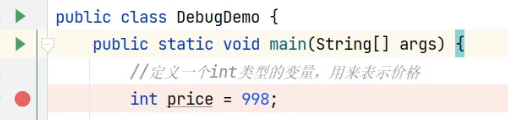

② 如何运行加了断点的程序

在代码区域右键Debug执行

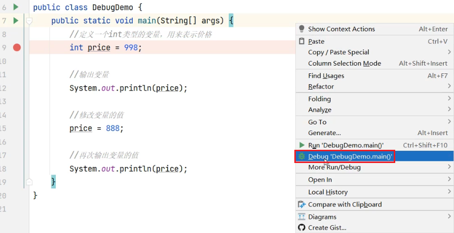

③ 看哪里

看Debugger窗口，看Console窗口

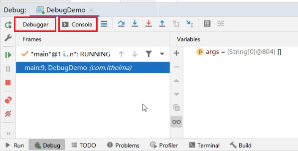

④ 点哪里

点(Step Over F8) 开始，点(Stop)结束

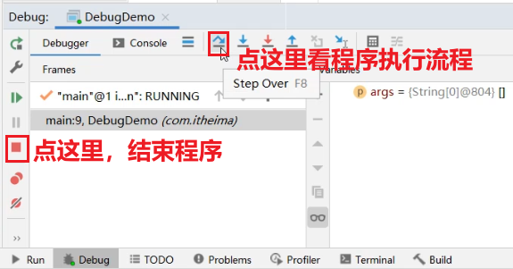

⑤ 如何删除断点

选择要删除的断点，单击鼠标左键即可。也就是把第一步的动作，再做一次即可。

总结一下，Debug的使用流程：

①如何加断点：选择要设置断点的代码行，在行号的区域后面单击鼠标左键即可

②如何运行加了断点的程序：在代码区域右键Debug执行

③看哪里：看Debugger窗口，看Console窗口

④点哪里：点(Step Over F8) 开始，点(Stop)结束

⑤如何删除断点：选择要删除的断点，单击鼠标左键即可

讲解完毕后，大家赶快动手练习一下吧。

通过Debug的方式看一下，如下代码的执行流程：

```java
/*
    Debug查看程序执行流程
 */
public class DebugDemo {
    public static void main(String[] args) {
        //定义一个int类型的变量，用来表示价格
        int price = 998;

        //输出变量
        System.out.println(price);

        //修改变量的值
        price = 888;

        //再次输出变量的值
        System.out.println(price);
    }
}
```

### 2.4 输入输出语句

#### 2.4.1 输出语句

两种常见的输出语句（基础阶段常用）

* 换行输出语句 
* 不换行输出语句

演示如下：

```java
public class TestPrintlnAndPrint {
    public static void main(String[] args) {
        String name = "admin";
        int age = 18;

        // System.out.println(输出内容);//输出内容之后，紧接着换行
        // System.out.print(输出内容);////输出内容之后不换行
        
        //对比如下两组代码：
        System.out.println(name);
        System.out.println(age);

        System.out.print(name);
        System.out.print(age);
        System.out.println(); //()里面为空，效果等同于换行，输出一个换行符
        //等价于 System.out.print("\n"); 或  System.out.print('\n');
        //System.out.print();//错误，()里面不能为空   核心类库PrintStream类中没有提供print()这样的方法

        //对比如下两组代码：
        System.out.print("姓名：" + name +",");//""中的内容会原样显示
        System.out.println("年龄：" + age);//""中的内容会原样显示

        System.out.print("name = " + name + ",");
        System.out.println("age = " + age);
    }
}
```

注意事项：

* 换行输出语句，括号内可以什么都不写，只做换行处理
* 不换行输出语句，括号内什么都不写的话，编译报错
* 如果()中有多项内容，那么必须使用 + 连接起来
* 如果某些内容想要原样输出，就用""引起来，而要输出变量中的内容，则不要把变量名用""引起来

还有一种输出，叫格式化输出，暂时先了解。

* %d：十进制整数
* %f：浮点数
* %c：单个字符
* %b：boolean值
* %s：字符串
* ....

演示代码如下：

```java
public class TestPrintf {
    public static void main(String[] args) {
        byte b = 127;
        int age = 18;
        long bigNum = 123456789L;
        float weight = 123.4567F;
        double money = 589756122.22552;
        char gender = '男';
        boolean marry = true;
        String name = "张三";
        System.out.printf("byte整数：%d，年龄：%d，大整数：%d，身高：%f，身高：%.1f，钱：%f，钱：%.2f，性别：%c，婚否：%b，姓名：%s", b,age,bigNum,weight,weight,money,money,gender,marry,name);
    }
}
```

#### 2.4.2 输入语句

键盘输入代码的四个步骤：

1. 申请资源，创建Scanner类型的对象

2. 提示输入xx

3. 接收输入内容

4. 全部输入完成之后，释放资源，归还资源

输入各种类型的数据，演示代码如下：

```java
import java.util.Scanner;

/*
控制台键盘输入：
1、先声明一个Scanner类型的变量，并赋值一个对象
Scanner：是一个文本扫描仪类型，它的全名称是java.util.Scanner，它是核心类库中定义好的，可以直接用
Scanner是一个类，不是基本数据类型，是引用数据类型，所以必须给它赋值一个“对象”。

2、建议大家写，提示用户输入xx
不写不会错，不够“友好”

3、从控制台接收用户数的一个xx数据，并且赋值给合适的变量
int 变量 = input.nextInt();  //input是Scanner类型的变量，上面叫什么名，下面就用什么名
double 变量 = input.nextDouble();
long 变量 = input.nextLong();
boolean 变量 = input.nextBoolean();
String 变量 = input.next();
char 变量 = input.next().charAt(0);

如果要接收数据的变量的数据类型和用户输入的数据的数据类型不符合，会报 InputMisMatchException输入不匹配错误

4、关闭IO流
 */
public class TestInput {
    public static void main(String[] args) {
        //全名称使用法
//        java.util.Scanner input = new java.util.Scanner(System.in);

        Scanner input = new Scanner(System.in);
        //这句代码唯一可以改的是input，它是一个变量名

        System.out.print("请输入一个整数：");//先执行，先显示这句话
        int num = input.nextInt();//接收键盘输入， 它们有顺序要求
        System.out.println("num = " + num);
        
        System.out.print("请输入一个小数：");
        double d = input.nextDouble();
        System.out.println("d = " + d);

        System.out.print("请输入一个布尔值：");
        boolean b = input.nextBoolean();
        System.out.println("b = " + b);

        System.out.print("请输入一个大整数");
        long big = input.nextLong();
        System.out.println("big = " + big);

        System.out.print("请输入一个字符串");
        String str = input.next();
        System.out.println("str = " + str);

        System.out.print("请输入单个字符：");
        char c = input.next().charAt(0);
        /*
        input.next()：接收一个字符串，很多个字符
        input.next().charAt(0)：表示从多个字符中取1个字符，取第1个

        charAt(0）：表示取一个字符串的第1个
        charAt(1）：表示取一个字符串的第2个
        charAt(2）：表示取一个字符串的第3个
        ...
        如果输入的字符串的个数少于你要获取的位置，就报错StringIndexOutOfBoundsException字符串下标越界
         */
        System.out.println("c = " + c);

        input.close();//建议大家记得它，代码没有错误，但是会造成JVM以外的操作系统相关内存没有得到是否
    }
}
```

next()与nextLine()的区别，演示如下：

```java
import java.util.Scanner;

/*
键盘输入：
    next()与nextLine()的区别？

    next()，读取输入的数据时，遇到空格等空白字符，就认为本次数据输入结束
    nextLine()，读取输入的数据时，遇到回车换行才认为结束

    上一个接收输入的语句是nextInt()，next()，nextDouble()....
    下一个紧接着的接收输入的语句是nextLine()
    这个时间发现第二个输入语句，还没有输入呢，就结束了。

    因为：nextInt()，next()，nextDouble()....它没有读取 回车换行符，数据通道（IO流）中还有回车换行符，
    那么下一个nextLine()，一看通道中有 回车换行符，就以为输入结束了。

结论：
    如果字符串中不会包含空格，那么建议大家使用next()更好。
    如果字符串中想要包含空格，那么nextLine()的前面还有其他输入的话，加一句input.nextLine()把前面的回车换行读取掉。

 */
public class TestNextAndNextLine {
    public static void main(String[] args) {
        Scanner input = new Scanner(System.in);
        
        System.out.print("请输入年龄：");
        int age = input.nextInt();
        System.out.println("age = " + age);
        input.nextLine();//左边不用变量不用接收，目的只是把年龄后面的回车换行符读取掉
                        //当下面name用的是nextLine()，就需要加这句代码，如果下面name用的是next()就不用加这句代码。

        System.out.print("请输入一个姓名：");
        String name = input.nextLine();
        /*
        next()方法：
        张三              name = "张三";
        张 三，认为张后面空格，就是结束了，而不是回车换行结束  name = "张";

        nextLine()方法：
        张三
        张  三
        都可以接收
         */

        System.out.println("name = " + name);

        input.close();
    }
}
```

### 3.4.1 单分支条件判断：if

* **if语句第一种格式：** if

```java
if(条件表达式)｛
  	语句体;
｝
```

* **执行流程**

  + 首先判断条件表达式看其结果是true还是false
* 如果是true就执行语句体
  + 如果是false就不执行语句体

  

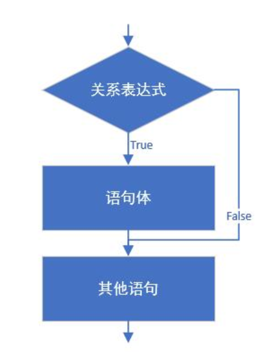

案例：从键盘第一个小的整数赋值给small，第二个大的整数赋值给big，如果输入的第一个整数大于第二个整数，就交换。输出显示small和big变量的值。

```java
import java.util.Scanner;

public class Test09If {
    public static void main(String[] args) {
        Scanner input = new Scanner(System.in);

        System.out.print("请输入第一个整数：");
        int small = input.nextInt();

        System.out.print("请输入第二个整数：");
        int big = input.nextInt();

        if (small > big) {
            int temp = small;
            small = big;
            big = temp;
        }
        System.out.println("small=" + small + ",big=" + big);

        input.close();
    }
}
```

### 3.4.2 双分支条件判断：if...else

* **if语句第二种格式：** if...else

```java
if(关系表达式) { 
  	语句体1;
}else {
  	语句体2;
}
```

* 执行流程

  + 首先判断关系表达式看其结果是true还是false

  + 如果是true就执行语句体1

  + 如果是false就执行语句体2
  

    

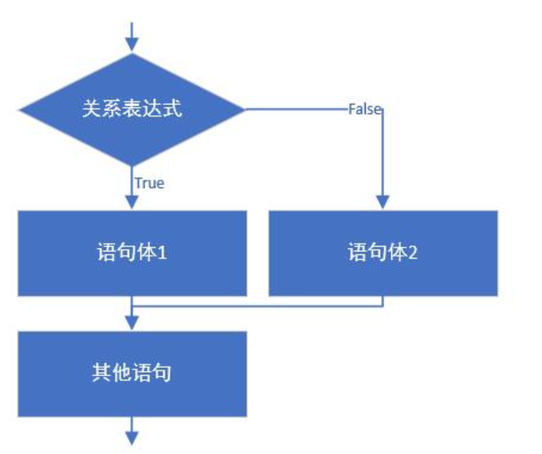

  

    

  

    

  

案例：从键盘输入一个整数，判定是偶数还是奇数    

```java
import java.util.Scanner;

public class Test10IfElse {
    public static void main(String[] args){
        // 判断给定的数据是奇数还是偶数
        Scanner input = new Scanner(System.in);

        System.out.print("请输入整数：");
        int a = input.nextInt();

        if(a % 2 == 0) {
            System.out.println(a + "是偶数");
        } else{
            System.out.println(a + "是奇数");
        }

        input.close();
    }
}
```

### 3.4.3 多分支条件判断：if...else if

* **if语句第三种格式：** if...else if ...else

```java
if (判断条件1) {
  	执行语句1;
} else if (判断条件2) {
  	执行语句2;
}
...
}else if (判断条件n) {
 	执行语句n;
} else {
  	执行语句n+1;
}
```

* **执行流程**

  + 首先判断关系表达式1看其结果是true还是false
* 如果是true就执行语句体1，然后结束当前多分支
  + 如果是false就继续判断关系表达式2看其结果是true还是false
* 如果是true就执行语句体2，然后结束当前多分支
  + 如果是false就继续判断关系表达式…看其结果是true还是false
* …
  + 如果没有任何关系表达式为true，就执行语句体n+1，然后结束当前多分支。

  

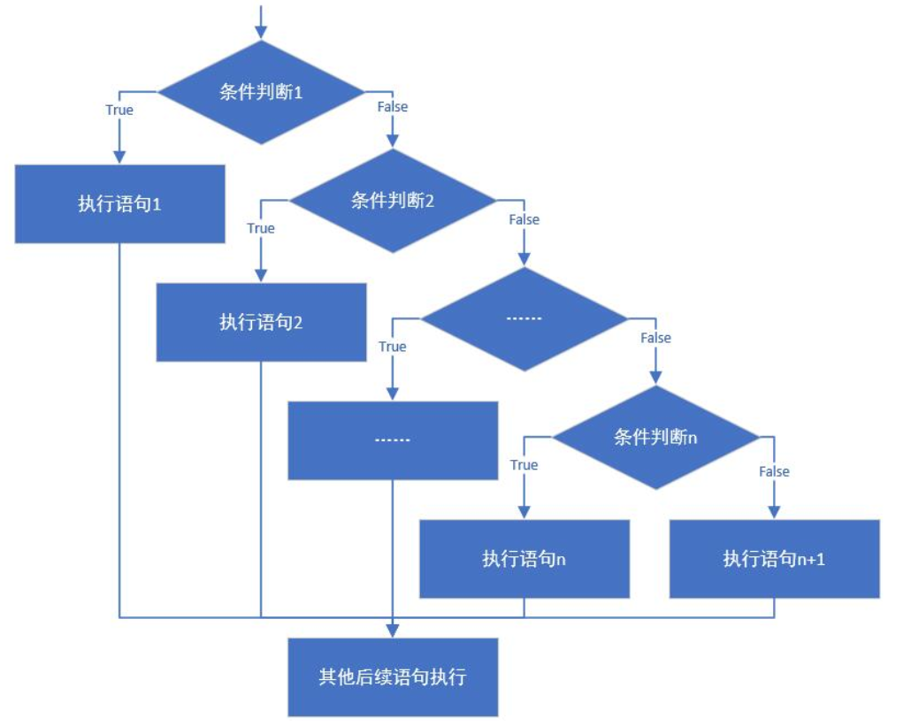

案例：通过指定考试成绩，判断学生等级，成绩范围[0, 100]

* 90-100      优秀
* 80-89        好
* 70-79        良
* 60-69        及格
* 60以下    不及格

```java
import java.util.Scanner;

public class Test11IfElseIf {
    public static void main(String[] args) {
        Scanner input = new Scanner(System.in);
        System.out.print("请输入成绩[0,100]：");
        int score = input.nextInt();

        if(score<0 || score>100){
            System.out.println("你的成绩是错误的");
        }else if(score>=90 && score<=100){
            System.out.println("你的成绩属于优秀");
        }else if(score>=80 && score<90){
            System.out.println("你的成绩属于好");
        }else if(score>=70 && score<80){
            System.out.println("你的成绩属于良");
        }else if(score>=60 && score<70){
            System.out.println("你的成绩属于及格");
        }else {
            System.out.println("你的成绩属于不及格");
        }
        
        input.close();
    }
}

```

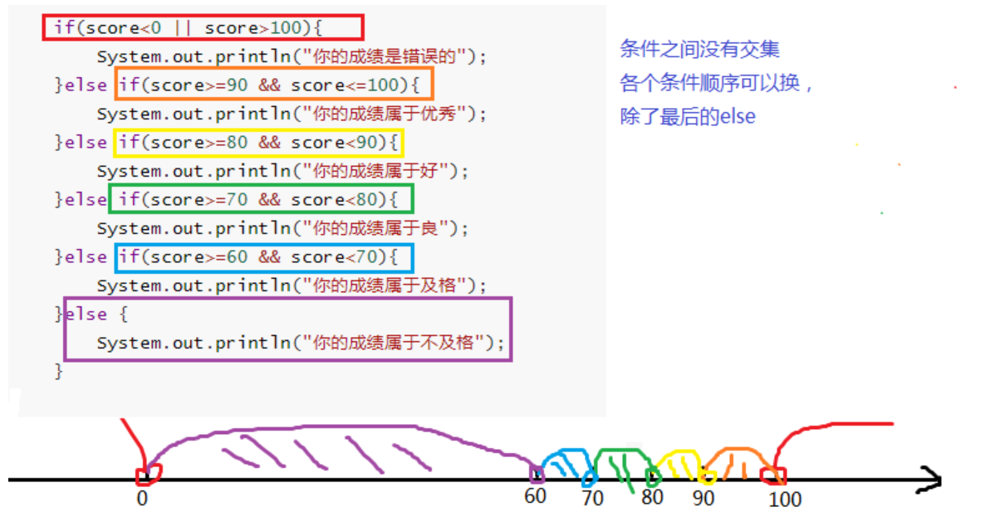

```java
import java.util.Scanner;

public class Test11IfElseIf {
    public static void main(String[] args) {
        Scanner input = new Scanner(System.in);
        System.out.print("请输入成绩[0,100]：");
        int score = input.nextInt();

        if(score<0 || score>100){
            System.out.println("你的成绩是错误的");
        }else if(score>=90){
            System.out.println("你的成绩属于优秀");
        }else if(score>=80){
            System.out.println("你的成绩属于好");
        }else if(score>=70){
            System.out.println("你的成绩属于良");
        }else if(score>=60){
            System.out.println("你的成绩属于及格");
        }else {
            System.out.println("你的成绩属于不及格");
        }

        input.close();
    }
}

```

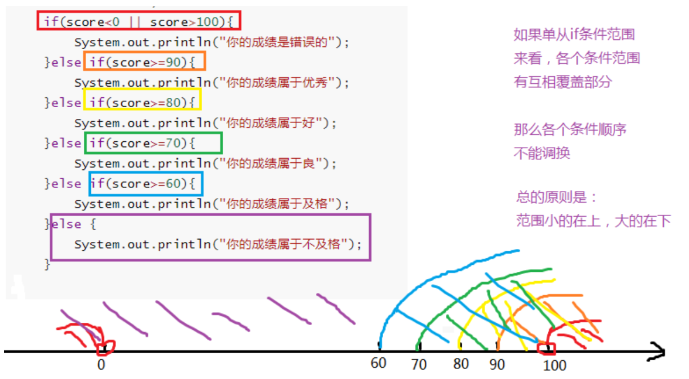

### 3.4.4 if..else嵌套

在if的语句块中，或者是在else语句块中，
又包含了另外一个条件判断（可以是单分支、双分支、多分支）

执行的特点：
（1）如果是嵌套在if语句块中的
只有当外部的if条件满足，才会去判断内部的条件
（2）如果是嵌套在else语句块中的
只有当外部的if条件不满足，进入else后，才会去判断内部的条件

案例：从键盘输入一个年份值和月份值，输出该月的总天数

要求：年份为正数，月份1-12。

例如：输入2022年5月，总天数是31天。

​          输入2022年2月，总天数是28天。

​		 输入2020年2月，总天数是29天。

```java
import java.util.Scanner;

public class Test12NestIfElse {
    public static void main(String[] args){
        //从键盘输入一个年份和月份
        Scanner input = new Scanner(System.in);

        System.out.print("年份：");
        int year = input.nextInt();

        System.out.print("月份：");
        int month = input.nextInt();

        if(year>0){
            if(month>=1 && month<=12){
                //合法的情况
                int days;
                if(month==2){
                    if(year%4==0 && year%100!=0 || year%400==0){
                        days = 29;
                    }else{
                        days = 28;
                    }
                }else if(month==4 || month==6  || month==9 || month==11){
                    days = 30;
                }else{
                    days = 31;
                }
                System.out.println(year+"年" + month + "月有" + days +"天");
            }else{
                System.out.println("月份输入不合法");
            }
        }else{
            System.out.println("年份输入不合法");
        }

        input.close();
    }
}
```

### 3.4.5 switch...case多分支选择结构

语法格式：

```java
switch(表达式){
    case 常量值1:
        语句块1;
        【break;】
    case 常量值2:
        语句块2;
        【break;】   
    。。。
   【default:
        语句块n+1;
        【break;】
     】
}
```

执行过程：

（1）入口

①当switch(表达式)的值与case后面的某个常量值匹配，就从这个case进入；

②当switch(表达式)的值与case后面的所有常量值都不匹配，寻找default分支进入; 不管default在哪里

（2）一旦从“入口”进入switch，就会顺序往下执行，直到遇到“出口”，即可能发生贯穿

（3）出口

①自然出口：遇到了switch的结束}

②中断出口：遇到了break等

> 注意：
>
> （1）switch(表达式)的值的类型，只能是：4种基本数据类型（byte, short, int, char），两种引用数据类型（JDK1.5之后枚举、JDK1.7之后String）
>
> （2）case后面必须是常量值，而且不能重复

#### 1、如何避免case穿透

案例：从键盘输入星期的整数值，输出星期的英文单词

```java
import java.util.Scanner;

public class Test13SwitchDemo1 {
    public static void main(String[] args) {
        //定义指定的星期
        Scanner input = new Scanner(System.in);
        System.out.print("请输入星期值：");
        int weekday = input.nextInt();

        //switch语句实现选择
        switch(weekday) {
            case 1:
                System.out.println("Monday");
                break;
            case 2:
                System.out.println("Tuesday");
                break;
            case 3:
                System.out.println("Wednesday");
                break;
            case 4:
                System.out.println("Thursday");
                break;
            case 5:
                System.out.println("Friday");
                break;
            case 6:
                System.out.println("Saturday");
                break;
            case 7:
                System.out.println("Sunday");
                break;
            default:
                System.out.println("你输入的星期值有误！");
                break;
        }

        input.close();
    }
}
```
