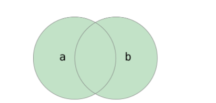

目标：https://yujingbo1023.github.io/xm/


## 一，初识CSS

### 1，认识CSS

CSS表示层叠样式表（Cascading Style Sheet，简称：CSS，又称为又称串样式列表、级联样式表、串接样式表、阶层式样式表）是为网页添加样式的代码。CSS并不是一门编程语言，是样式语言。作用就是进行网页布局和美化网页。

**版本**

* CSS2  CSS3    先学习CSS2   后面学习CSS3
* HTML1~5    前面也是先学习4  后面学习5

先快速体验一把CSS，css写在style标签中的，style标签是放在head标签里面，title标签下面，如下：


**常见属性**:


继续体验，如下：


注意点及语法规则：

* CSS 标点符号都是英文状态下的

* 每一个样式键值对写完之后，最后需要写分号

* 每一条属性分属性名和属性值

  


* 学习CSS就是去学习一堆的属性和选择器，规则如下：

  

```html
  <style>
      {}

      叫声明块 在声明块中放一个个的属性，属性的格式是：xxx:yyyy;

      每一个属性是以分号结束 属性名也叫键，属性值也叫值。整体也叫键值对。 选择器 {
          属性名: 属性值;
          属性名: 属性值;
          属性名: 属性值;
          属性名: 属性值;
          ...
      }
  </style>
```

  

### 2，三种写法

写CSS，有三种写法：

* 内部式：CSS 写在style标签中, 提示：style标签虽然可以写在页面任意位置，但是通常约定写在 head 标签中
* 外部式：CSS 写在一个单独的.css文件中, 提示：需要通过link标签在网页中引入
* 行内式：CSS 写在标签的style属性中, 提示：之后会配合js使用

**行内样式（inline style）**:

1. 行内样式（inline style），也有人翻译成行内联式
2. 行内样式表存在于HTML元素的style属性之中
3. CSS样式之间用分号;隔开，建议每条CSS样式后面都加上分号
4. 在原生的HTML编写过程中确实这种写法是不推荐的，之后会配合JS使用

代码演示：


**内部样式（internal style sheet）**:

1. 将CSS放在HTML文件 head元素 里的 style元素 之中

代码演示：


**外部样式（external style sheet）**:

1. 外部样式表（external style sheet） 是将css编写一个独立的文件中，并且通过元素引入进来
2. link元素的作用，后续单独讲解
3. 可以在style元素或者CSS文件中使用@import导入其他的CSS文件

代码演示：


总结一把：

* 学习时，使用内部样式
* 项目时，使用外部样式
* 对于行内样式，偶尔也会使用

## 二，CSS选择器

**选择器的作用**：

1. 选择页面中对应的标签（找她），方便后续设置样式（改她）

**选择器的种类繁多，大概可以这么归类**：

1. 通用选择器（universal selector）
2. 元素选择器（type selectors）
3. 类选择器（class selectors）
4. id选择器（id selectors）
5. 属性选择器（attribute selectors）
6. 组合（combinators）
7. 伪类（pseudo-classes）
8. 伪元素（pseudo-elements）

### 1，CSS基础选择器

**通用选择器**：

1. 结构：* { css属性名：属性值； }
2. 通用选择器（universal selector）
3. 所有的元素都会被选中;
4. 一般用来给所有元素作一些通用性的设置，比如内边距、外边距，比如重置一些内容
5. 效率比较低，尽量不要使用;

代码演示：


**简单选择器**：

1. 简单选择器是开发中用的最多的选择器
2. 元素选择器（type selectors）, 使用元素的名称
3. 类选择器（class selectors）, 使用 . 类名
4. id选择器（id selectors）, 使用 #id


**元素选择器**：

1. 结构：标签名 { css属性名：属性值； }
2. 作用：通过标签名，找到页面中所有这类标签，设置样式
3. 标签选择器选择的是一类标签，而不是单独某一个
4. 标签选择器无论嵌套关系有多深，都能找到对应的标签

代码演示：


**类选择器**：

1. 结构：.类名 { css属性名：属性值； }
2. 作用：通过类名，找到页面中所有带有这个类名的标签，设置样式
3. 所有标签上都有class属性，class属性的属性值称为类名（类似于名字）
4. 类名可以由数字、字母、下划线、中划线组成，但不能以数字或者中划线开头
5. 一个标签可以同时有多个类名，类名之间以空格隔开
6. 类名可以重复，一个类选择器可以同时选中多个标签

代码演示：


**id选择器**：

1. 结构：#id属性值 { css属性名：属性值； }
2. 作用：通过id属性值，找到页面中带有这个id属性值的标签，设置样式
3. 所有标签上都有id属性
4. id属性值类似于身份证号码，在一个页面中是唯一的，不可重复的
5. 一个标签上只能有一个id属性值
6. 一个id选择器只能选中一个标签

代码演示：


总结：

* 通配符选择器
* 标签选择器
* class选择器
* ID选择器

### 2，CSS高级选择器

1. 属性选择器（attribute selectors）
2. 组合（combinators）
3. 伪类（pseudo-classes）
4. 伪元素（pseudo-elements）

**属性选择器(attribute selectors)**：

1. 拥有某一个属性 [att]
2. 属性等于某个值 [att=val]
3. [attr*=val]: 属性值包含某一个值val （了解）
4. [attr^=val]: 属性值以val开头 （了解）
5. [attr$=val]: 属性值以val结尾 （了解）
6. [attr|=val]: 属性值等于val或者以val开头后面紧跟连接符 （了解）
7. [attr~=val]: 属性值包含val, 如果有其他值必须以空格和val分割 （了解）

代码演示：


**后代选择器（descendant combinator）**：

1. 后代选择器一: 所有的后代(直接/间接的后代)，选择器之间以空格分割
2. 后代选择器二: 直接子代选择器(必须是直接子代)

代码演示：


**兄弟选择器(sibling combinator)**：

1. 兄弟选择器一:相邻兄弟选择器， 使用符号 + 连接
2. 兄弟选择器二: 普遍兄弟选择器， 使用符号 ~ 连接

代码演示：


**交集选择器**：

1. 交集选择器: 需要同时符合两个选择器条件(两个选择器紧密连接)
2. 在开发中通常为了精准的选择某一个元素


代码演示：


**并集选择器**：

1. 并集选择器: 符合一个选择器条件即可(两个选择器以,号分割)
2. 在开发中通常为了给多个元素设置相同的样式;



代码演示：


**动态伪类（dynamic pseudo-classes)**：

1. a:hover 鼠标挪动到链接上(重要)
2. 除了a元素，:hover也能用在其他元素上
3. 选中鼠标悬停在元素上的状态，设置样式
4. 伪类选择器选中的元素的某种状态

代码演示：


总结：


经常使用的选择：

* 标签选择器
* 类选择器
* ID选择器
* 后代选择器
* 并集选择器
* 交集选择器
* hover选择器

## 三，字体和文本相关的属性

### 1，CSS颜色表示法

有两种颜色表示法：

* 使用单词表示，不能表示所有的颜色

* RGB表示，RGB是一种色彩空间，通过R（red，红色）、G（green，绿色）、B（blue，蓝色）三原色来组成了不同的颜色，通过调整这三个颜色不同的比例，就可以组合成其它的颜色。

  


使用RGB表示，又有两种形式表示：

* rgb函数 或 rgba函数    rgb(0, 0, 0)   rgb(255, 255, 255)  rgb(255, 0, 0)  rgba(255, 0, 0, 0.5)
* 16进制表示  以#打头  #000000  #ffffff  #ff0000  #f00  #0f0  #00f

总结：


代码演示：


### 2，**Chrome浏览器开发者工具**

1. 打开Chrome调试工具，方式一：右键 – 检查，方式二：快捷键 – F12
2. 快捷键：ctrl+ 可以调整页面或者调试工具的字体大小
3. 可以通过删除某些元素来查看网页结构
4. 可以通过增删css来调试网页样式


代码如下：


开始调试：


总结：


### 3，字体相关的样式

### 4，文本相关的样式

## 四，第一次大作业

### 1，网页的三大组成部分是哪些？分别说出他们的作用。

### 2，元素的结构是什么？有哪些单标签元素、双标签元素？

### 3，实现如下效果


### 4，实现如下效果（a标签跳转）


### 5，实现如下效果


### 6，实现如下效果


### 7，实现如下效果（自定义列表）


### 8，实现如下效果


### 9，实现如下效果


### 10，实现如下效果


### 11，实现如下效果


### 12，实现如下效果


