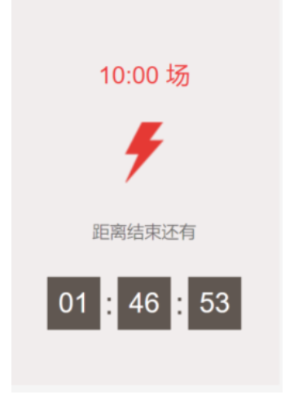
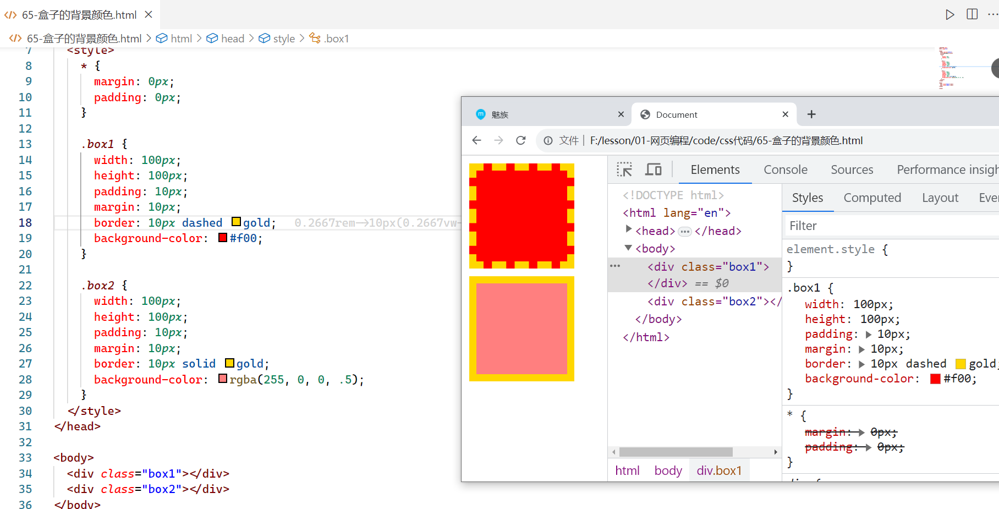
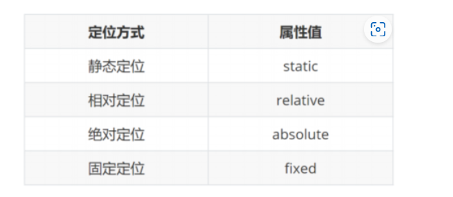

目标：https://yujingbo1023.github.io/xm/


## 一，初识CSS

### 1，认识CSS

CSS表示层叠样式表（Cascading Style Sheet，简称：CSS，又称为又称串样式列表、级联样式表、串接样式表、阶层式样式表）是为网页添加样式的代码。CSS并不是一门编程语言，是样式语言。作用就是进行网页布局和美化网页。

**版本**

* CSS2  CSS3    先学习CSS2   后面学习CSS3
* HTML1~5    前面也是先学习4  后面学习5

先快速体验一把CSS，css写在style标签中的，style标签是放在head标签里面，title标签下面，如下：


**常见属性**:


继续体验，如下：


注意点及语法规则：

* CSS 标点符号都是英文状态下的

* 每一个样式键值对写完之后，最后需要写分号

* 每一条属性分属性名和属性值

  


* 学习CSS就是去学习一堆的属性和选择器，规则如下：

  

```html
  <style>
      {}

      叫声明块 在声明块中放一个个的属性，属性的格式是：xxx:yyyy;

      每一个属性是以分号结束 属性名也叫键，属性值也叫值。整体也叫键值对。 选择器 {
          属性名: 属性值;
          属性名: 属性值;
          属性名: 属性值;
          属性名: 属性值;
          ...
      }
  </style>
```

  

### 2，三种写法

写CSS，有三种写法：

* 内部式：CSS 写在style标签中, 提示：style标签虽然可以写在页面任意位置，但是通常约定写在 head 标签中
* 外部式：CSS 写在一个单独的.css文件中, 提示：需要通过link标签在网页中引入
* 行内式：CSS 写在标签的style属性中, 提示：之后会配合js使用

**行内样式（inline style）**:

1. 行内样式（inline style），也有人翻译成行内联式
2. 行内样式表存在于HTML元素的style属性之中
3. CSS样式之间用分号;隔开，建议每条CSS样式后面都加上分号
4. 在原生的HTML编写过程中确实这种写法是不推荐的，之后会配合JS使用

代码演示：


**内部样式（internal style sheet）**:

1. 将CSS放在HTML文件 head元素 里的 style元素 之中

代码演示：


**外部样式（external style sheet）**:

1. 外部样式表（external style sheet） 是将css编写一个独立的文件中，并且通过元素引入进来
2. link元素的作用，后续单独讲解
3. 可以在style元素或者CSS文件中使用@import导入其他的CSS文件

代码演示：


总结一把：

* 学习时，使用内部样式
* 项目时，使用外部样式
* 对于行内样式，偶尔也会使用

## 二，CSS选择器

**选择器的作用**：

1. 选择页面中对应的标签（找她），方便后续设置样式（改她）

**选择器的种类繁多，大概可以这么归类**：

1. 通用选择器（universal selector）
2. 元素选择器（type selectors）
3. 类选择器（class selectors）
4. id选择器（id selectors）
5. 属性选择器（attribute selectors）
6. 组合（combinators）
7. 伪类（pseudo-classes）
8. 伪元素（pseudo-elements）

### 1，CSS基础选择器

**通用选择器**：

1. 结构：* { css属性名：属性值； }
2. 通用选择器（universal selector）
3. 所有的元素都会被选中;
4. 一般用来给所有元素作一些通用性的设置，比如内边距、外边距，比如重置一些内容
5. 效率比较低，尽量不要使用;

代码演示：


**简单选择器**：

1. 简单选择器是开发中用的最多的选择器
2. 元素选择器（type selectors）, 使用元素的名称
3. 类选择器（class selectors）, 使用 . 类名
4. id选择器（id selectors）, 使用 #id


**元素选择器**：

1. 结构：标签名 { css属性名：属性值； }
2. 作用：通过标签名，找到页面中所有这类标签，设置样式
3. 标签选择器选择的是一类标签，而不是单独某一个
4. 标签选择器无论嵌套关系有多深，都能找到对应的标签

代码演示：


**类选择器**：

1. 结构：.类名 { css属性名：属性值； }
2. 作用：通过类名，找到页面中所有带有这个类名的标签，设置样式
3. 所有标签上都有class属性，class属性的属性值称为类名（类似于名字）
4. 类名可以由数字、字母、下划线、中划线组成，但不能以数字或者中划线开头
5. 一个标签可以同时有多个类名，类名之间以空格隔开
6. 类名可以重复，一个类选择器可以同时选中多个标签

代码演示：


**id选择器**：

1. 结构：#id属性值 { css属性名：属性值； }
2. 作用：通过id属性值，找到页面中带有这个id属性值的标签，设置样式
3. 所有标签上都有id属性
4. id属性值类似于身份证号码，在一个页面中是唯一的，不可重复的
5. 一个标签上只能有一个id属性值
6. 一个id选择器只能选中一个标签

代码演示：


总结：

* 通配符选择器
* 标签选择器
* class选择器
* ID选择器

### 2，CSS高级选择器

1. 属性选择器（attribute selectors）
2. 组合（combinators）
3. 伪类（pseudo-classes）
4. 伪元素（pseudo-elements）

**属性选择器(attribute selectors)**：

1. 拥有某一个属性 [att]
2. 属性等于某个值 [att=val]
3. [attr*=val]: 属性值包含某一个值val （了解）
4. [attr^=val]: 属性值以val开头 （了解）
5. [attr$=val]: 属性值以val结尾 （了解）
6. [attr|=val]: 属性值等于val或者以val开头后面紧跟连接符 （了解）
7. [attr~=val]: 属性值包含val, 如果有其他值必须以空格和val分割 （了解）

代码演示：


**后代选择器（descendant combinator）**：

1. 后代选择器一: 所有的后代(直接/间接的后代)，选择器之间以空格分割
2. 后代选择器二: 直接子代选择器(必须是直接子代)

代码演示：


**兄弟选择器(sibling combinator)**：

1. 兄弟选择器一:相邻兄弟选择器， 使用符号 + 连接
2. 兄弟选择器二: 普遍兄弟选择器， 使用符号 ~ 连接

代码演示：


**交集选择器**：

1. 交集选择器: 需要同时符合两个选择器条件(两个选择器紧密连接)
2. 在开发中通常为了精准的选择某一个元素


代码演示：


**并集选择器**：

1. 并集选择器: 符合一个选择器条件即可(两个选择器以,号分割)
2. 在开发中通常为了给多个元素设置相同的样式;


代码演示：


**动态伪类（dynamic pseudo-classes)**：

1. a:hover 鼠标挪动到链接上(重要)
2. 除了a元素，:hover也能用在其他元素上
3. 选中鼠标悬停在元素上的状态，设置样式
4. 伪类选择器选中的元素的某种状态

代码演示：


总结：


经常使用的选择：

* 标签选择器
* 类选择器
* ID选择器
* 后代选择器    div p{}     div>p{}
* 并集选择器    div, p, .box{}
* 交集选择器    div.item{}
* hover选择器  

## 三，字体和文本相关的属性

### 1，CSS颜色表示法

有两种颜色表示法：

* 使用单词表示，不能表示所有的颜色

* RGB表示，RGB是一种色彩空间，通过R（red，红色）、G（green，绿色）、B（blue，蓝色）三原色来组成了不同的颜色，通过调整这三个颜色不同的比例，就可以组合成其它的颜色。

  


使用RGB表示，又有两种形式表示：

* rgb函数 或 rgba函数    rgb(0, 0, 0)   rgb(255, 255, 255)  rgb(255, 0, 0)  rgba(255, 0, 0, 0.5)
* 16进制表示  以#打头  #000000  #ffffff  #ff0000  #f00  #0f0  #00f

总结：


代码演示：


### 2，**Chrome浏览器开发者工具(掌握)**

1. 打开Chrome调试工具，方式一：右键 – 检查，方式二：快捷键 – F12
2. 快捷键：ctrl+ 可以调整页面或者调试工具的字体大小
3. 可以通过删除某些元素来查看网页结构
4. 可以通过增删css来调试网页样式


代码如下：


开始调试：


总结：


### 3，字体相关的样式

#### a) font-size

1. font-size决定文字的大小 
2. 常用的设置：具体数值+单位 
3. 谷歌浏览器默认文字大小是16px 
4. 单位需要设置，否则无效 
5. 常用的设置：百分比，基于父元素的font-size计算，比如50%表示等于父元素font-size的一半 
6. font-size有继承性。

代码演示：


#### b) font-family

1. font-family用于设置文字的字体名称 
2. 可以设置1个或者多个字体名称  
3. 浏览器会选择列表中第一个该计算机上有安装的字体 
4. 渲染规则：从左往右按照顺序查找，如果电脑中未安装该字体，则显示下一个字体，如果都不支持，此时会根据操作系统，显示最后字体系列的默认字体 
5. 如果字体名称中存在多个单词，推荐使用引号包裹 
6. 网页开发时，尽量使用系统常见自带字体，保证不同用户浏览网页都可以正确显示 
7. window上默认字体是微雅黑，macOs上默认字体是苹方 
8. 程序员决定不了，使用什么样的字体，由设计师决定。
9. 也有继承性，一般情况下，都是给body设置。

代码演示：


看一些网站设置的字体，如下：


#### c) font-weight

1. font-weight用于设置文字的粗细（重量）
2. 常见的取值：normal：等于400
3. 常见的取值：bold：等于700
4. 100 | 200 | 300 | 400 | 500 | 600 | 700 | 800 | 900 ：每一个数字表示一个重量
5. strong、b、h1~h6等标签的font-weight默认就是bold 
6. 不是所有字体都提供了九种粗细，因此部分取值页面中无变化 
7. 实际开发中以：正常、加粗两种取值使用最多 


直接上代码：


#### d) font-style

1. font-style用于设置文字的常规、斜体显示
2. normal：常规显示
3. italic(斜体)：用字体的斜体显示(通常会有专门的字体)
4. em、i、cite、address、var、dfn等元素的font-style默认就是italic

代码演示：


#### e) font-variant

1. font-variant可以影响小写字母的显示形式，variant是变形的意思;
2. normal：常规显示，small-caps：将小写字母替换为缩小过的大写字母

代码演示：


#### f) line-height

1. line-height用于设置文本的行高
2. 行高可以先简单理解为一行文字所占据的高度
3. 取值：数字+px
4. 取值：倍数（当前标签font-size的倍数）
5. 网页精准布局时，会设置 line-height : 1 可以取消上下间距
6. 行高的严格定义是：两行文字基线（baseline）之间的间距
7. 基线（baseline）：与小写字母x最底部对齐的线


代码演示：


**区分height和line-height的区别**：

1. height：元素的整体高度
2. line-height：元素中每一行文字所占据的高度
3. 应用实例：假设div中只有一行文字，如何让这行文字在div内部垂直居中？答：让line-height等同于height

代码演示：


#### g) font

1. font是一个缩写属性
2. font 属性可以用来作为 font-style, font-variant, font-weight, font-size, line-height 和 font-family 属性的简写
3. font-style、font-variant、font-weight可以随意调换顺序，也可以省略
4. line-height可以省略，如果不省略，必须跟在font-size后面
5. font-size、font-family不可以调换顺序，不可以省略

代码演示：


### 4，文本相关的样式

#### a) text-decoration

1. text-decoration用于设置文字的装饰线
2. decoration是装饰/装饰品的意思;
3. decoration取值：none，无任何装饰线，可以去除a元素默认的下划线 
4. decoration取值：underline，下划线 
5. decoration取值：overline，上划线 
6. decoration取值：line-through，中划线（删除线） 
7. a元素有下划线的本质是被添加了text-decoration属性
8. 开发中会使用 text-decoration : none ; 清除a标签默认的下划线

代码演示：


#### b) text-transform

1. text-transform用于设置文字的大小写转换
2. text-transform取值：capitalize(使…首字母大写, 资本化的意思)将每个单词的首字符变为大写
3. text-transform取值：uppercase(大写字母)将每个单词的所有字符变为大写
4. text-transform取值：lowercase(小写字母)将每个单词的所有字符变为小写
5. text-transform取值：none：没有任何影响

代码演示：


#### c) text-indent

1. text-indent用于设置第一行内容的缩进
2. 取值：数字+px
3. 取值：数字+em（推荐：1em = 当前标签的font-size的大小）
4. text-indent: 2em; 刚好是缩进2个文字


代码演示：


#### d) text-align

1. text-align: 直接翻译过来设置文本的对齐方式
2. 如果需要让文本水平居中，text-align属性给文本所在标签（文本的父元素）设置
3. 取值：left 左对齐
4. 取值：right 右对齐
5. 取值：正中间显示
6. 取值：两端对齐



代码演示：


**text-align : center 能让哪些元素水平居中？**

1. 文本
2. span标签、a标签
3. input标签、img标签
4. 这个属性有继承性

#### e) **letter-spacing、word-spacing**

1. letter-spacing、word-spacing分别用于设置字母、单词之间的间距
2. 默认是0，可以设置为负数

代码演示：


### 5，CSS继承性

**继承性(Inherited)**：

1. 如果一个属性具备继承性, 那么在该元素上设置后, 它的后代元素都可以继承这个属性 
2. 如果后代元素自己有设置该属性, 那么优先使用后代元素自己的属性(不管继承过来的属性权重多高) 
3. 常见的font-size/font-family/font-weight/line-height/color/text-align都具有继承性 
4. 可以通过调试工具判断样式是否可以继承 
5. 好处：可以在一定程度上减少代码 、


通过调试工具判断样式是否可以继承，代码演示：


对于a标签中文本的颜色，继承不了的，如下：


如果是其它标签是可以继承的，如下：


强制继承，了解，有些属性是不能继承的，但是可以强制继承，如下：


**继承失效的特殊情况**：

1. a标签的color会继承失效，其实color属性继承下来了，但是被浏览器默认设置的样式给覆盖掉了 
2. h系列标签的font-size会继承失效， 其实font-size属性继承下来了，但是被浏览器默认设置的样式给覆盖掉了
3. 其它元素有浏览器默认样式，此时继承性依然存在，但是优先显示浏览器的默认样式 

### 6，CSS层叠性

**层叠性：**

1. 给同一个标签设置不同的样式 → 此时样式会层叠叠加 → 会共同作用在标签上
2. 给同一个标签设置相同的样式 → 此时样式会层叠覆盖 → 最终写在最后的样式会生效

给同一个标签设置不同的样式 → 此时样式会层叠叠加 → 会共同作用在标签上


比较ID选择器，CLASS选择器，标签选择器的层叠性，如下：


接着对比，对比行内样式，内部样式和外部样式的优先级，如下：


利用important可以强制改变优先级，如下：


对于后代选择器，需要考虑权重值，如下：


后面写项目时，如果效果和你想的不一样，需要考虑继承性和层叠性。你要检查你是不是对同一个元素通过没的选择器，设置了相同的样式。

### 7，元素的类型

**元素的类型**：

1. 块级元素（block-level elements）: 独占父元素的一行   男标签
2. 行内级元素（inline-level elements）:多个行内级元素可以在父元素的同一行中显示   女标签
3. 行内块级元素（inline-level elements）:多个行内级元素可以在父元素的同一行中显示     人妖标签

**块级元素**：

1. 独占一行（一行只能显示一个） 
2. 宽度默认是父元素的宽度，高度默认由内容撑开 
3. 可以设置宽高 
4. 标签：div、p、h系列、ul、li、dl、dt、dd、form、header、nav、footer…… 

代码演示：


**行内元素**：

1. 一行可以显示多个 ，并排显示
2. 宽度和高度默认由内容撑开 
3. 不可以设置宽高 
4. 标签：a、span 、b、u、i、s、strong、ins、em、del…… 

代码演示：


**行内块元素**：

1. 一行可以显示多个 ，并排显示。除了可以并排显示之外，其它特性和男标签一样。
2. 可以设置宽高 
3. 特殊情况：img标签有行内块元素特点，但是Chrome调试工具中显示结果是inline 
4. 标签：input、textarea、button、select…… 

代码演示：


通过一个属性，叫display，可以改变标签的性别

* block：让元素显示为块级元素 
* inline：让元素显示为行内级元素
* inline-block：让元素同时具备行内级、块级元素的特征
* none：隐藏元素

代码演示：


总结：


## 四，第一次作业

**1，网页的三大组成部分是哪些？分别说出他们的作用。**

**2，元素的结构是什么？有哪些单标签元素、双标签元素？**

**3，实现如下效果**


**4，实现如下效果（a标签跳转）**


**5，实现如下效果**


**6，实现如下效果**


**7，实现如下效果（自定义列表）**


** 8，实现如下效果**


**9，实现如下效果**


**10，实现如下效果**


**11，实现如下效果**


**12，实现如下效果**


## 五，第二次作业

**1，说一下什么是CSS的继承性，什么是CSS的层叠性？**

**2，总结目前所学过的所有选择器？思考它们的应用场景。**

**3，完成下面效果**


**4，完成下面效果**


**5，完成下面效果**


## 六，盒子模型

### 1，盒子模型介绍

标签都是矩形的，每一个标签都是一个盒子，先看一下生活中的盒子，如下：


网页都是有一堆盒子组成的，如下：


**盒子模型(Box Model)的组成**：

1. 内容（content），盒子的内容，可以通过width/height 设置
2. 内边距（padding），边框和内容之间的间距 ，也叫补白
3. 边框（border），元素自己的边框
4. 外边距（margin），盒子和其他盒子之间的间距
5. 背景（background），分背景颜色和背景图片


代码演示：


### 2，内容的宽高

1. 对于男标签和人妖标签可以设置盒子的宽高， 对于女标签来说, 设置宽高是无效的 
2. min-width：最小宽度，无论内容多少，宽度都大于或等于min-width 
3. max-width：最大宽度，无论内容多少，宽度都小于或等于max-width
4. 移动端适配时, 可以设置最大宽度和最小宽度


代码演示：


### 3，内边距

1. padding属性用于设置盒子的内边距, 通常用于设置边框和内容之间的间距 

2. 四个方向 

   - padding-top：上内边距
   - padding-right：右内边距
   - padding-bottom：下内边距
   - padding-left：左内边距

3. padding-top、padding-right、padding-bottom、padding-left来设置某个方向的padding

4. 也可以通过padding属性来设置四个方向padding

   


代码演示：


### 4，边框

1. border用于设置盒子的边框 

2. 边框包含边框的宽度，边框的样式，边框的颜色
   


3. 边框宽度

   - border-top-width、border-right-width、border-bottom-width、border-left-width
   - border-width是上面4个属性的简写属性

4. 边框颜色

   - border-top-color、border-right-color、border-bottom-color、border-left-color
   - border-color是上面4个属性的简写属性

5. 边框样式

   - border-top-style、border-right-style、border-bottom-style、border-left-style

   - border-style是上面4个属性的简写属性

     


6. 单独设置某一个边框

   - border-top：1px solid red; 
   - border-right
   - border-bottom
   - border-left
   - border

7. border主要是用来给盒子增加边框的, 但是在开发中我们也可以利用边框的特性来实现一些形状 

   - <https://css-tricks.com/the-shapes-of-css/#top-of-site>  

代码演示：


### 5，圆角

1. border-radius用于设置盒子的圆角 
2. 常见的值: 数值: 通常用来设置小的圆角, 比如6px;
3. 常见的值: 百分比: 通常用来设置一定的弧度或者圆形
   


4. 有四个属性 border-top-left-radius、border-top-right-radius、border-bottom-right-radius，和 border-bottom-left-radius，可以设置不同的方向的圆角。用的最多的还是border-radius。
5. 如果一个元素是正方形, 设置border-radius大于或等于50%时，就会变成一个圆

代码演示：


### 6，外边距

1. margin属性用于设置盒子的外边距, 通常用于元素和元素之间的间距

2. margin包括四个方向, 所以有如下的取值

   - margin-top：上外边距
   - margin-right：右外边距
   - margin-bottom：下外边距
   - margin-left：左外边距

3. margin单独编写是一个缩写属性

   - margin-top、margin-right、margin-bottom、margin-left的简写属性
   - margin缩写属性是从零点钟方向开始, 沿着顺时针转动的, 也就是上右下左

4. margin也并非必须是四个值, 也可以有其他值

   


代码演示：


**兄弟元素之间的margin塌陷：**

1. margin有重叠问题，这个重叠问题，也叫margin的塌陷
2. 兄弟元素之间的margin塌陷，之间的间隙，取决于最大的marign，并不是margin相加
3. 兄弟元素之间的margin塌陷是发生在垂直方向，在水平方向上是没有塌陷
4. 解决：你要设置时，一定要小心，要么设置上面盒子的下marign，要么设置下面盒子的上margin  

代码演示：


**父子元素之间的margin塌陷：**

1. 父子元素之间margin也会塌陷, 给父元素设置margin-top，给子元素也设置margin-top,此时，就产生了margin的塌陷

代码演示：


如何解决父子元素之间的margin塌陷？

* 给父加边框
* 添加overflow:hidden    overflow表示溢出的意思 
* 给父元素设置padding-top
* 给父元素或子元素设置浮动

代码演示：


**margin的其它知识点：**

1. 利用margin可以让一个盒子水平居中

2. margin也可以是负值，当margin为负值时，就会向另一个方向移动

3. 对于女标签(盒子)来，margin垂直方向无效

4. 览器会默认给部分标签设置默认的margin和padding，但一般在项目开始前需要先清除这些标签默认的margin和padding，后续自己设置

   


代码演示：


### 7，外轮廓

1. outline表示元素的外轮廓,不占用空间,默认显示在border的外面
2. outline相关属性有
   - outline-width: 外轮廓的宽度
   - outline-style：取值跟border的样式一样，比如solid、dotted等
   - outline-color: 外轮廓的颜色
   - outline：outline-width、outline-style、outline-color的简写属性，跟border用法类似
3. 应用场景：去除a元素、input元素的focus轮廓效果

代码演示：


### 8，盒子阴影

1. box-shadow属性可以设置一个或者多个阴影
2. 每个阴影用shadow表示，多个阴影之间用逗号,隔开，从前到后叠加
3. 常见格式
   - 第1个值：offset-x, 水平方向的偏移，正数往右偏移
   - 第2个值：offset-y, 垂直方向的偏移，正数往下偏移
   - 第3个值：blur-radius, 模糊半径
   - 第4个值：spread-radius, 延伸半径
   - 第5个值：color：阴影的颜色，如果没有设置，就跟随color属性的颜色
   - 第6个值：inset：外框阴影变成内框阴影
4. 通过一个网站测试盒子的阴影: <https://html-css-js.com/css/generator/box-shadow/>

代码演示：


### 9，文字阴影

1. text-shadow用法类似于box-shadow，用于给文字添加阴影效果
2. 以通过一个网站测试文字的阴影: <https://html-css-js.com/css/generator/box-shadow/>

代码演示：


### 10，新的盒子模型

1. box-sizing用来设置盒子模型为新的盒子模型
2. 值如果是border-box：padding、border都布置在width、height里边
3. 值如果是content-box：padding、border都布置在width、height外边

代码演示：


### 11，盒子背景

盒子的背景分背景颜色和背景图片。

**背景颜色：**

1. 属性名：background-color（bgc）
2. 颜色取值：关键字、rgb表示法、rgba表示法、十六进制……
3. 背景颜色默认值是透明： rgba(0,0,0,0) 、transparent
4. 背景颜色不会影响盒子大小，并且还能看清盒子的大小和位置，一般在布局中会习惯先给盒子设置背景颜色
5. 背景颜色默认填充的是内容区域，padding区域和border区域。

代码演示：



**背景图片：**

1. 属性名：background-image（bgi）,会盖在(不是覆盖)background-color的上面
2. 在开发中, 为了让网页更加美观, 我们经常会设置各种各样的背景 
3. 属性值是通过url函数来设置的，背景图片中url中可以省略引号
4. 如果设置了背景图片后，元素没有具体的宽高，背景图片是不会显示出来的 
5. 背景图片默认是在水平和垂直方向平铺的
6. 背景图片仅仅是指给盒子起到装饰效果，类似于背景颜色，是不能撑开盒子的
7. 计算机中坐标系 和数学中的坐标系不一样。


代码演示：


通过background-repeat来设置图片是否平铺：


代码演示：


通过background-position来设置背景图片的位置：


代码演示：


还有一个复合属性，叫background：

1. 属性值：单个属性值的合写，取值之间以空格隔开 
2. 书写顺序：推荐(background：color image repeat position)
3. background-size可以省略，如果不省略，background-size必须紧跟在background-position的后面 
4. 其他属性也都可以省略，而且顺序任意 
5. 在pc端，如果盒子大小和背景图片大小一样，此时可以直接写 background：url()

代码演示：


### 12，字体图标

字体图标不是图片，就把它当成文本，放大不会失真，可以任意切换颜色，用到很多个图标时，文件相对图片较小。阿里icons：https://www.iconfont.cn/


使用步骤：

1. 第一步：登录阿里icons（<https://www.iconfont.cn/>），下载代码，并且拷贝到项目中
2. 第二步: 通过link引入iconfont.css文件 
3. 第三步: 使用字体图标  
   - 方式一: 通过对应字体图标的Unicode来显示代码
   - 方式二: 利用已经编写好的class, 直接使用即可; 


下载完后，得到如下：


把代码copy到fonts下面，如下：


代码演示：


还有一些其它的用法，后面说。

### 13，精灵图

1. 精灵图是CSS图像合成技术，将各种小图片合并到一张图片上，然后利用CSS的背景定位来显示对应的图片部分
2. 好处：
   - 减少网页的http请求数量，加快网页响应速度，减轻服务器压力
   - 解决了图片命名的困扰，只需要针对一张集合的图片命名  
3. 制作
   - 方法1：Photoshop, 设计人员提供
   - 方法2：https://www.toptal.com/developers/css/sprite-generator
4. 使用
   - 精灵图的原理是通过只显示图片的很小一部分来展示的
   - 置对应元素的宽度和高度
   - 设置精灵图作为背景图片
   - 调整背景图片的位置来展示
   - 获取精灵图的位置：http://www.spritecow.com/


代码演示：


## 七，Flex布局

### 1，Flex布局介绍

flex目的就是为了让块级标签，可以并排显示。也叫弹性布局。之前让块级标签并排显示，使用浮动比较多，现在使用flex布局比较多。

**几个概念：**

* 如果给一个元素设置了display:flex。那么就开启了flex布局。

* 添加display:flex; 这个标签，叫容器。

* 容器中的直接子元素叫项目。那么它的性别就变了，变成男标签。
	


​	

* 项目默认就是在主轴上排列的。

* 和主轴垂直那个轴叫交叉轴。

  


代码演示：


### 2，容器相关的属性

容器相关的属性有6个：

1. flex-direction    决定主轴的方向
2. flex-wrap   项目压缩时，是否换行
3. flex-flow     是direction和wrap的简写
4. justify-content     处理主轴的富余空间
5. align-items    一行项目时，处理交叉轴的富余空间
6. align-content   多根主轴在交叉轴上的排序顺序（多行项目，处理交叉轴的富余空间）

**容器属性之flex-direction**

1. flex-direction 决定了 main axis 的方向，有 4 个取值
2. 项目 默认都是沿着 main axis（主轴）从 main start 开始往 main end 方向排布
3. row（默认值）、row-reverse、column、column-reverse


代码演示：


**容器属性之flex-wrap**

1. 决定主轴是多根还是一根，或者是决定项目是否换行

2. fnowrap（默认）：单行

3. wrap：多行

4. wrap-reverse：多行（对比 wrap，cross start 与 cross end 相反）

   


   

代码演示：


**容器属性之flex-flow**

1. flex-flow 属性是 flex-direction 和 flex-wrap 的简写
2. 顺序任何, 并且都可以省略

代码演示：


**容器属性之justify-content**

1. justify-content决定项目在主轴的排列顺序
2. flex-start（默认值）：与 main start 对齐
3. flex-end：与 main end 对齐
4. center：居中对齐
5. space-between：
   - flex items 之间的距离相等
   - 与 main start、main end两端对齐
6. space-around：
   - flex items 之间的距离相等
   - flex items 与 main start、main end 之间的距离是 flex items 之间距离的一半
7. space-evenly：
   - flex items 之间的距离相等
   - flex items 与 main start、main end 之间的距离 等于 flex items 之间的距离


代码演示：


**容器属性之align-item**

1. 决定项目在交叉轴上的对齐方式
2. normal：在弹性布局中，效果和stretch一样
3. stretch：当 flex items 在 cross axis 方向的 size 为 auto 时，会自动拉伸至填充 flex container
4. flex-start：与 cross start 对齐
5. flex-end：与 cross end 对齐
6. center：居中对齐
7. baseline：与基准线对齐


代码演示：


**容器属性之align-content**

1. 决定多行项目在交叉轴上的对齐方式
2. stretch（默认值）：与 align-items 的 stretch 类似
3. flex-start：与 cross start 对齐
4. flex-end：与 cross end 对齐
5. center：居中对齐
6. space-between：
   - flex items 之间的距离相等
   - 与 cross start、cross end两端对齐
7. space-around： ：
   - flex items 之间的距离相等
   - flex items 与 cross start、cross end 之间的距离是 flex items 之间距离的一半
8. space-evenly：
   - flex items 之间的距离相等
   - flex items 与 cross start、cross end 之间的距离 等于 flex items 之间的距离


代码演示：


### 3，项目关的属性

**项目属性之order**

1. 决定了 flex items 的排布顺序
2. 可以设置任意整数（正整数、负整数、0），值越小就越排在前面
3. 默认值是 0


代码演示：


**项目属性之align-self**

* 单独设置某个项目在交叉轴上的对齐方式


代码演示：


**项目属性之flex-grow**

1. 决定了 flex items 如何扩展(拉伸/成长)
2. 可以设置任意非负数字（正小数、正整数、0），默认值是 0
3. 前提是有富余空间的情况下，才能拉伸/成长
4. 富余空间size * flex-grow / sum

代码演示：


**项目属性之flex-shrink**

1. 设置压缩比例
2. 可以设置任意非负数字（正小数、正整数、0），默认值是 1
3. flex items 超出 flex container 的 size * 收缩比例 / 所有 flex items 的收缩比例之和

代码演示：


**项目属性之flex-basis**

1. 设置项目在主轴上的宽度
2. auto（默认值）、具体的宽度数值（100px）
3. flex-basis的优先级是高于width

代码演示：


**项目属性之flex属性**

1. flex 是 flex-grow || flex-shrink || flex-basis 的简写,flex 属性可以指定1个，2个或3个值。
2. 最最常用的：一个无单位数(number): 它会被当作flex-grow的值。  

代码演示：


大家可以使用flex实现色子案例：https://blog.csdn.net/m0_61843874/article/details/121196912

## 八，第三次作业

实战魅族官网：https://yujingbo1023.github.io/meitu/

### 1，pxcook的使用

下载：https://www.fancynode.com.cn/pxcook


打开软件：


创建项目：


把设计图，拖到软件上，如下：


双击打开，按alt+鼠标滚轮，就可以放大图片，如下：


按空格键，就可以拖拽，如下：


量尺寸，如下：


吸颜色：


### 2，实战

## 九，浮动布局

### 1，初识浮动布局

有了flex布局，基本上干死了浮动布局，现在不管是写PC端的网页还是移动端的网页，基本上都是清一色的flex布局。对于浮动布局，了解。浮动布局的作用也是让男标签并排显示。

直接上代码：


### 2，浮动布局的特点

特点：

1. 浮动元素会脱标，在标准流中不占位置，有文本，会形成字围效果。

   


2. 如果一个块级元素，在没有设置widht的情况下（前提条件）， 一旦使用float，那么它的宽度就会发生变化，尽量最小，包裹其内容，能够完全包裹其中的内容。

   


3. 在一个块级容器中，如果它的子元素，都浮动了，父元素没有设置高度，那么块级容器将会塌陷。所谓的塌就是高度变成0了，这就是浮的破坏性。也就是说，浮动，它会对父元素造成影响，清除这种影响，也叫清除浮动。

   


4. 如果女标签浮动了，它会自动地变成男标签，盒子模型的6大属性都会起作用。 

   


### 3，清除浮动

所谓的清除浮动，就是清除浮动所造成的影响，就是清除对父元素造成的影响和清除去兄弟元素造成的影响。

概念：

1. 浮动会对其它元素造成影响
   - 对父元素造成影响
   - 对后面的兄弟元素造成影响
2. 对父元素造成影响：
   - 如果父元素内部的所有的子元素都浮动了，如果父元素没有设置高度，那么它的高度就会塌陷，就是高度变成0了。
   - 有了影响，就需要我们清除这种影响，清除这种影响，叫清除浮动。
3. 清除对父元素造成影响：
   - 加高法  
   - overflow:hidden; 
   - 内墙法  在父元素内部的最后面添加一堵墙  clear: both; 专门用来清除影响的
   - 使用伪元素来清除浮动   
4. 对后面的兄弟元素造成影响：
   - clear: both; clear后面可以跟left，表示清除左浮动造成的影响   clear后面可以跟right，表示清除右浮动造成的影响。通常情况下，我们会直接写clear:both。  表示清除左右浮动造成的影响哪个兄弟受了影响，就写在哪个兄弟上面的。 

代码演示：


## 十，第四次作业

实现拉勾网：https://yujingbo1023.github.io/lagou/

## 十一，定位

### 1，定位介绍

**标准文档流：**

1. 默认情况下，元素都是按照normal flow（标准流、常规流、正常流、文档流【document flow】）进行排布
2. 块级元素独占一行 → 垂直布局
3. 行内元素/行内块元素一行显示多个 → 水平布局
4. 默认情况下，互相之间不存在层叠现象
5. 在标准流中，可以使用margin、padding对元素进行定位，其中margin还可以设置负数
6. 设置一个元素的margin或者padding，通常会影响到标准流中其他元素的定位效果，不便于实现元素层叠的效果
7. 如果我们希望一个元素可以跳出标准文档流,可以通过position属性来进行设置
8. 定位可以让元素自由的摆放在网页的任意位置
9. 一般用于盒子之间的层叠情况，定位之后的元素层级最高，可以层叠在其他盒子上面


**定位方式：**



只有position属性是不行的，还需要其它属性配合设置它的偏移量：


总结：

* 相对定位   position:relative; left right top bottom
* 绝对定位   postion:absoute; left right top bottom
* 固定定位   position:fixed; left right top bottom

### 2，相对定位

**相对定位：**

1. 相对于自己之前的位置进行移动，对盒子的位置进行微调，可以使用相对定位。
2. 可以通过left、right、top、bottom其中的两个属性来设置偏移量。
3. 定位参照对象是元素自己原来的位置
4. 在页面中占位置，没有脱标
5. 应用场景：1）配合绝对定位组（子绝父相） 2）在不影响其他元素位置的前提下，对当前元素位置进行微调


参考代码：


### 3，绝对定位

**绝对定位：**

1. 在页面中不占位置，元素脱离normal flow（脱离标准流、脱标）
2. 参考点是需要手动设置的。代码：position:relative;  一般情况下，参考点都是父元素。子绝父相。
3. 如果没有设置参考点，一级一级向上找，直到body。如果body也没有设置，就以body作为参考点。
4. 可以通过left、right、top、bottom其中的两个属性来设置偏移量。
5. 通过z-index可以改变绝对定位元素的层叠顺序，值越大，越在上面。


代码演示：


使用绝对定位，让一个盒子水平垂直居中，如下：


### 4，固定定位

**固定定位：**

1. 元素脱离normal flow（脱离标准流、脱标）
2. 参考点是整个浏览器（视口）
3. 可以通过left、right、top、bottom其中的两个属性来设置偏移量。
4. 如果是女标签绝对定位或固定定位了，就会变成男标签。

代码演示：


使用固定定位写一个小案例：


总结：


## 十二，布局套路

### 1，table布局（淘汰）

* 父级容器—display: table
* 子级容器—display:table-cell

代码演示：


### 2，浮动布局

两列布局解决方案(一边固定，另外一边动态变化)，代码演示：


三列布局解决方案，左边固定，中间固定，右侧自适应，代码如下：


### 3，inline-block布局（了解）

使用inline-block布局，回车换行会导致间隙，把父元素的fs设置成0，再单独给每个子元素设置fs。直接上代码，如下：


### 4，flex布局

使用flex布局，使用水平竖直居中，代码如下：


使用flex，实现两列布局，一侧固定，一侧自适应，如下：


### 5，Grid布局（了解）

自行研究，参考文章：https://blog.csdn.net/ancartoon/article/details/121514585

先看如下代码：


### 6，columns布局（了解）

CSS属性 **columns** 用来设置元素的列宽和列数。直接上代码：


### 7，水平居中

文本的水平居中：


一个男标签水平居中：


多个男标签水平居中：


已知父子宽高，使用绝对定位让一个男标签水平居中：


已知父宽高，不知子宽高，让一个男标签水平居中：


使用flex布局，实现水平居中，如下：


### 8，垂直居中

单行文本实现垂直居中，如下：


多行文本的垂直居中，如下：


图片实现垂直居中，如下：


让男标签实现垂直居中：

* table布局（淘汰）
* flex（display:flex; align-items:center; ）
* 定位（子绝父相） + margin负值 或 transfrom

代码演示：


多个盒子实现垂直居中，如下：


### 9，水平垂直居中

1. position + margin负值 / transform
2. flex + justify-content + align-items

### 10，圣杯布局

1. 圣杯布局是来源于该布局效果类似圣杯而得名。简单来说，就是指三行三列布局
2. 圣杯布局核心：主要是实现中间主体部分中的左右定宽+中间自适应的布局效果
3. center 要放在前面原因是在样式加载慢或无样式的时候先向用户呈现主要内容

使用浮动+定位+margin为负值实现圣杯布局（不好理解），代码演示：


使用flex布局，非常方便使用圣杯布局，如下 ：


### 11，双飞翼布局

1. 双飞翼布局最早是淘宝团队提出，是针对圣杯布局的优化解决方案。 主要是优化了圣杯布局中开启定位的问题。


### 12，全屏布局

1. 全屏布局就是指HTML页面铺满整个浏览器窗口，并且没有滚动条。而且还可以跟着浏览器的大小变化而变化；

代码：

```html
<!DOCTYPE html>
<html lang="en">

<head>
    <meta charset="UTF-8">
    <title>Document</title>
    <style>
        * {
            margin: 0px;
            padding: 0px;
        }

        header {
            height: 100px;
            background-color: gold;
            position: fixed;
            left: 0;
            right: 0;
            top: 0;
        }

        footer {
            height: 100px;
            background-color: pink;
            position: fixed;
            left: 0;
            right: 0;
            bottom: 0;
        }

        .content {
            background-color: skyblue;
            position: fixed;
            top: 100px;
            bottom: 100px;
            left: 0;
            right: 0
        }

        .content .left {
            width: 300px;
            height: 100%;
            background-color: red;
            position: fixed;
            top: 100px;
            bottom: 100px;
            left: 0;
        }

        .content .right {
            height: 100%;
            background-color: lawngreen;
            position: fixed;
            top: 100px;
            bottom: 100px;
            left: 300px;
            right: 0px;
        }
    </style>
</head>

<body>
    <header>Header</header>
    <div class="content">
        <div class="left">Left</div>
        <div class="right">Right</div>
    </div>
    <footer>Footer</footer>
</body>

</html>
```

效果：


## 十三，实战

设计图：https://share.lanhuapp.com/#/invite?sid=lXJYbL47

目标：https://yujingbo1023.github.io/xm/
