## 一，计算机组成

### 1，基本概念

**计算机的组成：**

* 计算机是由多个硬件组合而成，常见的硬件有：CPU、硬盘、内存、网卡、显示器、机箱、电源....

* 机械将零件组合在一起，他们之间是无法进行协作。

  


**操作系统：**

* 用于协调计算机的各个硬件，让硬件之间进行协同工作，以完成某个目标。
* 常见的操作系统
  + windows，优点：生态牛逼、工具多；缺点：略慢、收费。【个人】
  + linux，优点：资源占用少、免费（很多公司的服务器上安装Linux）；缺点：工具少、告别游戏。【企业的服务器】
  + mac，优点：生态还行、工具差不多都有、用户体验和交互； 缺点：不能玩游戏

**应用软件：**

* 在安装上操作系统之后，我们会在自己电脑上安装一些常用的软件，例如：QQ、杀毒、微信...
* 问题来了：这些软件是由谁开发的？是由各大公司的程序员开发的。
* 前端开发主要开发浏览器上运行的应用程序，可以把软件理解成为一大堆的代码的集合。

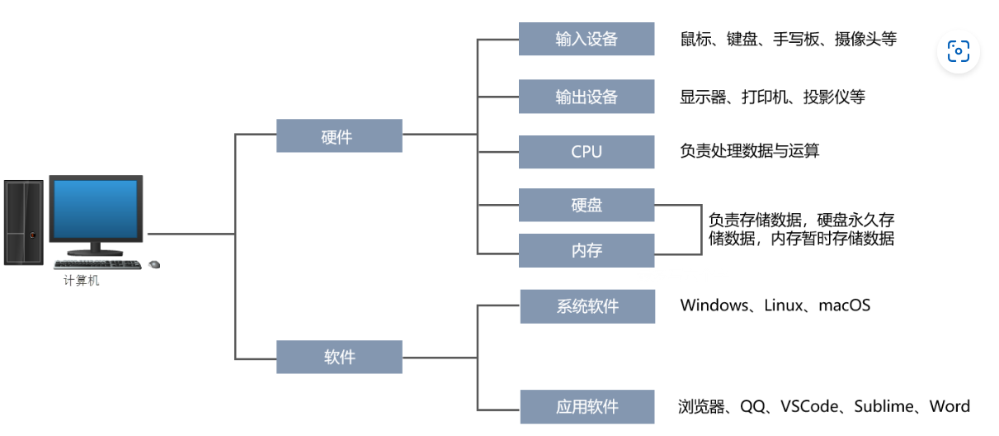

**编程语言：**

* 软件，是由程序员使用 编程语言 开发出来的一大堆代码的集合。全球的编程语言有2500+多种，常见的编程语言：JavaScript、Java、C#、Python、PHP、C...

* 学习编程语言就是学习它的语法，根据语法再去编写相应的软件中的功能。

  

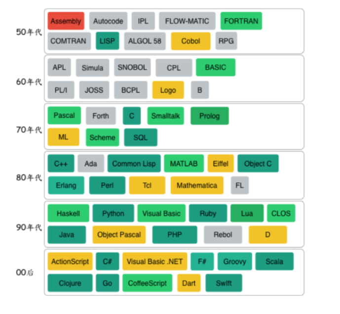

**编程语言分类：**

* 从翻译的角度来说，分编译型和解释型
* 从高低的角度来说，分低级语言和高级语言

**低级语言和高级语言：**

* 低级编程语言，写出来的代码直接可以被计算机识别。

  + 机器语言：101 001 00001 00010 001000100010001，机器码，交给计算机去执行。
* 汇编语言，MOV INC ... ，指令，交给计算机去执行。
* 高级编程语言，写出来的代码无法直接被计算机识别，但可以通过某中方式将其转换为计算机可以识别的语言。
  + JS、C、C++、Java、Python、Ruby...，这类编程语言在编写代码时几乎是写英语作文。
  + 交由相关编译器或解释器翻译成机器码，然后再交给计算机去执行。

**编译器和解释器：**

* 编程语言分编译型的和解释型器，编译型的语言是一次性编译好，解释型语言，边解释边执行。

* 编译器/解释器，就是一个 `翻译官` ，将代码翻译成计算机能够识别的命令。
* wc使用JS开发一个软件，写10000行代码，需要使用JS解释器，翻译成计算机可以识别的命令。
* xq使用Go开发一个软件，写20000行代码，需要使用GO编译器，翻译成计算机可以识别的命令。
* 解释器，实时翻译。拿到1000行代码之后，解释一句交给操作系统一句。
* 编译器，全文翻译。拿到2000行代码之后会将他编译成一个临时文件（计算机能够识别命令），再把文件交给操作系统去读取。  
* JavaScript、Python、PHP、Ruby... 一般称为解释型语言。
* C、C++、Go、Java... 一般称为编译型语言。

**学习编程的本质：**

* 第一步：选择一门编程语言，在自己电脑上安装此编程语言的编译器或解释器。
* 第二步：学习语言的规则，语法规则+业务背景 开发我们需要的软件（代码的集合）
* 第三步：使用编译器或解释器去运行自己写的代码。

**总结：**

1. 简述硬件 & 操作系统 & 软件（应用系统）之间的关系。
   - 计算机是由多个硬件组成，例如：CPU、硬盘、内存、网卡、主板等。
   - 操作系统则是安装在计算机上用于协调各硬件进行配合工作的，他将用户的一些行为转化为计算机能够识别的命令，并协调各个硬件配合完成相关命令。 
   - 软件，是由程序员开发并安装在操作系统的程序（本质上是一大堆的代码），例如：微信、QQ、金山毒霸等。
   
2. 列举常见的操作系统都有哪些。

   常用的操作系统有三类：
    - win：win7、win10、xp 等
    - linux：centos、ubuntu、redhat 等。
    - mac：Catalina、Mojave、Sierra 等。
   
3. 简述编译器和解释器的区别和作用。 

   - 编译器和解释器的作用是将各编程语言的代码进行翻译，从而使得计算机能够识别并执行。
   - 编译器，全文翻译，将代码编译成 `临时文件` ，再执行临时文件。
   - 解释器，实时翻译，对代码实行边解释边执行。

## 二，JavaScript介绍

### 1，JS介绍

**JS介绍：**

​	JS是直接可以运行在浏览器上的，因为浏览器内置了JS的解释，是一种高级语言，是解释性语言。也就是我们所谓的脚本语言，所谓的脚本语言，就是不需要编译，由解释器去执行。当然现在JS也可以运行在NODE端，后面说。

**JS作用：**

* Web开发

* 服务端开发（Node.js）

* 桌面程序（Electron）

* App

* 控制硬件

* 游戏开发

* ...

  

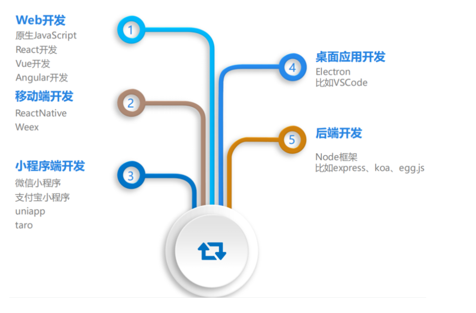

**JS组成：**

* ECMAScript 

  + 规定了js基础语法核心知识。

* DOM

  + DOM 操作文档，比如对页面元素进行移动、大小、添加删除等操作

* BOM

  + BOM 操作浏览器，比如页面弹窗，检测窗口宽度、存储数据到浏览器等等

  

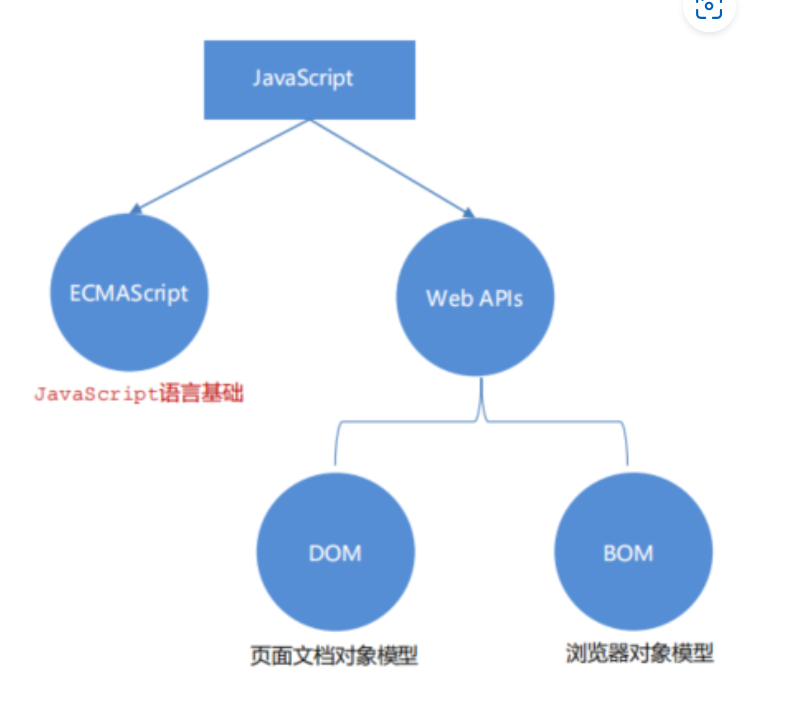

**ECMAScript版本：**

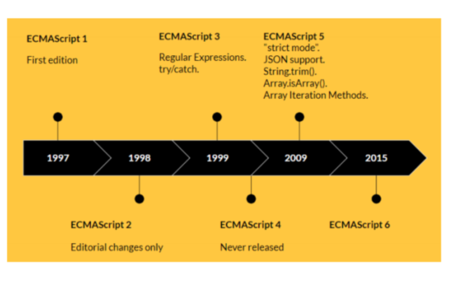

### 2，书写JS的三种方式

行内写法，目前这种写法不推荐，了解，直接上代码：

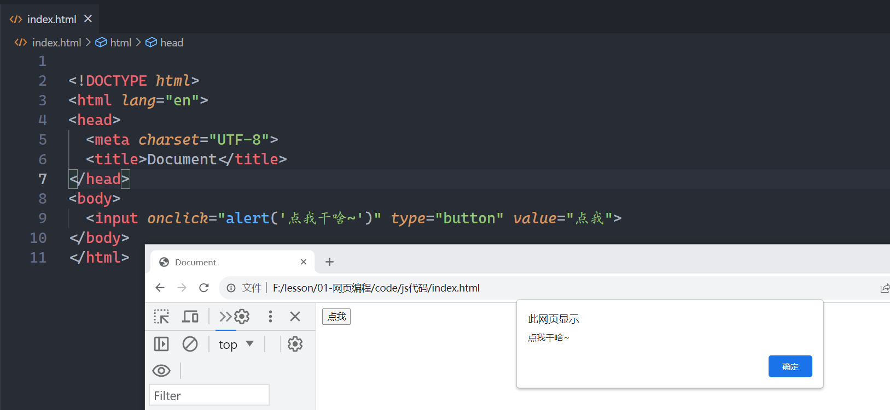

总结行内写法的特点：

* 可以将单行或少量 JS 代码写在HTML标签的事件属性中（以 on 开头的属性），如：onclick
* 可读性差， 在html中编写JS大量代码时，不方便阅读；
* 特殊情况下使用

还有一种叫内部写法，把JS代码写在script标签中，如下：

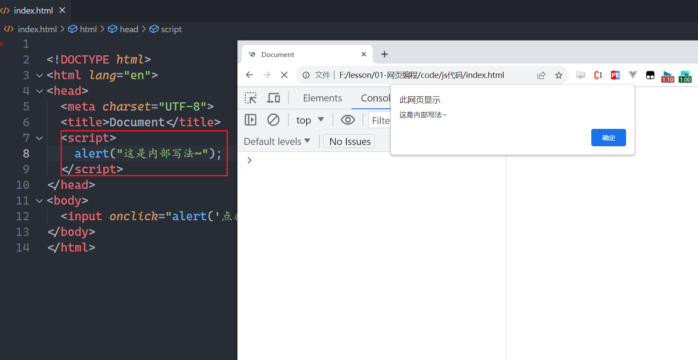

总结内部写法的特点：

* 可以把多行JS代码写在script标签中
* 学习时，为了方便，直接把JS代码写在scirpt标签
* 推荐将JavaScript代码和编写位置放在body子元素的最后一行；

最后一种写法，是外部写法，需要单独创建一个JS文件，通过script标签引入这个文件，如下：

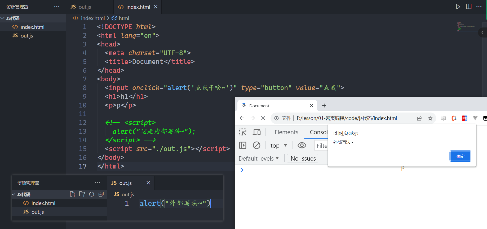

总结外部写法的特点：

* 需要通过script元素的src属性来引入JavaScript文件
* 在写项目时，通常都会使用外部写法，把JS代码放在一个单独的文件中，在页面中引入。
* 使用外部写法，script标签中就不能写其它代码了，写了也白了
* script标签不能写成单标签
* 推荐将JavaScript代码和编写位置放在body子元素的最后一行

### 3，JS的输出与输入

为了方便信息的输入输出，JS中提供了一些输入输出语句，其常用的语句如下：

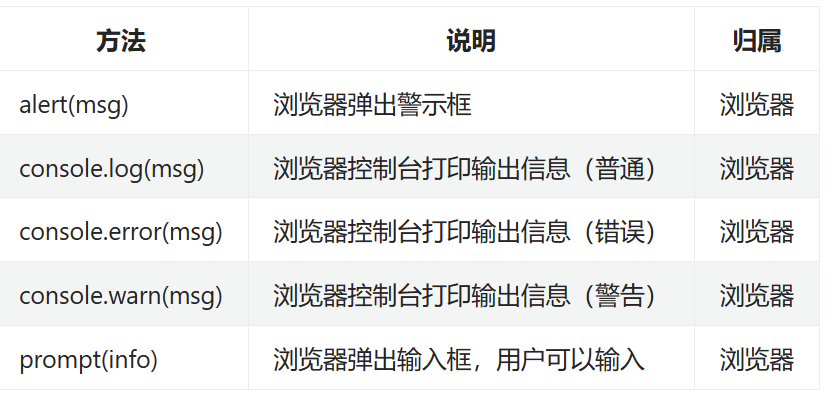

注意：alert() 主要用来显示消息给用户，console.log() 用来给程序员自己看运行时的消息。

直接上代码：

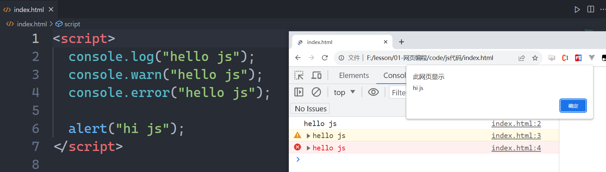

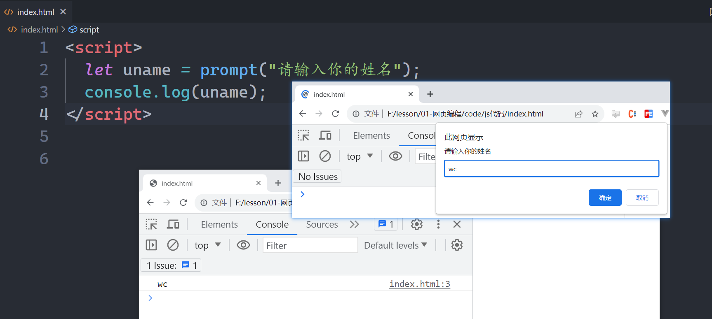

**做几个练习：**

* 在控制台中输出你自己的姓名
* 在控制台中输出  春眠不觉晓， 出处闻啼鸟， 夜来风雨声， 花落知多少。

## 三，初识数据类型

软件运行流程：

1. 打开某个程序时，先从硬盘中把程序的代码加载到内存中
2. CPU执行内存中的代码

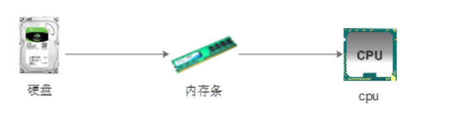

​	前面说过，使用编译语言是去开发软件的，软件上面的很多的数据，这些数据都是放在内存的。内存空间是有限，绝大部分的编程语言为了合理地使用内存空间，都会把使用到的数据进行分类，分成不同的类型，目的就是为了更加合理的使用内存空间。现在我大致了解一下JS中的数据类型。

### 1，数字类型

是Number，包含整数和小数，例如：年龄、存款、尺寸、手机号等。数据类型是支持 加/减/乘/除/取余/指数 等操作。直接上代码：

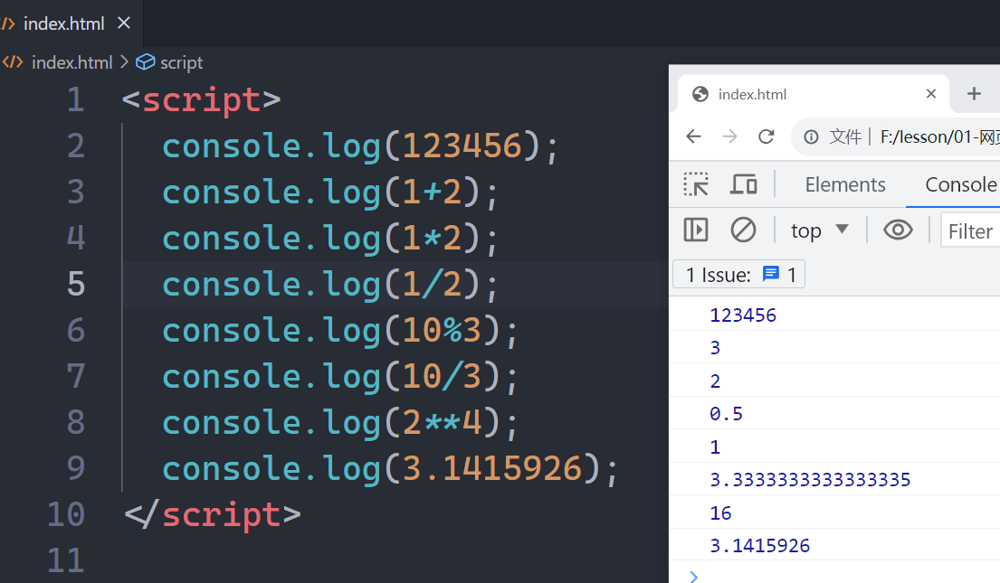

### 2，字符串

字符串，其实就是我们生活中的文本信息。例如：姓名、地址、自我介绍等。 字符串有一个特点，他必须由引号引起来，直接上代码：

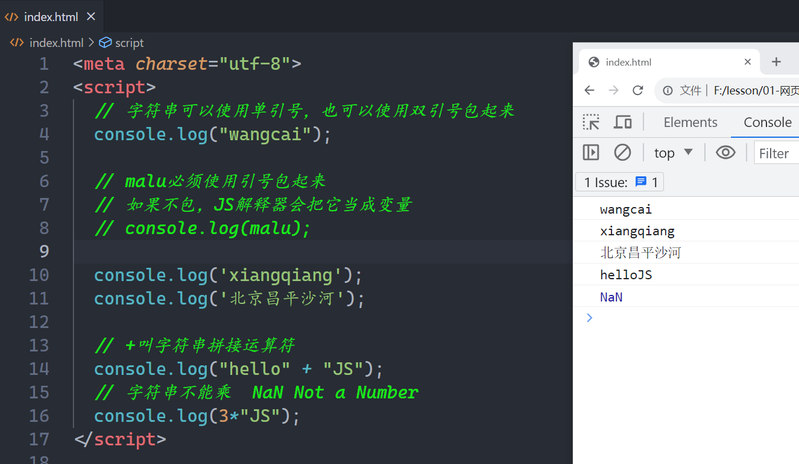

### 3，布尔类型

布尔类型就两个值：true和false。 布尔类型对应的值只有两个，一个是ture，一个是false， 直接上代码：

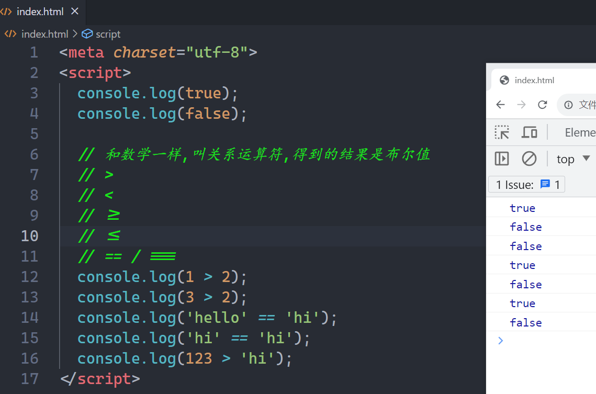

### 4，数据类型转化

把一种数据类型转化成另一个数据类型，转为数字，代码：

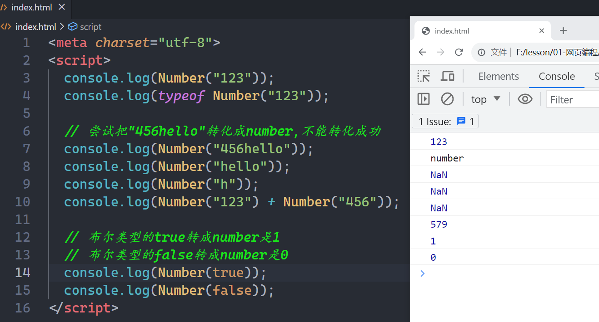

转换成字符串：

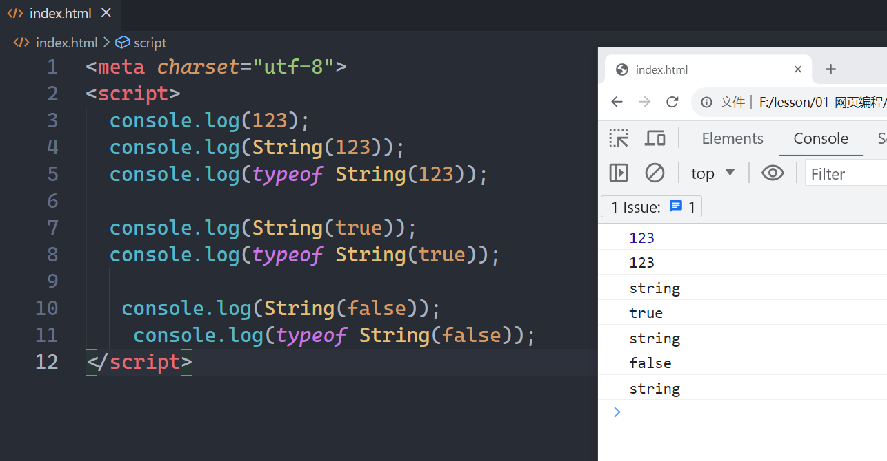

转换成布尔值：

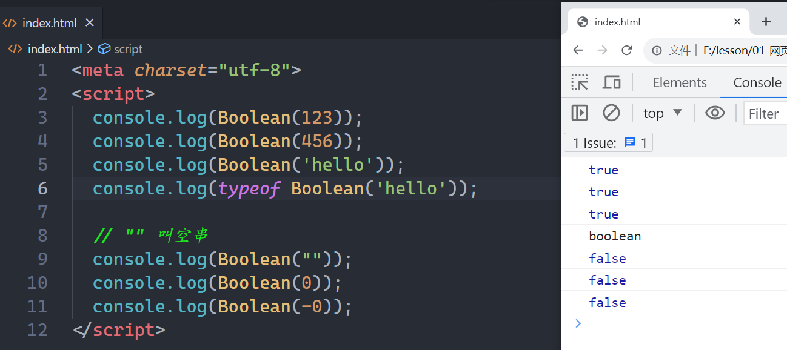

**练习题：**

* 计算整型50乘以10再除以5的商并输出

* 判断整型8是否大于10的结果并输出

* 计算整型30除以2得到的余数并输出

* 判断 字符串”admin”和”root”是否相等的结果并输出

* 判断 字符串666和整型666是否相等的结果并输出

* 看代码写结果（禁止运行代码）

  

```html
  <meta charset="utf-8">
  <script>
      console.log(Number("100") * 3)
      console.log(Number("123") + Number("88"))
      console.log(String(111) + String(222))
      console.log(String(111) * 3)
      console.log(Number("8") > 7)
      console.log(String(111) == 111)
      console.log(Boolean(-1))
      console.log(Boolean(0))
      console.log(Boolean(""))
      console.log(Boolean("你好"))
      console.log(true == true)
      console.log(true == false)
      console.log(Boolean("") == Boolean(0))
  </script>
```

  

## 四，变量

## 五，深入数据类型
