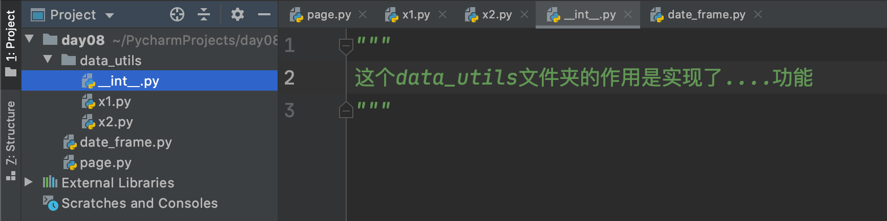
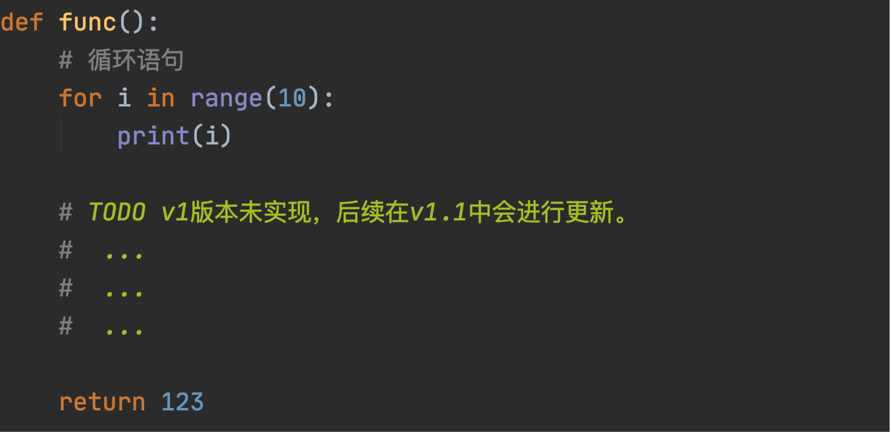
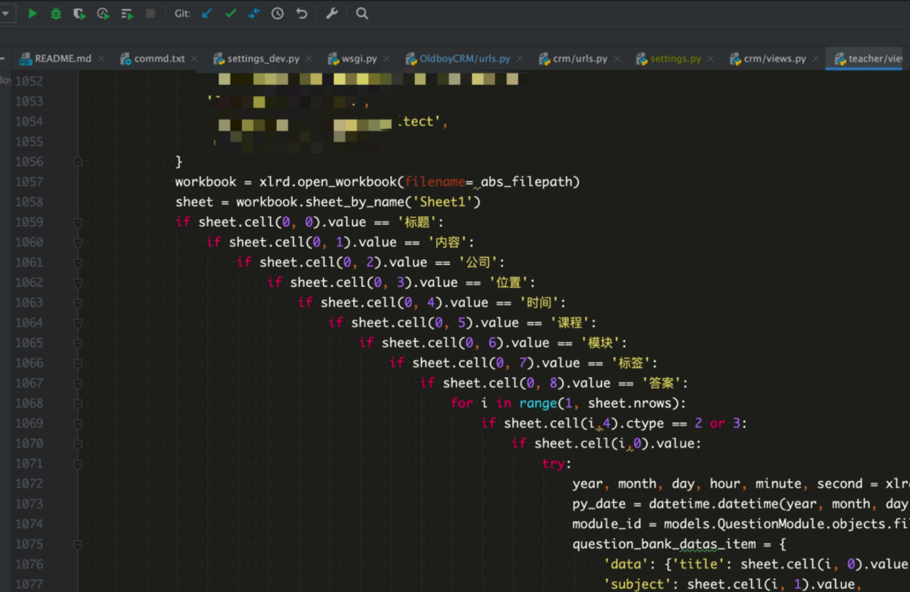
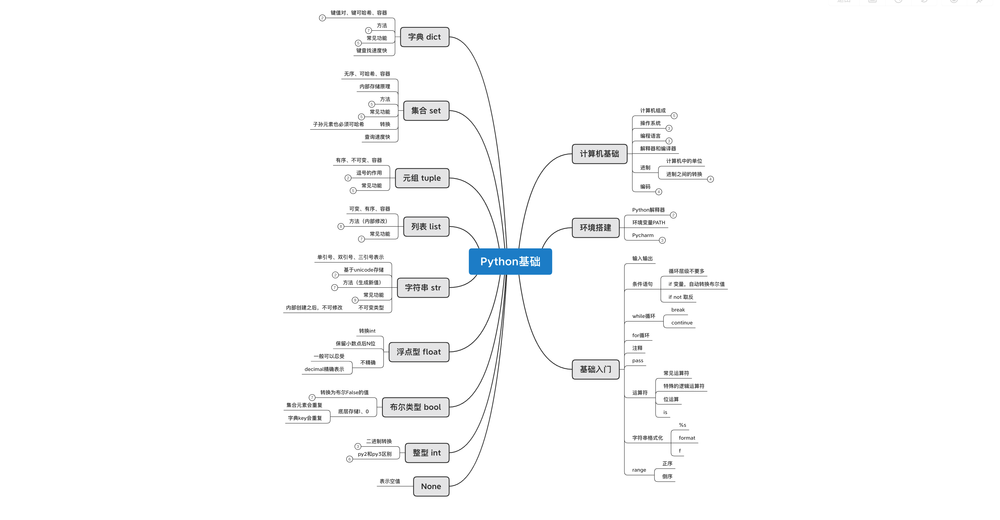

常见的数据类型：

- <span style="color:gray">int，整数类型（整形）</span>
- <span style="color:gray">bool，布尔类型</span>
- <span style="color:gray">str，字符串类型</span>
- <span style="color:gray">list，列表类型</span>
- <span style="color:gray">tuple，元组类型</span>
- **dict，字典类型**
- **set，集合类型**
- **float，浮点类型（浮点型）**


目标：掌握字典、集合、浮点类型相关知识。

课程概要：

- set集合，一个不允许重复重复 & 可变类型（元素可哈希）。
- dict字典，一个容器且元素必须是键值对。
- float类型，我们生活中常见的小数。


## 1.集合（set）

集合是一个 无序 、可变、不允许数据重复的容器。

### 1.1 定义

```python
v1 = { 11, 22, 33, "root" }
```

- 无序，无法通过索引取值。

- 可变，可以添加和删除元素。

  ```python
  v1 = {11,22,33,44}
  v1.add(55)
  print(v1) # {11,22,33,44,55}
  ```

- 不允许数据重复。

  ```python
  v1 = {11,22,33,44}
  v1.add(22)
  print(v1) # {11,22,33,44}
  ```

一般什么时候用集合呢？

> 就是想要维护一大堆不重复的数据时，就可以用它。比如：做爬虫去网上找图片的链接，为了避免链接重复，可以选择用集合去存储链接地址。


**注意**：定义空集合时，只能使用`v = set()`，不能使用 `v={}`（这样是定义一个空字典）。

```python
v1 = []
v11 = list()

v2 = ()
v22 = tuple()

v3 = set()

v4 = {} # 空字典
v44 = dict()
```


### 1.2 独有功能

1. 添加元素

   ```python
   data = {"刘嘉玲", '关之琳', "王祖贤"}
   data.add("郑裕玲")
   print(data)
   ```

   ```python
   data = set()
   data.add("周杰伦")
   data.add("林俊杰")
   print(data)
   ```

2. 删除元素

   ```python
   data = {"刘嘉玲", '关之琳', "王祖贤","张曼⽟", "李若彤"}
   data.discard("关之琳") 
   print(data)
   ```

3. 交集

   ```python
   s1 = {"刘能", "赵四", "⽪⻓⼭"}
   s2 = {"刘科⻓", "冯乡⻓", "⽪⻓⼭"}
   
   s4 = s1.intersection(s2) # 取两个集合的交集 
   print(s4) # {"⽪⻓⼭"}
   
   s3 = s1 & s2   			  # 取两个集合的交集
   print(s3)
   ```

4. 并集

   ```python
   s1 = {"刘能", "赵四", "⽪⻓⼭"}
   s2 = {"刘科⻓", "冯乡⻓", "⽪⻓⼭"}
   s4 = s1.union(s2) 		# 取两个集合的并集  {"刘能", "赵四", "⽪⻓⼭","刘科⻓", "冯乡⻓", }
   print(s4)
   s3 = s1 | s2   			# 取两个集合的并集
   print(s3)
   ```

5. 差集

   ```python
   s1 = {"刘能", "赵四", "⽪⻓⼭"}
   s2 = {"刘科⻓", "冯乡⻓", "⽪⻓⼭"}
   s4 = s1.difference(s2) 		# 差集，s1中有且s2中没有的值 {"刘能", "赵四"}
   s6 = s2.difference(s1)   	# 差集，s2中有且s1中没有的值 {"刘科⻓", "冯乡⻓"}
   
   s3 = s1 - s2   			   # 差集，s1中有且s2中没有的值
   s5 = s2 - s1   			   # 差集，s2中有且s1中没有的值
   
   print(s5,s6)
   ```


### 1.3 公共功能

1. 减，计算差集

   ```python
   s1 = {"刘能", "赵四", "⽪⻓⼭"}
   s2 = {"刘科⻓", "冯乡⻓", "⽪⻓⼭"}
   
   s3 = s1 - s2 
   s4 = s2 - s1
   print(s3)
   print(s4)
   ```

2. &，计算交集

   ```python
   s1 = {"刘能", "赵四", "⽪⻓⼭"}
   s2 = {"刘科⻓", "冯乡⻓", "⽪⻓⼭"}
   s3 = s1 & s2
   print(s3)
   ```

3. |，计算并集

   ```python
   s1 = {"刘能", "赵四", "⽪⻓⼭"}
   s2 = {"刘科⻓", "冯乡⻓", "⽪⻓⼭"}
   s3 = s1 | s2
   print(s3)
   ```

4. 长度

   ```python
   v = {"刘能", "赵四", "尼古拉斯"}
   data = len(v)
   print(data)
   ```

5. for循环

   ```python
   v = {"刘能", "赵四", "尼古拉斯"}
   for item in v:
   	print(item)
   ```

### 1.4 转换

其他类型如果想要转换为集合类型，可以通过set进行转换，并且如果数据有重复自动剔除。

提示：int/list/tuple/dict都可以转换为集合。

```python
v1 = "旺财"
v2 = set(v1)
print(v2) # {"旺","财"}
```

```python
v1 = [11,22,33,11,3,99,22]
v2 = set(v1)
print(v2) # {11,22,33,3,99}
```

```python
v1 = (11,22,3,11)
v2 = set(v1)
print(v2) # {11,22,3}
```

提示：这其实也是去重的一个手段。

```python
data = {11,22,33,3,99}

v1 = list(data) # [11,22,33,3,99]

v2 = tuple(data) # (11,22,33,3,99)
```


### 1.5 其他

#### 1.5.1 元素必须可哈希

因存储原理，集合的元素必须是可哈希的值，即：内部通过通过哈希函数把值转换成一个数字。


```python
v1 = hash("wc")
print(v1)

v2 = hash("xq")
print(v2)
```

目前可哈希的数据类型：int、bool、str、tuple，而list、set是不可哈希的。

总结：集合的元素只能是 int、bool、str、tuple 。

- 转换成功

  ```python
  v1 = [11,22,33,11,3,99,22]
  v2 = set(v1)
  print(v2) # {11,22,33,3,99}
  ```

- 转换失败

  ```python
  v1 = [11,22,["root","eric"],33]
  v2 = set(v1) # 报错 
  print(v2) 
  ```


#### 1.5.3 查找速度特别快

因存储原理特殊，集合的查找效率非常高（数据量大了才明显）。

- 低

  ```python
  user_list = ["旺财","root","李璐"]
  if "root" in user_list:
      print("在")
  else:
      print("不在")
      
      
  user_tuple = ("旺财","root","李璐")
  if "root" in user_tuple:
      print("在")
  else:
      print("不在")
  ```

- 效率高

  ```python
  user_set = {"旺财","root","李璐"}
  if "root" in user_set:
      print("在")
  else:
      print("不在")
  ```

  

#### 1.5.4 对比和嵌套

| 类型  | 是否可变 | 是否有序 | 元素要求 | 是否可哈希 | 转换        | 定义空            |
| ----- | -------- | -------- | -------- | ---------- | ----------- | ----------------- |
| list  | 是       | 是       | 无       | 否         | list(其他)  | `v=[]或v=list()`  |
| tuple | 否       | 是       | 无       | 是         | tuple(其他) | `v=()或v=tuple()` |
| set   | 是       | 否       | 可哈希   | 否         | set(其他)   | `v=set()`         |

```python
data_list = [
    "root",
    11,
    (11, 22, 33, {"root", "eric"}, 22),
    [11, 22, 33, 22],
    {11, 22, (True, ["中国", "北京"], "沙河"), 33}
]
```

注意：由于True和False本质上存储的是 1 和 0 ，而集合又不允许重复，所以在整数 0、1和False、True出现在集合中会有如下现象：

```python
v1 = {True, 1}
print(v1)  # {True}

v2 = {1, True}
print(v2)  # {1}

v3 = {0, False}
print(v3)  # {0}

v4 = {False, 0}
print(v4)  # {False}
```


### 练习题

1. 写代码实现

   ```python
   v1 = {'root','sir','肖大'}
   v2 = []
   
   # 循环提示用户输入，如果输入值在v1中存在，则追加到v2中，如果v1中不存在，则添加到v1中。（如果输入N或n则停止循环）
   while True:
       name = input("请输入姓名(N/n退出)：")
       if name.upper() == "Q":
           break
       if name in v1:
           v2.append(name)
   	else:
           v1.add(name)
   ```

2. 下面那些值不能做集合的元素

   ```python
   ""
   0
   [11,22,33]   # 不能
   []           # 不能
   (123)
   {1,2,3}      # 不能
   ```

3. 模拟用户信息录入程序，已录入则不再创建。

   ```python
   user_info_set = set()
   
   while True:
       name = input("请输入姓名：")
       age = input("请输入年龄：")
   	item = (name,age,)
       if item in user_info_set:
           print("该用户已录入")
   	else:
       	user_info_set.add(item)
   ```

4. 给你个列表去重。

   ```python
   v = [11,22,11,22,44455]
   data = set(v) # {11,22,44455}
   result = list(data) # [11,22,44455]
   ```


## 强插：None类型

Python的数据类型中有一个特殊的值None，意味着这个值啥都不是 或 表示空。 相当于其他语言中 `null`作用一样。

在一定程度上可以帮助我们去节省内存。例如：

```python
v1 = None
v2 = None
..
v1 = [11,22,33,44]
v2 = [111,22,43]
```

```python
v3 = []
v4 = []
...
v3 = [11,22,33,44]
v4 = [111,22,43]
```

注意：暂不要考虑Python内部的缓存和驻留机制。


目前所有转换为布尔值为False的值有：

```python
0
""
[] or list()
() or tuple()
set()
None
```

```python
if None:
    pass
```


## 2.字典（dict)

字典是 **无序**、**键不重复** 且 元素只能是**键值对**的**可变的** 个 **容器**。

```python
data = { "k1":1,  "k2":2 }
```

- 容器

- 元素必须键值对

- 键不重复，重复则会被覆盖

  ```python
  data = { "k1":1, "k1":2 }
  print(data) # {"k1":2}
  ```

- 无序（在Python3.6+字典就是有序了，之前的字典都是无序。）

  ```python
  data = { "k1":1,  "k2":2 }
  print(data)
  ```

  

### 2.1 定义

```python
v1 = {}
v2 = dict()
```

```python
data = { 
    "k1":1, 
    "k2":2 
}
```

```python
info = { 
    "age":12, 
    "status":True,  
    "name":"admin",   
    "hobby":['篮球','足球']  
}
```

字典中对键值得要求：

- 键：必须可哈希。 目前为止学到的可哈希的类型：int/bool/str/tuple；不可哈希的类型：list/set/dict。（集合）
- 值：任意类型。

```python
data_dict = {
	"旺财":29,
	 True:5,
	123:5,
    (11,22,33):["root","eric"]
}
```

```python
# 不合法
v1 = {
    [1, 2, 3]: '周杰伦',
    "age" : 18
} 
v2 = {
    {1,2,3}: "哈哈哈",
    'name':"root"
} 

v3 = {
    {"k1":123,"k2":456}: '呵呵呵',
    "age":999
}
```

```python
data_dict = {
    1: 29,
    True: 5
}
print(data_dict) # {1: 5}
```


一般在什么情况下会用到字典呢？

当我们想要表示一组固定信息时，用字典可以更加的直观，例如：

```python
# 用户列表
user_list = [ ("root","123"), ("admin","666") ]
...
```

```python
# 用户列表
user_list = [ {"name":"root","pwd":"123"}, {"name":"eric","pwd":"123"} ]
```


### 2.2 独有功能

1. 获取值

   ```python
   info = { 
       "age":12, 
       "status":True, 
       "name":"旺财",
       "data":None
   }
   
   data1 = info.get("name")
   print(data1) # 输出：旺财
   
   data2 = info.get("age")
   print(data2) # 输出：12
   
   data = info.get("email") # 键不存在，默认返回 None
   """
   if data == None:
       print("此键不存在")
   else:
       print(data)
   
   if data:
       print(data)
   else:
       print("键不存在")
   """
   
   """
   # 字典的键中是否存在 email
   if "email" in info:
       data = info.get("email")
       print(data)
   else:
   	print("不存在")
   """
   
   data = info.get("hobby",123)
   print(data) # 输出：123
   ```

   ```python
   # 案例：
   user_list = {
       "admin": "123",
       "root": "uk87",
   }
   
   username = input("请输入用户名：")
   password = input("请输入密码：")
   # None，用户名不存在
   # 密码，接下来比较密码
   pwd = user_list.get(username)
   
   if pwd == None:
       print("用户名不存在")
   else:
       if password == pwd:
           print("登录成功")
   	else:
           print("密码错误")
   ```

   ```python
   # 案例：
   user_list = {
       "admin": "123",
       "root": "uk87",
   }
   
   username = input("请输入用户名：")
   password = input("请输入密码：")
   # None，用户名不存在
   # 密码，接下来比较密码
   pwd = user_list.get(username)
   
   if pwd:
       if password == pwd:
           print("登录成功")
   	else:
           print("密码错误")
   else:
       print("用户名不存在")
   ```

   ```python
   # 案例：
   user_list = {
       "admin": "123",
       "root": "uk87",
   }
   
   username = input("请输入用户名：")
   password = input("请输入密码：")
   # None，用户名不存在
   # 密码，接下来比较密码
   pwd = user_list.get(username)
   
   if not pwd:
       print("用户名不存在")
   else:
       if password == pwd:
           print("登录成功")
   	else:
           print("密码错误")
           
   # 写代码的准则：简单的逻辑处理放在前面；复杂的逻辑放在后面。
   ```

2. 所有的键

   ```python
   info = {"age":12, "status":True, "name":"admin","email":"xx@live.com"}
   data = info.keys()
   print(data) # 输出：dict_keys(['age', 'status', 'name', 'email'])    py2 -> ['age', 'status', 'name', 'email']
   
   result = list(data)
   print(result) # ['age', 'status', 'name', 'email']
   ```

   注意：在Python2中 字典.keys()直接获取到的是列表，而Python3中返回的是`高仿列表`，这个高仿的列表可以被循环显示。

   ```python
   # 循环
   info = {"age":12, "status":True, "name":"admin","email":"xx@live.com"}
   for ele in info.keys():
       print(ele)
   ```

   ```python
   # 是否存在
   info = {"age":12, "status":True, "name":"admin","email":"xx@live.com"}
   # info.keys() # dict_keys(['age', 'status', 'name', 'email'])
   if "age" in info.keys():
       print("age是字典的键")
   else:
       print("age不是")
   ```

3. 所有的值

   ```python
   info = {"age":12, "status":True, "name":"admin","email":"xx@live.com"}
   data = info.values()
   
   print(data) # 输出：dict_values([12, True, 'admin', 'xx@live.com'])
   ```

   注意：在Python2中 字典.values()直接获取到的是列表，而Python3中返回的是高仿列表，这个高仿的列表可以被循环显示。

   ```python
   # 循环
   info = {"age":12, "status":True, "name":"admin","email":"xx@live.com"}
   for val in info.values():
       print(val) 
   ```

   ```python
   # 是否存在
   info = {"age":12, "status":True, "name":"admin","email":"xx@live.com"}
   if 12 in info.values():
       print("12是字典的值")
   else:
       print("12不是")
   ```

   

4. 所有的键值

   ```python
   info = {"age":12, "status":True, "name":"admin","email":"xx@live.com"}
   data = info.items()
   
   print(data) # 输出 dict_items([ ('age', 12),  ('status', True),  ('name', 'admin'),  ('email', 'xx@live.com')  ])
   ```

   ```python
   for item in info.items():
       print(item[0],item[1]) # item是一个元组 (键，值)
   ```

   ```python
   for key,value in info.items():
       print(key,value) # key代表键，value代表值，将兼职从元组中直接拆分出来了。
   ```

   ```python
   info = {"age":12, "status":True, "name":"admin","email":"xx@live.com"}
   data = info.items()
   
   if ('age', 12) in data:
       print("在")
   else:
       print("不在")
   ```

5. 设置值

   ```python
   data = {
       "name": "旺财",
       "email": 'xxx@live.com'
   }
   data.setdefault("age", 18)
   print(data)  # {'name': '旺财', 'email': 'xxx@live.com', 'age': 18}
   
   data.setdefault("name", "root")
   print(data)  # {'name': '旺财', 'email': 'xxx@live.com', 'age': 18}
   ```

6. 更新字典键值对

   ```python
   info = {"age":12, "status":True}
   info.update( {"age":14,"name":"旺财"} )   # info中没有的键直接添加；有的键则更新值
   print(info) # 输出：{"age":14, "status":True,"name":"旺财"}
   ```

7. 移除指定键值对

   ```python
   info = {"age":12, "status":True,"name":"旺财"}
   
   data = info.pop("age")
   
   print(info) # {"status":True,"name":"旺财"}
   print(data) # 12
   ```

8. 按照顺序移除（后进先出）

   ```python
   info = {"age":12, "status":True,"name":"旺财"}
   data = info.popitem() # ("name","旺财" )
   
   print(info) # {"age":12, "status":True}
   print(data) # ("name","旺财")
   ```

   - py3.6后，popitem移除最后的值。
   - py3.6之前，popitem随机删除。

```python
# 练习题
""" 
结合下面的两个变量 header 和 stock_dict实现注意输出股票信息，格式如下：
	SH601778，股票名称:中国晶科、当前价:6.29、涨跌额:+1.92。
    SH688566，股票名称:吉贝尔、当前价:...               。
	...
"""
header = ['股票名称', '当前价', '涨跌额']

stock_dict = {
    'SH601778': ['中国晶科', '6.29', '+1.92'], 
    'SH688566': ['吉贝尔', '52.66', '+6.96'], 
    'SH688268': ['华特气体', '88.80', '+11.72'], 
    'SH600734': ['实达集团', '2.60', '+0.24']
}
```


参考代码：

```python
"""
结合下面的两个变量 header 和 stock_dict 实现注意输出股票信息，格式如下：
    SH601778，股票名称:中国晶科、当前价:6.29、涨跌额:+1.92。
    SH688566，股票名称:吉贝尔、当前价:...
    ...
"""
header = ['股票名称', '当前价', '涨跌额']

stock_dict = {
    'SH601778': ['中国晶科', '6.29', '+1.92'],
    'SH688566': ['吉贝尔', '52.66', '+6.96'],
    'SH688268': ['华特气体', '88.80', '+11.72'],
    'SH600734': ['实达集团', '2.60', '+0.24']
}

for key, value in stock_dict.items():
    # print(key, value)  # 'SH601778': ['中国晶科', '6.29', '+1.92'],
    text_list = []  # ["股票名称:中国晶科",    "当前价:6.29"   , "涨跌额:+1.92"]
    for index in range(len(value)):
        text = "{}:{}".format(header[index], value[index])  #
        text_list.append(text)

    data = "、".join(text_list)  # "股票名称:中国晶科、当前价:6.29、涨跌额:+1.92"
    result = "{}，{}。".format(key, data)
    print(result)
```


### 2.3 公共功能

1. 求`并集`（Python3.9新加入）

   ```python
   v1 = {"k1": 1, "k2": 2}
   v2 = {"k2": 22, "k3": 33}
   
   v3 = v1 | v2
   print(v3) # {'k1': 1, 'k2': 22, 'k3': 33}
   ```

2. 长度

   ```python
   info = {"age":12, "status":True,"name":"旺财"}
   data = len(info)
   print(data) # 输出：3
   ```

3. 是否包含

   ```python
   info = { "age":12,  "status":True,"name":"旺财" }
   v1 = "age" in info
   print(v1)
   
   v2 = "age" in info.keys()
   print(v2)
   
   if "age" in info:
       pass
   else:
       pass
   ```

   ```python
   info = {"age":12, "status":True,"name":"旺财"}
   v1 = "旺财" in info.values()
   print(v1)
   ```

   ```python
   info = {"age": 12, "status": True, "name": "旺财"}
   # 输出info.items()获取到的 dict_items([ ('age', 12),  ('status', True),  ('name', 'admin'),  ('email', 'xx@live.com')  ])
   v1 = ("age", 12) in info.items()
   print(v1)
   ```

4. 索引（键）
   字典不同于元组和列表，字典的索引是`键`，而列表和元组则是 `0、1、2等数值` 。

   ```python
   info = { "age":12,  "status":True, "name":"旺财"}
   
   print( info["age"] )  	    # 输出：12
   print( info["name"] )		# 输出：旺财
   print( info["status"] )	    # 输出：True
   print( info["xxxx"] )   	# 报错，通过键为索引去获取之后时，键不存在会报错（以后项目开发时建议使用get方法根据键去获取值）
   
   value = info.get("xxxxx") # None
   print(value)
   ```

5. 根据键 修改值 和 添加值 和 删除键值对
   上述示例通过键可以找到字典中的值，通过键也可以对字典进行添加和更新操作

   ```python
   info = {"age":12, "status":True,"name":"旺财"}
   
   info["gender"] = "男"
   
   print(info) # 输出： {"age":12, "status":True,"name":"旺财","gender":"男"}
   ```

   ```python
   info = {"age":12, "status":True,"name":"旺财"}
   
   info["age"] = "18" 
   
   print(info) # 输出： {"age":"18", "status":True,"name":"旺财"}
   ```

   ```python
   info = {"age":12, "status":True,"name":"旺财"}
   del info["age"]  # 删除info字典中键为age的那个键值对（键不存在则报错）
   
   print(info) # 输出： {"status":True,"name":"旺财"}
   ```

   ```python
   info = {"age": 12, "status": True, "name": "旺财"}
   if "agea" in info:
   
       # del info["age"]
       data = info.pop("age")
       print(info)
       print(data)
   else:
       print("键不存在")
   ```

6. for循环
   由于字典也属于是容器，内部可以包含多个键值对，可以通过循环对其中的：键、值、键值进行循环；

   ```python
   info = {"age":12, "status":True,"name":"旺财"}
   for item in info:
   	print(item)  # 所有键
   ```

   ```python
   info = {"age":12, "status":True,"name":"旺财"}
   for item in info.key():
   	print(item)
   ```

   ```python
   info = {"age":12, "status":True,"name":"旺财"}
   for item in info.values():
   	print(item)
   ```

   ```python
   info = {"age":12, "status":True,"name":"旺财"}
   for key,value in info.items():
   	print(key,value)
   ```


### 2.4 转换

想要转换为字典.

```python
v = dict( [ ("k1", "v1"), ["k2", "v2"] ] )

print(v) # { "k1":"v1", "k2":"v2" }
```

```python
info = { "age":12, "status":True, "name":"旺财" }

v1 = list(info)        # ["age","status","name"]

v2 = list(info.keys()) # ["age","status","name"]

v3 = list(info.values()) # [12,True,"旺财"]

v4 = list(info.items()) # [ ("age",12), ("status",True), ("name","旺财") ]
```


### 1.5 其他

#### 1.5.1 速度快

```python
info = {
    "root":["肝胆","铁锤"], 
	"admin":["二蛋","缺货"]
}
for "root" in info:
    print("在"）
```

```python
info = {
    "root":["肝胆","铁锤"], 
	"admin":["二蛋","缺货"]
}
v1 = info["root"]
v2 = info.get("root")
```


#### 1.5.2 嵌套

我们已学了很多数据类型，在涉及多种数据类型之间的嵌套时，需注意一下几点：

- 字典的键必须可哈希（list/set/dict不可哈希）。

  ```python
  info = {
      (11,22):123
  }
  
  # 错误
  info = {
      (11,[11,22,],22):"root"
  }
  ```

- 字典的值可以是任意类型。

  ```python
  info = {
      "k1":{12,3,5},
  	"k2":{"xx":"x1"}
  }
  ```

- 字典的键和集合的元素在遇到  布尔值 和 1、0 时，需注意重复的情况。
- 元组的元素不可以被替换。

```python
dic = {
	'name':'汪峰',
	'age':48,
	'wife':[ {'name':'国际章','age':38},{'name':'李杰','age':48} ],
	'children':['第一个娃','第二个娃']
}
"""
1. 获取汪峰的妻子名字
	d1 = dic['wife'][0]['name']
	print(d1)
2. 获取汪峰的孩子们
	d2 = dic['children']
	print(d2)
3. 获取汪峰的第一个孩子
	d3 = dic['children'][0]
	print(d3)
4. 汪峰的媳妇姓名变更为 章子怡
	dic['wife'][0]['name] = "章子怡"
	print(dic)
5. 汪峰再娶一任妻子
	dic['wife'].append( {"name":"铁锤","age":19} )
	print(dic)
	
6. 给汪峰添加一个爱好：吹牛逼
	dic['hobby'] = "吹牛逼"
	print(dic)
7. 删除汪峰的年龄
	del dic['age']
	或
	dic.pop('age')
	print(dic)
"""
```


## 3.浮点型（float）

浮点型，一般在开发中用于表示小数。

```python
v1 = 3.14
v2 = 9.89
```

关于浮点型的其他知识点如下：

- 在类型转换时需要，在浮点型转换为整型时，会将小数部分去掉。

  ```python
  v1 = 3.14 
  data = int(v1)
  print(data) # 3
  ```

- 想要保留小数点后N位

  ```python
  v1 = 3.1415926
  result = round(v1,3)
  print(result) # 3.142
  ```

- 浮点型的坑（所有语言中）
  
```python
  v1 = 0.1
  v2 = 0.2
  
  v3 = v1+v2
  print(v3)  # 0.300000000000000000004
```


  在项目中如果遇到精确的小数计算应该怎么办？

  ```python
  import decimal
  
  v1 = decimal.Decimal("0.1")
  v2 = decimal.Decimal("0.2")
  v3 = v1 + v2
  print(v3) # 0.3
  ```

  

## 总结

1. 集合，是 无序、不重复、元素必须可哈希、可变的一个容器（子孙元素都必须是可哈希）。

2. 集合的查找速度比较快（底层是基于哈希进行存储）

3. 集合可以具有 交并差 的功能。

4. 字典是 无序、键不重复 且 元素只能是键值对的可变的一个容器（键子孙元素都必须是可哈希）。

5. py3.6+之后字典就变为有序了。

6. py3.9 新增了一个 `{} | {} `运算。

7. 字典的常见功能。

8. 在python2和python3中，字典的 keys() 、values()、items() 三个功能获取的数据类型不一样。

9. None是代表内存中的一个空值。

   ```python
   0
   ""
   [] or list()
   () or tuple()
   set()
   None
   {} or dict()
   ```

10. 浮点型用于表示小数，但是由于其内部存储原理可能会引发数据存储不够精准。


## 作业

1. 根据需求写代码

   ```python
   dic = {'k1': "v1", "k2": "v2", "k3": [11,22,33]}
   
   # 请在字典中添加一个键值对，"k4": "v4"，输出添加后的字典
   # 请在修改字典中 "k1" 对应的值为 "root"，输出修改后的字典
   # 请在k3对应的值中追加一个元素 44，输出修改后的字典
   # 请在k3对应的值的第 1 个位置插入个元素 18，输出修改后的字典
   ```

2. 根据需求写代码

   ```python
   dic1 = {
    'name':['root',2,3,5],
    'job':'teacher',
    'ok':{'root':['python1','python2',100]}
   }
   
   # 1，将name对应的列表追加⼀个元素’admin’。
   # 2，将name对应的列表中的root全变成大写。
   # 3，ok对应的字典加⼀个键值对’bad’:’linux’。
   # 4，将ok对应的字典中的root对应的列表中的python2删除
   ```

3. 循环提示用户输入，并将输入内容添加到字典中（如果输入N或n则停止循环）

   ```python
   例如：用户输入 x1|admin ,则需要再字典中添加键值对 {'x1':"admin"}
   ```

4. 判断以下值那个能做字典的key ？那个能做集合的元素？

   - 1
   - -1
   - ""
   - None
   - [1,2]
   - (1,)
   - {11,22,33,4}
   - {'name':'admin','age':18}

5. 将字典的键和值分别追加到 key_list 和 value_list 两个列表中，如：

   ```python
   key_list = []
   value_list = []
   info = {'k1':'v1','k2':'v2','k3':'v3'}
   ```

6. 字典dic = {'k1': "v1", "k2": "v2", "k3": [11,22,33]}

   ```python
   a. 请循环输出所有的key
   b. 请循环输出所有的value
   c. 请循环输出所有的key和value
   ```

7. 请循环打印k2对应的值中的每个元素。

   ```python
   info = {
       'k1':'v1',
       'k2':[('root'),('admin'),('ok')],
   }
   ```

8. 有字符串"k: 1|k1:2|k2:3  |k3 :4" 处理成字典 {'k':1,'k1':2....} 

9. 写代码

   ```python
   """
   有如下值 li= [11,22,33,44,55,66,77,88,99,90] ,将所有大于 66 的值保存至字典的第一个key对应的列表中，将小于 66 的值保存至第二个key对应的列表中。
   
      result = {'k1':[],'k2':[]}
   """
   ```

11. 输出商品列表，用户输入序号，显示用户选中的商品

    ```python
    """
    商品列表：
      goods = [
    		{"name": "电脑", "price": 1999},
    		{"name": "鼠标", "price": 10},
    		{"name": "游艇", "price": 20},
    		{"name": "美女", "price": 998}
    	]
    要求:
    1：页面显示 序号 + 商品名称 + 商品价格，如：
          1 电脑 1999 
          2 鼠标 10
    	  ...
    2：用户输入选择的商品序号，然后打印商品名称及商品价格
    3：如果用户输入的商品序号有误，则提示输入有误，并重新输入。
    4：用户输入Q或者q，退出程序。
    """
    ```


参考代码：

```python
# 1.根据需求写代码
"""
dic = {'k1': "v1", "k2": "v2", "k3": [11, 22, 33]}

dic['k4'] = "v4"
print(dic)

dic['k1'] = "root"
print(dic)

dic['k3'].append(44)
print(dic)

dic['k3'].insert(1,18)
print(dic)

# 注意：int/float/bool/str/list/tuple/set/dict
"""

# 2.根据需求写代码
"""
dic1 = {
    'name': ['root', 2, 3, 5],
    'job': 'teacher',
    'ok': {'root': ['python1', 'python2', 100] }
}


dic1['name'].append("admin")

new_name = dic1['name'][0].upper()
dic1['name'][0] = new_name

new_name = dic1['name'][0].capitalize()
dic1['name'][0] = new_name

dic1['ok'][''] = "linux"

dic1['ok']['root'].remove("python2")

del dic1['ok']['rot'][1]

"""

# 3.循环提示用户输入，并将输入内容添加到字典中（如果输入N或n则停止循环）
"""
info = {}

while True:
    text = input("请输入内容（n/N退出)：")  
    if text.upper() == "N":
        break
    data_list = text.split("|") 
    info[data_list[0]] = data_list[1]

print(info)
"""

# 4.判断以下值那个能做字典的key ？那个能做集合的元素？
"""
[1,2]
{11,22,33,4}
{'name':'admin','age':18}
"""

# 5.将字典的键和值分别追加到 key_list 和 value_list 两个列表中，如：
"""
key_list = []
value_list = []
info = {'k1': 'v1', 'k2': 'v2', 'k3': 'v3'}
for key, value in info.items():
    key_list.append(key)
    value_list.append(value)
print(key_list)
print(value_list)
"""
"""
key_list = []
value_list = []
info = {'k1': 'v1', 'k2': 'v2', 'k3': 'v3'}
key_list = list(info.keys())
value_list = list(info.values())
print(key_list)
print(value_list)
"""

# 6.字典dic = {'k1': "v1", "k2": "v2", "k3": [11,22,33]}
"""
dic = {'k1': "v1", "k2": "v2", "k3": [11, 22, 33]}
for key in dic.keys():
    print(key)

dic = {'k1': "v1", "k2": "v2", "k3": [11, 22, 33]}
for v in dic.values():
    print(v)

dic = {'k1': "v1", "k2": "v2", "k3": [11, 22, 33]}
for k, v in dic.items():
    print(k, v)
"""

# 7.请循环打印k2对应的值中的每个元素。
"""
info = {
    'k1':'v1',
    'k2':[ ('admin'),('root'),('ok')],
}

for item in info['k2']:
    print(item)

"""

# 8.有字符串"k: 1|k1:2|k2:3  |k3 :4" 处理成字典 {'k':1,'k1':2....}
"""
result = {}
text = "k: 1|k1:2|k2:3  |k3 :4"
data_list = text.split('|')  # ["k: 1","k1:2","k2:3  ","k3 :4"]
for item in data_list:
    # item # "k: 1"
    small_list = item.split(":")  # ["k"," 1"]
    result[small_list[0]] = int(small_list[1].strip())
print(result)
"""

"""
v = "k1:3"
v1, v2 = v.split(":")  # ["k1","3"]
print(v1, v2)
"""
"""
result = {}
text = "k: 1|k1:2|k2:3  |k3 :4"
data_list = text.split('|')  # ["k: 1","k1:2","k2:3  ","k3 :4"]
for item in data_list:
    key, value = item.split(":")  # ["k"," 1"]
    result[key] = int(value.strip())
print(result)
"""

# 9.写代码
"""
result = {'k1': [], 'k2': []}
li = [11, 22, 33, 44, 55, 66, 77, 88, 99, 90]

for item in li:
    if item > 66:
        result['k1'].append(item)
    elif item == 66:
        pass
    else:
        result['k2'].append(item)
print(result)
"""

"""
# result = {"k1":[77,88]}
result = {}
li = [11, 22, 33, 44, 55, 66, 77, 88, 99, 90]

for item in li:
    if item > 66:
        if "k1" in result:
            result['k1'].append(item)
        else:
            result['k1'] = [item]
    elif item == 66:
        pass
    else:
        if "k2" in result:
            result['k2'].append(item)
        else:
            result['k2'] = [item]
print(result)

"""

# 11.输出商品列表，用户输入序号，显示用户选中的商品
"""
商品列表：
    goods = [
        {"name": "电脑", "price": 1999},
        {"name": "鼠标", "price": 10},
        {"name": "游艇", "price": 20},
        {"name": "美女", "price": 998}
    ]
要求:
1：页面显示 序号 + 商品名称 + 商品价格，如：
      1 电脑 1999 
      2 鼠标 10
2：用户输入选择的商品序号，然后打印商品名称及商品价格
3：如果用户输入的商品序号有误，则提示输入有误，并重新输入。
4：用户输入Q或者q，退出程序。
"""

"""
goods = [
    {"name": "电脑", "price": 1999},
    {"name": "鼠标", "price": 10},
    {"name": "游艇", "price": 20},
    {"name": "美女", "price": 998}
]
for index in range(len(goods)):
    item = goods[index]
    print(index + 1, item['name'], item['price'])

while True:
    num = input("请输入要选择的商品序号(Q/q)：")  # "1"
    if num.upper() == "Q":
        break
    if num.isdecimal():
        num = int(num)
        if 0 < num < 5:
            target_index = num - 1
            choice_item = goods[target_index]
            print(choice_item["name"], choice_item['price'])
        else:
            print("序号范围选择错误")
    else:
        print("用户输入的序号格式错误")

# 注意：此示例是初级程序员会写的程序。
"""


"""
goods = [
    {"name": "电脑", "price": 1999},
    {"name": "鼠标", "price": 10},
    {"name": "游艇", "price": 20},
    {"name": "美女", "price": 998}
]
for index in range(len(goods)):
    item = goods[index]
    print(index + 1, item['name'], item['price'])

while True:
    num = input("请输入要选择的商品序号(Q/q)：")  # "1"
    if num.upper() == "Q":
        break
    if not num.isdecimal():
        print("用输入的格式错误")
        break
    num = int(num)

    if num > 4 or num < 0:
        print("范围选择错误")
        break
    target_index = num - 1
    choice_item = goods[target_index]
    print(choice_item["name"], choice_item['price'])
"""

"""
准则：
    - 尽可能少if嵌套
    - 简单的逻辑先处理
"""
```

## 3. 补充知识之代码规范

程序员写代码是有规范的，不只是实现功能而已。


### 3.1 名称

在Python开发过程中会创建文件夹/文件/变量等，这些在命名有一些潜规则（编写代码时也要注意pep8规范）。

- 文件夹，小写 & 小写下划线连接，例如：`commands`、`data_utils`等。

- 文件，小写 & 小写下划线连接，例如：`page.py`、`db_convert.py`等。

- 变量

  - 全局变量，大写 & 大写下划线连接，例如：`NAME = "旺财"` 、`BASE_NAME = 18`
  - 局部变量，小写 & 小写下划线连接，例如：`data = [11,22,33]`、`user_parent_id = 9`等。

  

### 3.2 注释

作为程序员，写代码注释是非常基础且有用的技能，方便以后对代码进行维护和理解。

- 文件夹
  

- 文件注释

  ```python
  """
  这个文件主要为项目提供工具和转换的功能，初次之外还有日志....
  例如：
  	...
  	...
  	...
  """
  
  
  ....
  ```

- 代码注释

  ```python
  name = "root"
  # 在名称后面添加一个ok
  data = name + "ok" 
  print(data)
  ```

  ```python
  name = "root"
  """
  在名称后面添加一个ok，内部的实现机制：
  	1. xxx
      2. xxx
      3. xx
  """
  data = name + "ok" 
  print(data)
  ```

  

### 3.3 todo

基于注释可以实现todo注释的效果，例如：




### 3.4 条件嵌套

以后写条件语句一定要想办法减少嵌套的层级（最好不要超过3层）。




### 3.5 简单逻辑先处理

示例1：

```python
goods = [
    {"name": "电脑", "price": 1999},
    {"name": "鼠标", "price": 10},
    {"name": "游艇", "price": 20},
    {"name": "美女", "price": 998}
]
for index in range(len(goods)):
    item = goods[index]
    print(index + 1, item['name'], item['price'])

while True:
    num = input("请输入要选择的商品序号(Q/q)：")  # "1"
    if num.upper() == "Q":
        break
    if num.isdecimal():
        num = int(num)
        if 0 < num < 5:
            target_index = num - 1
            choice_item = goods[target_index]
            print(choice_item["name"], choice_item['price'])
        else:
            print("序号范围选择错误")
    else:
        print("用户输入的序号格式错误")
```

示例2：

```python
goods = [
    {"name": "电脑", "price": 1999},
    {"name": "鼠标", "price": 10},
    {"name": "游艇", "price": 20},
    {"name": "美女", "price": 998}
]
for index in range(len(goods)):
    item = goods[index]
    print(index + 1, item['name'], item['price'])

while True:
    num = input("请输入要选择的商品序号(Q/q)：")  # "1"
    if num.upper() == "Q":
        break
    if not num.isdecimal():
        print("用输入的格式错误")
        break
    num = int(num)

    if num > 4 or num < 0:
        print("范围选择错误")
        break
    target_index = num - 1
    choice_item = goods[target_index]
    print(choice_item["name"], choice_item['price'])
```


### 3.6 循环

尽量少循环多干事，提高代码效率。

```python
key_list = []
value_list = []

info = {'k1': 'v1', 'k2': 'v2', 'k3': 'v3'}

for key, value in info.items():
    key_list.append(key)
    value_list.append(value)
```

```python
info = {'k1': 'v1', 'k2': 'v2', 'k3': 'v3'}

key_list = list(info.keys())
value_list = list(info.values())

```


### 3.7 变量和值

```python
# 推荐
name = "admin"
age = 19
```

```python
# 不推荐
name="admin"
age= 18
```

可以基于Pycharm的格式化工具来实现自动处理。

python代码规范：PEP8规范。


## 4.知识补充


### 4.1 pass

一般Python的代码块是基于 `:` 和`缩进`来实现，Python中规定代码块中必须要有代码才算完整，在没有代码的情况下为了保证语法的完整性可以用pass代替，例如：

```python
# 其他编程语言
if 提交{
    ...
}else{
    ....
}
```

```python
if 条件 :
    pass
else:
    pass
```


```python
if 条件:
    pass
else:
    pass
```

```python
for i in range(xxx):
    pass
```


### 4.2 is 比较

`is` 和 `==`的区别是什么？

- `==`，用于比较两个值是否相等。
- is，用于表示内存地址是否一致。

```python
# 示例1
v1 = []
v2 = []

print( v1 == v2 )  # True，两个值相当
print( v1 is v2 )  # False，不属于同一块内存。
```

```python
# 示例2
v1 = []
v2 = v1

print( v1 == v2 )  # True，两个值相当
print( v1 is v2 )  # True，属于同一块内存。
```

```python
# 示例3
v1 = None
v2 = None

print(v1 == v2)  # True，两个值相当
print(v1 is v2)  # True，属于同一块内存。
```


### 4.3 位运算

计算机底层本质上都是二进制，我们平时在计算机中做的很多操作底层都会转换为二进制的操作，位运算就是对二进制的操作。

- `&`，与（都为1）

  ```python
  a = 60            # 60 = 0011 1100 
  b = 13            # 13 = 0000 1101 
  
  c = a & b         # 12 = 0000 1100
  ```

- `|`，或（只要有一个为1）

  ```python
  a = 60            # 60 = 0011 1100 
  b = 13            # 13 = 0000 1101 
  
  c = a | b         # 61 = 0011 1101 
  ```

- `^`，异或（值不同）

  ```python
  a = 60            # 60 = 0011 1100 
  b = 13            # 13 = 0000 1101 
  
  c = a ^ b         # 49 = 0011 0001 
  ```

- `~`，取反

  ```python
  a = 60            #  60 = 0011 1100 
  
  c = ~a;           # -61 = 1100 0011
  ```

- `<<`，左移动

  ```python
  a = 60            #  60 = 0011 1100
  c = a << 2;       # 240 = 1111 0000
  ```

- `>>`，右移动

  ```python
  a = 60            # 60 = 0011 1101 
  c = a >> 2;       # 15 = 0000 1111
  ```

平时在开发中，二进制的位运算几乎很好少使用，在计算机底层 或 网络协议底层用的会比较多，例如：

- 计算  2**n

  ```python
  2**0    1 << 0   1     1
  2**1    1 << 1   10    2
  2**2    1 << 2   100   4
  2**3    1 << 3   1000  8
  ...
  ```

- 计算一个数的一半【面试题】

  ```python
  v1 = 10 >> 1 
  print(v1) # 值为5
  
  v2 = 20 >> 1
  print(v2) # 值为 10
  ```

- 网络传输数据，文件太大还未传完（websocket源码为例）。

  ```python
       第1个字节         第2个字节         ... 
   0 1 2 3 4 5 6 7 8 9 0 1 2 3 4 5 6 7 8 9 0 1 2 3 4 5 6 7 8 9 0 1
  +-+-+-+-+-------+-+-------------+-------------------------------+
  |F|R|R|R| opcode|M| Payload len |    Extended payload length    |
  |I|S|S|S|  (4)  |A|     (7)     |             (16/64)           |
  |N|V|V|V|       |S|             |   (if payload len==126/127)   |
  | |1|2|3|       |K|             |                               |
  +-+-+-+-+-------+-+-------------+ - - - - - - - - - - - - - - - +
  
  FIN位置是0，表示这是一部分数据，后续还有数据。
  FIN位置是1，表示这是最后数据，已发送完毕。
  ```

  ```python
  # 例如：接收到的第一个字节的值为245（11110101），让v的二进制和 1000 0000 做 & 与运算。
  
  v = 245   # 245 11110101
            # 128 10000000
                  10000000
      
  data = v & 128
  if data == 0:
      print("还有数据")
  else:
      print("已完毕")
  ```

  

## 5.阶段总结

可使用思维导图（ xmind 软件），对阶段知识点的内容进行梳理，将知识梗概和重点写出来，也便于以后的回顾和复习。




## 6.阶段考试

1. 简述解释型语言和编译型语言的区别。

2. 罗列你听说过的编程语言。

3. 简述位和字节的关系？

4. 简述你理解的 ascii、unicode、utf-8、gbk 编码。

5. py2和py3默认解释器编码分别是什么？如何在代码中修改解释器的编码？

6. pass的作用？

7. is和==的区别？

8. 列举你了解的Python2和Python3的区别。

9. 变量名的命名规范有哪些？

10. 都有那些值转换为布尔值时为False？

11. 简述如下三个变量的区别。

    ```python
    v1 = (1)
    v2 = (1,)
    v3 = 1
    ```

12. 你所学的数据类型中哪些是可变的类型？

13. 你所学的数据类型中哪些是可哈希的类型？

14. 你所学的数据类型中哪些是有序的？

15. 列举你能记得的如下数据类型的方法（独有功能）。

    - str
    - list
    - dict

16. 请将字符 `name = "admin"` 翻转。

17. 进制之间如何进行转换？

18. 循环过程中 break和continue的作用是什么？

19. 看代码写结果

    ```python
    v1 = 1 or 9 and 88 or [11,22] and (1,2,3)
    
    v2 = 1>5 or "root" and {"K1":"v1"} or 888
    
    print(v1,v2)
    ```

20. 看代码写结果

    ```python
     info = [ 
         {'k1':(1),'k2':{'k9':'ok','k10':'admin'}}, 
         (11,22,33,44),
         {199,2,3,4,5},
         True, 
         ['李杰','root', { 'extra': ("root",[18,20],'eric') } ]
    ]
    ```

    - 利用索引获取 "ok" 
    - 利用索引获取 44
    - 删除k10对应的键值对
    - 在 `{ 'extra': ("root",[18,20],'eric') }` 字典中添加一个键值对 `"name":"admin"`
    - 在集合` {199,2,3,4,5} `中添加一个 "北京"
    - 将列表中的True修改为 "真"
    - 在列表 `[18,20]`的第0个索引位置插入 666

21. 判断下面的代码是否正确？正确的话则写出结果，否则标明错误。

    ```python
    v1 = (11,22,33)
    v2 = (11)
    v3 = {11,2,33}
    v4 = {11,2,("root","eric"),33}
    v5 = {11,2,("root",{"北京","上海"},"eric"),33}
    ```

22. 看代码写结果

    ```python
    v1 = [11,22,33]
    v2 = [11,22,33]
    v1.append(666)
    
    print(v1)
    print(v2)
    ```

23. 看代码写结果

    ```python
    v1 = [11,22,33]
    v2 = v1
    v1.append(666)
    
    print(v1)
    print(v2)
    ```

24. 看代码写结果

    ```python
    v1 = [1,2,3,4,5]
    v2 = [v1,v1,v1]
    v2[1][0] = 111
    v2[2][0] = 222
    
    print(v1)
    print(v2)
    ```

25. 写代码实现，循环提示用户输入内容（Q或q终止），并将内容用 "_" 连接起来。

26. 写代码实现，将IP转换为整数。

    > 如 10.3.9.12 转换规则为：
    >         10            00001010
    >          3             00000011
    >          9             00001001
    >         12            00001100
    > 再将以上二进制拼接起来，然后再进行一次翻转。
    >
    > 最终将翻转之后的二进制转换为整型。

27. 写代码实现，车牌的区域划分。

    ```python
    car_list = ['鲁A32444', '沪B12333', '京B8989M', '京C49678', '黑C46555', '晋B25041', '沪C34567']
    
    # 根据以上代码获取各省车牌数量，例如：info = {"沪":2,"京":2 ...}
    ```

28. 写代码实现，数据格式化处理。

    ```python
    text = """id,name,age,phone,job
    1,root,22,13651054608,IT 
    2,admin,23,13304320533,Tearcher
    3,ok,18,1333235322,IT"""
    
    # 将上述数据处理为如下格式的结果：
    #    info = [{'id':'1','name':'root','age':'22','phone':'13651054608','job':'IT'},.... ..]
    # 提示：text的内容是根据 \n 分割（\n表示回车换行）。
    
    ```

29. 写代码实现 累乘计算器。

    ```python
    content = input("请输入内容:") # 用户可能输入 5*9*99.... 或 5* 9 * 10 * 99 或 5 * 9 * 99...
    
    # 补充代码实现
    ```

30. 使用for循环实现输出 9*9 乘法表

    ```
    1*1
    2*1 2*2
    3*1 3*2 3*3
    4*1 4*2 4*3 4*4
    5*1 5*2 5*3 5*4 5*5
    6*1 6*2 6*3 6*4 6*5 6*6
    7*1 7*2 7*3 7*4 7*5 7*6 7*7
    8*1 8*2 8*3 8*4 8*5 8*6 8*7 8*8
    9*1 9*2 9*3 9*4 9*5 9*6 9*7 9*8 9*9
    ```

31. 补充代码实现《棋牌游戏11点》

    需求：

    - 生成一副扑克牌（自己设计扑克牌的结构，小王和大王可以分别用14、15表示 ）

    - 3个玩家

      ```python
      user_list = ["root","admin","wc"]
      ```

    - 发牌规则

      - 默认先给用户发一张牌，其中 J、Q、K、小王、大王代表的值为0.5，其他就是则就是当前的牌面值。
      - 用户根据自己的情况判断是否继续要牌。
        - 要，则再给他发一张。
        - 不要，则开始给下个玩家发牌。
      - 如果用户手中的所有牌相加大于11，则表示爆了，此人的分数为0，并且自动开始给下个人发牌。

    - 最终计算并获得每个玩家的分值，例如：

      ```python
      result = {
          "root":8,
          "admin":9,
          "wc":0
      }
      ```

    必备技术点：随机抽排

    ```python
    import random
    
    total_poke_list = [("红桃", 1), ("黑桃", 2), ("大王", 15), ("小王", 14)]
    
    # 随机生成一个数，当做索引。
    index = random.randint(0, len(total_poke_list) - 1)
    # 获取牌
    print("抽到的牌为：", total_poke_list[index])
    # 踢除这张牌
    total_poke_list.pop(index)
    
    print("抽完之后，剩下的牌为：", total_poke_list)
    ```

    

    代码示例：（请补充实现）

    ```python
    result = {}
    user_list = ["root","admin","wc"]
    # 补充代码
    
    
    print(result)
    ```

## 6.阶段考试(参考答案)

1. 简述解释型语言和编译型语言的区别。

   ```
   编译器和解释器的作用是将各编程语言的代码进行翻译，从而使得计算机能够识别并执行。
   编译器，全文翻译，将代码编译成`临时文件`，再执行临时文件。
   解释器，实时翻译，对代码实行边解释边执行。
   ```

2. 罗列你听说过的编程语言。

   ```
   Java、C、C++、PHP、JavaScript、C#、Golang
   ```

3. 简述位和字节的关系？

   ```
   1字节等于8位
   ```

4. 简述你理解的 ascii、unicode、utf-8、gbk 编码。

   ```
   ascii编码、unicode字符集、utf-8编码、gbk编码本质上都是字符与二进制的关系。
   - ascii，只有256种对照关系，只包含英文、符号等。
   - unicode，万国码，包含了全球所有文字和二进制之间的一个对应关系。（ucs2或ucs4）
   - utf-8，对unicode字符集的码位进行压缩处理，间接也维护了字符和二进制的对照表。
   - gbk，包含中国、日本韩国等亚洲国家的文字和二进制的对照表。
   ```

5. py2和py3默认解释器编码分别是什么？如何在代码中修改解释器的编码？

   ```
   py2:ascii
   py3:utf-8
   
   在文件的顶部通过设置： # -*- coding:编码 -*- 实现修改。
   ```

6. pass的作用？

   ```
   pass相当于空行，程序啥都不做。 用于保持语法的完整性。
   ```

7. is和==的区别？

   ```
   is，比较内存地址是否一致。
   ==，比较值是否相等。
   ```

8. 列举你了解的Python2和Python3的区别。

   ```python
   - 默认解释器编码
   - 整型和长整形
   - 地板除取整、取小数
   - 字典的keys()/values()/items() 获取的值不同。
   - py2，字典无序；py3.6+ 字典有序。
   ```

9. 变量名的命名规范有哪些？

   ```
   三条规范（必须遵循，否则定义变量会报错）
     - 变量名只能由 字母、数字、下划线 组成。
     - 变量名不能以数字开头。
     - 变量名不能是Python内置关键字
   二条建议（遵循可以显得更加专业，不遵循也可以正常运行不报错）
   	- 下划线命名法，多个单词表示的变量名用下划线连接（均小写）
   	- 见名知意，通过阅读变量名就能知道此变量的含义。
   ```

10. 都有那些值转换为布尔值时为False？

    ```
    0
    ""
    [] or list()
    () or tuple()
    set()
    None
    {} or dict()
    ```

11. 简述如下三个变量的区别。

    ```python
    v1 = (1)    # 整型 1
    v2 = (1,)   # 元组
    v3 = 1      # 整型 1
    ```

12. 你所学的数据类型中哪些是可变的类型？

    ```
    list
    set
    dict
    ```

13. 你所学的数据类型中哪些是可哈希的类型？

    ```
    int
    bool
    float
    str
    tuple
    ```

14. 你所学的数据类型（容器）中哪些是有序的？

    ```
    list
    tuple
    dict（py3.6之后）
    ```

15. 列举你能记得的如下数据类型的方法（独有功能）。

    - str

      ```
      strip
      split
      join
      startswith
      endswith
      upper
      lower
      ...
      ```

    - list

      ```
      append
      insert
      remove
      extend
      sort
      reverse
      ...
      ```

    - dict

      ```
      get
      keys
      values
      items
      setdefault
      update
      ...
      ```

16. 请将字符 `name = "admin"` 翻转。

    ```
    data = name[::-1]
    print(data)
    ```
    
17. 进制之间如何进行转换？

    ```python
    - 十进制转其他：bin、oct、hex
    - 其他进制转十进制：int("其他进制",base=2或8或16)
    ```

18. 循环过程中 break和continue的作用是什么？

    ```python
    break,终止所有循环。
    continue，停止当前循环开始下次循环。
    ```

19. 看代码写结果

    ```python
    v1 = 1 or 9 and 88 or [11,22] and (1,2,3)
    
    v2 = 1>5 or "root" and {"K1":"v1"} or 888
    
    print(v1,v2) # 1    {'K1': 'v1'}
    ```
20. 看代码写结果

    ```python
     info = [ 
         {'k1':(1),'k2':{'k9':'ok','k10':'admin'}}, 
         (11,22,33,44),
         {199,2,3,4,5},
         True, 
         ['李杰','root', { 'extra': ("root",[18,20],'eric') } ]
    ]
    ```

    - 利用索引获取 "ok" 

      ```python
      info[0]["k2"]["k9"]
      ```

    - 利用索引获取 44

      ```python
      info[1][-1]
      ```

    - 删除k10对应的键值对

      ```python
      del info[0]['k2']['k10']
      ```

    - 在 `{ 'extra': ("root",[18,20],'eric') }` 字典中添加一个键值对 `"name":"admin"`

      ```python
      info[-1][2]["name"] = "admin"
      ```

    - 在集合` {199,2,3,4,5} `中添加一个 "北京"

      ```python
      info[2].add("北京")
      ```

    - 将列表中的True修改为 "真"

      ```python
      info[3] = "真"
      ```

    - 在列表 `[18,20]`的第0个索引位置插入 666

      ```python
      info[-1][-1]["extra"][1].insert(0,666)
      ```

21. 判断下面的代码是否正确？正确的话则写出结果，否则标明错误。

    ```python
    v1 = (11,22,33)									# 正确 (11,22,33)
    v2 = (11)										# 正确 11
    v3 = {11,2,33}									# 正确 {11,2,33}
    v4 = {11,2,("root","eric"),33}					# 正确 {11,2,("root","eric"),33}
    v5 = {11,2,("root",{"北京","上海"},"eric"),33}	 # 错误
    ```

22. 看代码写结果

    ```python
    v1 = [11,22,33]
    v2 = [11,22,33]
    v1.append(666)
    
    print(v1)  # [11,22,33,666]
    print(v2)  # [11,22,33]
    ```

23. 看代码写结果

    ```python
    v1 = [11,22,33]
    v2 = v1
    v1.append(666)
    
    print(v1) # [11,22,33,666]
    print(v2) # [11,22,33,666]
    ```

24. 看代码写结果

    ```python
    v1 = [1,2,3,4,5]
    v2 = [v1,v1,v1]
    
    v2[1][0] = 111
    v2[2][1] = 222
    
    print(v1) # [111,222,3,4,5]
    print(v2) # [[111,222,3,4,5],[111,222,3,4,5],[111,222,3,4,5]]
    ```


25. 写代码实现，循环提示用户输入内容（Q或q终止），并将内容用 "_" 连接起来。

    ```python
    data_list = []
    while True:
        text = input("请输入（Q/q退出）：")
        if text.upper() == "Q":
            break
        data_list.append(text)
    
    result = "_".join(data_list)
    print(result)
    ```

26. 写代码实现，将IP转换为整数。

    > 如 10.3.9.12 转换规则为：
    >         10            00001010
    >          3             00000011
    >          9             00001001
    >         12            00001100
    > 再将以上二进制拼接起来，然后再进行一次翻转。
    >
    > 最终将翻转之后的二进制转换为整型。

    ```python
    ip = "10.3.9.12"
    
    data_list = []
    num_list = ip.split(".")
    for num in num_list:
        item = bin(int(num))[2:].zfill(8)
        data_list.append(item)
    
    reverse_data = "".join(data_list)[::-1]
    result = int(reverse_data, base=2)
    print(result)
    ```

27. 写代码实现，车牌的区域划分。

    ```python
    car_list = ['鲁A32444', '沪B12333', '京B8989M', '京C49678', '黑C46555', '晋B25041', '沪C34567']
    
    # 根据以上代码获取各省车牌数量，例如：info = {"沪":2,"京":2 ...}
    ```

    ```python
    car_list = ['鲁A32444', '沪B12333', '京B8989M', '京C49678', '黑C46555', '晋B25041', '沪C34567']
    
    info = {}
    
    for item in car_list:
        city = item[0]
        if city in info:
            info[city] = info[city] + 1
        else:
            info[city] = 1
    
    print(info)
    ```

    ```python
    car_list = ['鲁A32444', '鲁B12333', '京B8989M', '京C49678', '黑C46555', '晋B25041', '沪C34567']
    
    info = {}
    for item in car_list:
        city = item[0]
        num = info.get(city, 0)
        info[city] = num + 1
    print(info)
    ```

    

28. 写代码实现，数据格式化处理。

    ```python
    text = """id,name,age,phone,job
    1,root,22,13651054608,IT 
    2,admin,23,13304320533,Tearcher
    3,address,18,1333235322,IT"""
    
    # 将上述数据处理为如下格式的结果：
    #    info = [  {'id':'1','name':'root','age':'22','phone':'13651054608','job':'IT'},.... ..  ]
    
    # 提示：text的内容是根据 \n 分割（\n表示回车换行）。
    ```

    ```python
    text = """id,name,age,phone,job
    1,root,22,13651054608,IT 
    2,admin,23,13304320533,Tearcher
    3,address,18,1333235322,IT"""
    
    data_list = text.split("\n") # ["id,name,age,phone,job","1,root,22,13651054608,IT"... ]
    header_list = data_list[0].split(",") # ["id","name","age"... ]
    info = []
    for index in range(1, len(data_list)):
        item = {}
        row = data_list[index] # 1,root,22,13651054608,IT 
        row_item_list = row.split(",") # ["1","root","22",...]
        for i in range(len(row_item_list)):
            item[header_list[i]] = row_item_list[i]
        info.append(item)
    print(info)
    ```

29. 写代码实现 累乘计算器。

    ```python
    content = input("请输入内容:") # 用户可能输入 5*9*99.... 或 5* 9 * 10 * 99 或 5 * 9 * 99... （不用考虑非数字的情况）
    
    # 补充代码实现
    result = 1
    num_list = content.split("*") # ["5","9","99"]
    for num in num_list:
        # result *= int(num)
        result = result * int(num)
    
    print(result)
    ```

30. 使用for循环实现输出 9*9 乘法表

    ```
    1*1
    2*1 2*2
    3*1 3*2 3*3
    4*1 4*2 4*3 4*4
    5*1 5*2 5*3 5*4 5*5
    6*1 6*2 6*3 6*4 6*5 6*6
    7*1 7*2 7*3 7*4 7*5 7*6 7*7
    8*1 8*2 8*3 8*4 8*5 8*6 8*7 8*8
    9*1 9*2 9*3 9*4 9*5 9*6 9*7 9*8 9*9
    
    
    1*1 
    1*2 2*2 
    1*3 2*3 3*3 
    1*4 2*4 3*4 4*4 
    1*5 2*5 3*5 4*5 5*5 
    1*6 2*6 3*6 4*6 5*6 6*6 
    1*7 2*7 3*7 4*7 5*7 6*7 7*7 
    1*8 2*8 3*8 4*8 5*8 6*8 7*8 8*8 
    1*9 2*9 3*9 4*9 5*9 6*9 7*9 8*9 9*9 
    ```

    ```python
    print("666",end=" ")
    print("999",end=" ")
    666 999 
    ```

    ```python
    for i in range(10):
        # 0,1,2,3,4,5,6,7,8
        for j in range(i): # []  [0] [0,1] [0,1,2]
            # 0,1
    ```

    ```python
    for i in range(1, 10):
        # 1 2 3 4 5 6 7 8 9
        for j in range(1, i + 1): # [1]  [1,2]  [1,2,3]  [1,2,3,4] [1,2,3,4,5] ... [1,2,3,4...9 ]
            # j * i
            # 1 * 1
            # 1 * 2  2 * 2
            # 1 * 3 2 * 2
            text = "{}*{}".format(j, i)
            print(text, end=" ")
        print("")
    ```

31. 补充代码实现《棋牌游戏11点》

    需求：

    - 生成一副扑克牌（自己设计扑克牌的结构，小王和大王可以分别用14、15表示 ）

    - 3个玩家

      ```python
      user_list = ["root","admin","wc"]
      ```

    - 发牌规则

      - 默认先给用户发一张牌，其中 J、Q、K、小王、大王代表的值为0.5，其他就是则就是当前的牌面值。
      - 用户根据自己的情况判断是否继续要牌。
        - 要，则再给他发一张。
        - 不要，则开始给下个玩家发牌。
      - 如果用户手中的所有牌相加大于11，则表示爆了，此人的分数为0，并且自动开始给下个人发牌。

    - 最终计算并获得每个玩家的分值，例如：

      ```python
      result = {
          "root":8,
          "admin":9,
          "wc":0
      }
      ```

    必备技术点：随机抽排

    ```python
    import random
    
    total_poke_list = [("红桃", 1), ("黑桃", 2), ("大王", 15), ("小王", 14)]
    
    # 随机生成一个数，当做索引。
    index = random.randint(0, len(total_poke_list) - 1)
    # 获取牌
    print("抽到的牌为：", total_poke_list[index])
    # 踢除这张牌
    data = total_poke_list.pop(index) # ("红桃", 1)
    
    print("抽完之后，剩下的牌为：", total_poke_list)
    ```

    

    代码示例：（请补充实现）

```python
    import random
    
    result = {}
    
    user_list = ["root", "admin", "wc"]
    
    # 1. 生成一副扑克牌
    total_poke_list = [ ("小王",14),("大王",15) ]
color_list = ["红桃", "黑桃", "方片", "梅花"]
    num_list = []
for num in range(1, 14):
        num_list.append(num)
    for color in color_list:
        for num in num_list:
            item = (color, num,)
            total_poke_list.append(item)
    
    # 2. 发牌 -> ["root", "admin", "wc"]
    for user in user_list:
        # 给用户发第一张牌
        score = 0
        index = random.randint(0, len(total_poke_list) - 1)
        poke = total_poke_list.pop(index) # ("花色",值)
        # JQK表示 0.5 点
        value = poke[1]
        if poke[1] > 10:
            value = 0.5 
        score += value
        print("给{}发的牌：{}{}，此刻所有牌面值总和:{}".format(user, poke[0], poke[1], score))
        
        # 用户选择是否继续要
        while True:
            choice = input("是否继续要牌(Y/N)？")
            choice = choice.upper()
    
            # 用户输入的不是Y/N/y/n
            if choice not in {"Y", "N"}:
                print("输入错误，请重新输入。")
                continue
    
            # 用户输入N，不继续要牌了
            if choice == "N":
                print("{}不要拍了".format(user))
                break
    
            # 继续要拍（再随机抽取一张）
            index = random.randint(0, len(total_poke_list) - 1)
            poke = total_poke_list.pop(index)
            value = poke[1]
            if poke[1] > 10:
                value = 0.5
            score += value
            
            print("给{}发的牌：{}{}，此刻所有牌面值总和:{}".format(user, poke[0], poke[1], score))
    
            # 大于11点，则用户爆了且分值变为0
            if score > 11:
                print("用户{}爆了".format(user))
                score = 0
                break
    
        result[user] = score
    
    print(result)
```
    
    